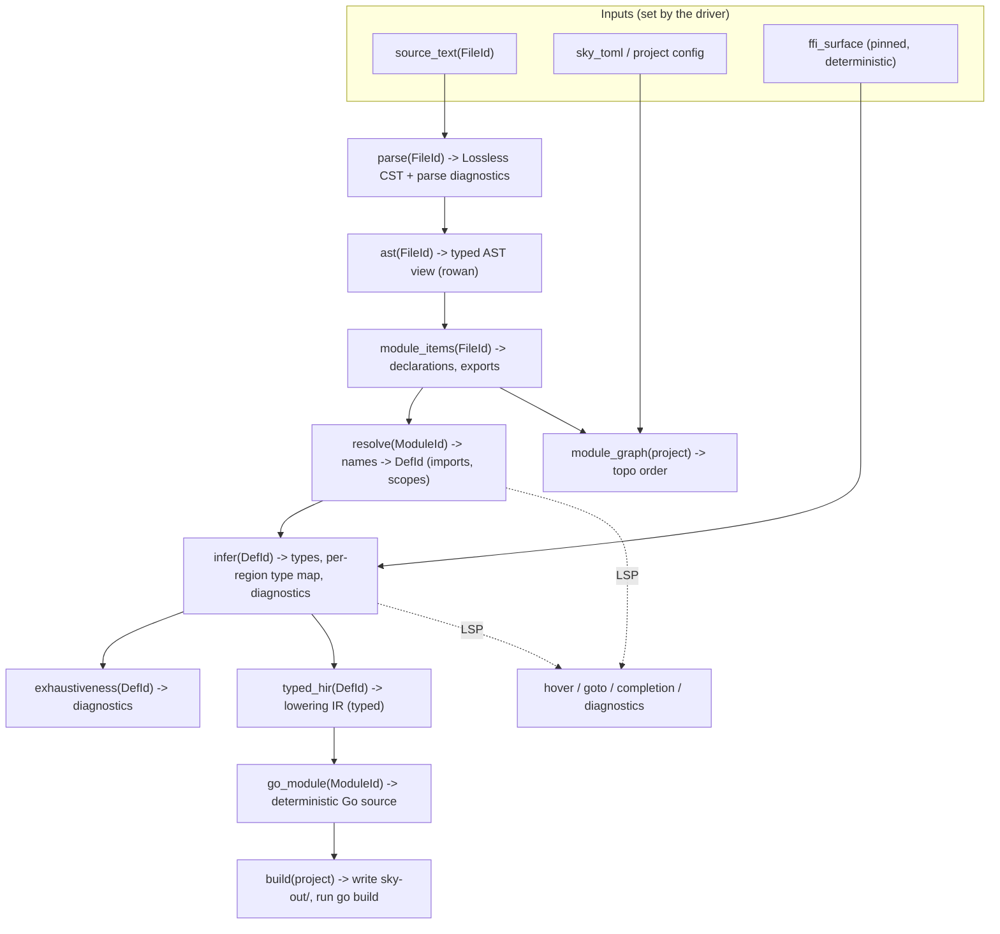

# 01 — Architecture Overview

The compiler is a **demand-driven, incremental query engine** (salsa), not a
batch pipeline. Everything downstream of source text is a *query* whose result is
memoised and automatically recomputed when its inputs change. The CLI and the LSP
are two front-ends over the **same** query database — the LSP is not a special
case, it is the query engine with a different driver.

This shape is the direct answer to laws L1 (no globals — the `db` *is* the state),
L2 (incremental for free), and L5 (queries compose along an explicit DAG).

> **Implementation status.** This salsa query
> engine is the **target** architecture, described below in the present tense. It
> is not yet the running engine. A salsa spike is wired — `skydb` (`rust/crates/skydb/src/lib.rs`)
> is a real `salsa` 0.28 database with one input (`SourceFile`) and one tracked
> query (`line_count`), proving the engine end-to-end — but its own header states
> "the full query DAG is threaded in M1+". The pipeline that actually parses,
> resolves, infers, lowers and emits the corpus today runs on a hand-rolled
> **resolution db** (`hir::db::SourceDb`, `rust/crates/hir/src/db.rs`): a
> value-threaded `struct` holding parsed modules + a `DefId` interner + a
> `RefCell` `module_exports` cache, walked in batch. It is deliberately structured
> so a salsa port is mechanical (see its module doc), and it already delivers the
> demand-driven cross-module `module_exports(dep)` lookup (no 5-round fixpoint) —
> but the "all edges are salsa queries" framing below, and **every "salsa query"
> / "salsa input" / `#[salsa::tracked]` label anywhere in this blueprint** —
> [`04`](04-syntax-lexer-parser.md), [`05`](05-name-resolution.md),
> [`06`](06-type-system.md), [`07`](07-lowering-and-ir.md),
> [`09`](09-runtime-and-ffi.md), [`10`](10-lsp-and-tooling.md),
> [`11`](11-testing-and-verification.md) — describes the destination, not the
> current build. The *logic* those sections describe (resolution, inference,
> lowering, FFI loading) is what the code does; only the memoising engine differs.
> Threading the DAG through salsa is remaining work ([`12`](12-migration-and-milestones.md)).

## Data flow (target: all edges are salsa queries)

- **Inputs** are the only mutable things; the driver `set_*`s them. Everything
  else is a pure function of inputs, memoised by salsa. Editing one file
  invalidates only the queries that transitively depend on it (L2).
- **No phase reaches into a global.** `infer` cannot read a `globalCgEnv`; it
  takes the `db` and asks `resolve(module)`. That is L1, enforced structurally.

## The interner is the spine (L3)

Everything with identity is an integer id, allocated in an arena, compared by
`==` on the int:

| Interned thing | Id | Replaces (Haskell) |
|---|---|---|
| File path | `FileId` | ad-hoc `FilePath` keys |
| Module name | `ModuleId` | `ModuleName.Canonical` |
| Definition (top-level/local) | `DefId` | name-string map keys |
| Symbol name | `Name` (interned `str`) | `String` everywhere |
| Type | `Ty` (interned) | `T.Type` + structural `Eq` |
| **Type variable** | `TyVarId` (arena) | **`UF.Point` pointer identity** ← the one real typechecker design task, solved for free |
| Source span | `Span { FileId, TextRange }` | `A.Region` |

Interning gives three wins at once (L3): O(1) identity comparison, arena
allocation (no GC pressure, predictable memory — the user's TCO/memory concern),
and **deterministic iteration** when you walk ids in allocation order (L4).

## Controlled mutation, not purity theatre and not IORef soup

Haskell forced a false choice: pure-threading (verbose) or IORef globals
(untraceable). Rust's idiom is the middle path the compiler actually wants:

- **Interners / arenas** are append-only stores inside the `db`. Monotonic,
  single-writer, deterministic — the "register-on-first-mention" pattern the
  Haskell code kept reinventing, now the default.
- **Union-find** (type inference) is a `Vec<TyVarId>` with in-place path
  compression + union-by-rank — genuinely mutable, genuinely fast, *local* to the
  inference query, never global. This is the honest scoped-mutation sweet spot
  we kept reaching for.
- **Everything else is pure** and memoised by salsa.

## Diagnostics as data (L7, L8)

- Parsing produces a **lossless CST** (rowan): every byte, including trivia and
  errors, is in the tree. The LSP works on syntactically broken code; formatting
  is exact; error recovery is built in (L8).
- Every query returns `(result, Vec<Diagnostic>)` — errors never throw, never
  short-circuit the whole build. `Diagnostic` is a structured value (span, code,
  severity, labels, suggested fix) rendered by one reporter for CLI *and* LSP.

## Determinism, end to end (L4)

- No `HashMap` iteration reaches output; emission walks `BTreeMap` / `IndexMap` /
  interned-id order.
- Fresh names (type vars, temporaries) are drawn from a counter seeded by a
  deterministic pre-order traversal, at the *collection* site, never from
  hashmap order at the emission site (the precise mistake the Haskell "sort keys
  before iterating" idea got wrong at the record-field site).
- The FFI surface is generated once, deterministically, and pinned/committed —
  the platform-variant Go inspector never runs mid-build (see [`09`](09-runtime-and-ffi.md)).
- A CI gate compiles the corpus N× across seeds + platforms and byte-diffs.

## The Go backend stays (L10, L9)

The compiler still emits Go and reuses the existing `runtime-go/rt` runtime
(goroutine-backed Tasks, the deploy story, SkyDeploy). The rewrite fixes the
*lowering* — a **typed IR** with a well-specified type system so coercion is the
rare, explicit exception rather than a pervasive `rt.Coerce` residual surface
(L9). See [`07`](07-lowering-and-ir.md) + [`08`](08-go-codegen.md).

## Why this specifically fixes the AI-velocity problem

- **Bounded context:** a change to inference touches the `ty` crate; a model
  loads that crate, not a 60k-line world. Queries have typed inputs/outputs, so
  a local edit is locally verifiable.
- **The type system catches the model's mistakes** the way it catches a human's
  — exhaustive matches, no `any`, `Result` everywhere (L6).
- **rust-analyzer** gives the model (and you) real hover/goto/rename *inside the
  compiler* — the tooling hole, closed for the authors too.
