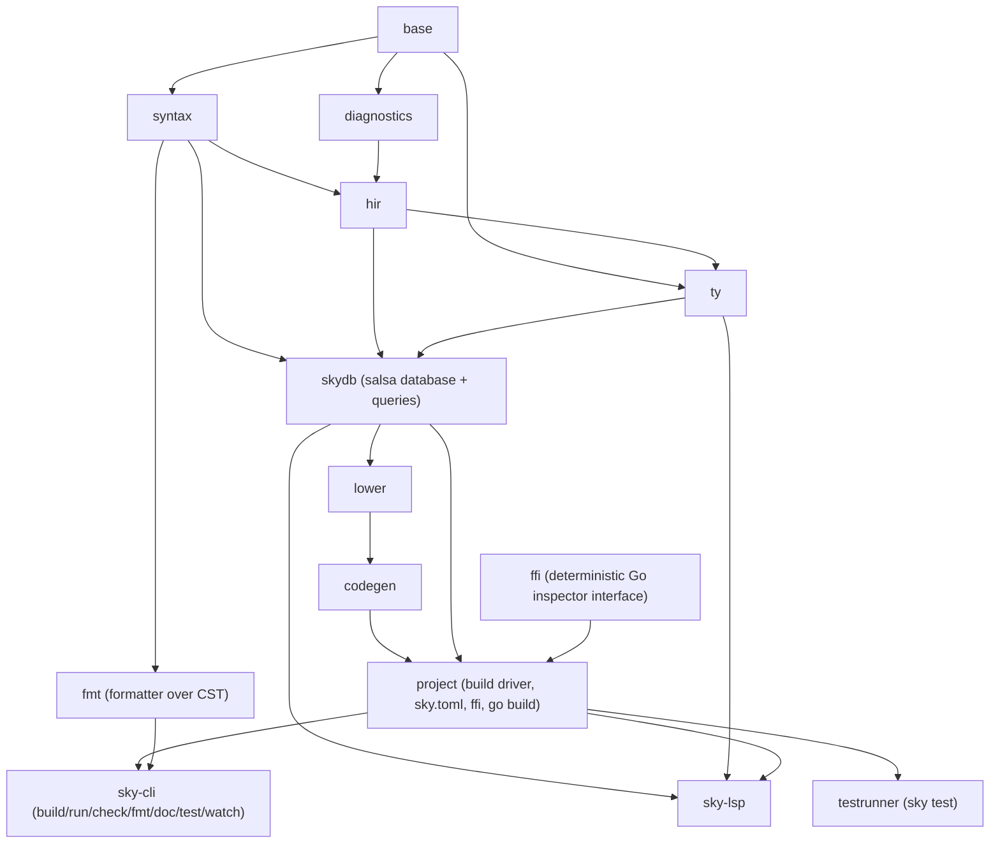

# 02 — Workspace & Crates

A Cargo workspace of small, single-responsibility crates. The crate dependency
graph is a **DAG by construction** — Cargo refuses cycles, so law L5 (enforced
boundaries, no monolith, no "circular imports") is guaranteed by the build
system, not by discipline. Each crate has a soft size budget (~2–4k lines);
crossing it is a signal to split.

## Crate DAG

## Crates

| Crate | Responsibility | Key deps | Doc |
|---|---|---|---|
| `base` | Interners, ids (`FileId`/`ModuleId`/`DefId`/`Name`/`Span`), arenas, `Text`, small utils. No logic. | `la-arena`, `smol_str`, `indexmap` | 01, 03 |
| `diagnostics` | `Diagnostic` type, severities, labels, suggested fixes, one renderer for CLI + LSP (Elm-style output). | `base`, `annotate-snippets` | 07(L7) |
| `syntax` | Lexer + lossless CST (rowan), typed AST view, error recovery, layout/indentation. | `base`, `rowan`, `logos`(lexer) | 04 |
| `hir` | Desugared, name-resolved high-level IR. Imports, scopes, `DefId` resolution, module items. | `base`, `syntax`, `diagnostics` | 05 |
| `ty` | HM inference, arena union-find, generalisation, exhaustiveness, the type table. | `base`, `hir`, `syntax`, `diagnostics` | 06 |
| `skydb` | The salsa database + query spike (target: every query; today: one input + one tracked query, doc 01). | `salsa`, `base`, `syntax`, `hir`, `ty`, `diagnostics` | 01 |
| `lower` | Typed lowering IR (Sky-typed → Go-IR), type-directed lowering, TCO, DCE, monomorphisation. | `base`, `ty`, `hir`, `syntax`, `skydb` | 07 |
| `codegen` | Deterministic Go source emission from the Go-IR; the runtime ABI/interface. | `base`, `lower` | 08 |
| `ffi` | Deterministic Go-package inspection → pinned `.skyi` surface; reproducible, committed. | `base`, `serde`, `serde_json`, `include_dir` | 09 |
| `project` | `sky.toml`, module discovery, dependency graph, driver that runs the build + `go build`, stdlib embedding. | `skydb`, `codegen`, `lower`, `hir`, `ty`, `syntax`, `base`, `ffi` | 08, 09 |
| `fmt` | `sky fmt` — opinionated formatter over the CST (idempotent, trivia-safe). | `syntax` | 04, 10 |
| `sky-cli` | The `sky` binary: build/run/check/fmt/doc/test/watch/add/etc. | `project`, `fmt`, `testrunner` | 10 |
| `sky-lsp` | LSP server over the resolution db (target: the same `skydb`). Hover/goto/completion/diagnostics/references/rename/semantic-tokens. | `base`, `syntax`, `hir`, `ty`, `skydb`, `project`, `diagnostics`, `tower-lsp`, `tokio` | 10 |
| `testrunner` | `sky test` (Sky.Test) runner. | `project` | 10 |
| `xtask` | Dev automation: run corpus, differential-test vs Haskell oracle, reproducibility gate. | `syntax`, `base`, `hir`, `ty`, `project`, `diagnostics` | 11, 12 |

> **Implementation status.** The **Key deps**
> column above reflects the actual `Cargo.toml` of each crate. Note that `lower`,
> `project`, `sky-lsp`, and `xtask` depend directly on the frontend crates
> (`hir`/`ty`/`syntax`/`diagnostics`) rather than reaching them only through
> `skydb` — because the running pipeline threads values through
> `hir::db::SourceDb`, not the salsa DAG (see [`01`](01-architecture-overview.md)
> status). `skydb` is on the graph and depended on, but as the M0 salsa spike, not
> yet the assembly point for "the whole compiler". The crate DAG itself (who may
> depend on whom) is as drawn and enforced by Cargo.

## Key external dependencies (and why)

- **`salsa`** — incremental query framework (the rust-analyzer engine). Delivers
  L2 + L1: the database is the only state; queries memoise + invalidate.
- **`rowan`** — lossless syntax trees (rust-analyzer's). Delivers L8: trivia +
  error nodes in one tree; exact formatting; recovery.
- **`la-arena`** — typed arena allocation for ids/nodes. Delivers L3 memory
  predictability.
- **`indexmap` / `BTreeMap`** — insertion-ordered / sorted maps. Delivers L4:
  no hashmap order in output. `HashMap` is allowed only for internal caches
  whose iteration never reaches emission.
- **`smol_str`** — cheap interned small strings for `Name`.
- **`tower-lsp`** — async LSP scaffolding.
- **`logos`** — fast lexer generator (or a hand-rolled lexer feeding rowan).
- **`insta`** — snapshot testing for CST/AST/diagnostics/emitted-Go goldens (11).

## Rules of the workspace

- A crate may only depend on crates above it in the DAG. Cargo enforces it.
- `#![forbid(unsafe_code)]` in `base`, `syntax`, `hir`, `ty`, `lower`, `codegen`.
- `#![warn(clippy::all)]` workspace-wide; deny on CI.
- No crate re-exports another's internals to "avoid a dependency" — if you need
  it, depend on it; if that would cycle, the design is wrong (extract a lower
  crate — the `base`/`Compile.Types` lesson, done right from the start).
- Emission-order determinism (L4) is a crate-local invariant of `codegen` +
  `lower`, covered by the reproducibility gate in `xtask`.
