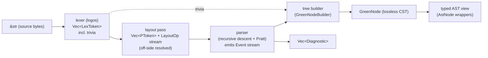
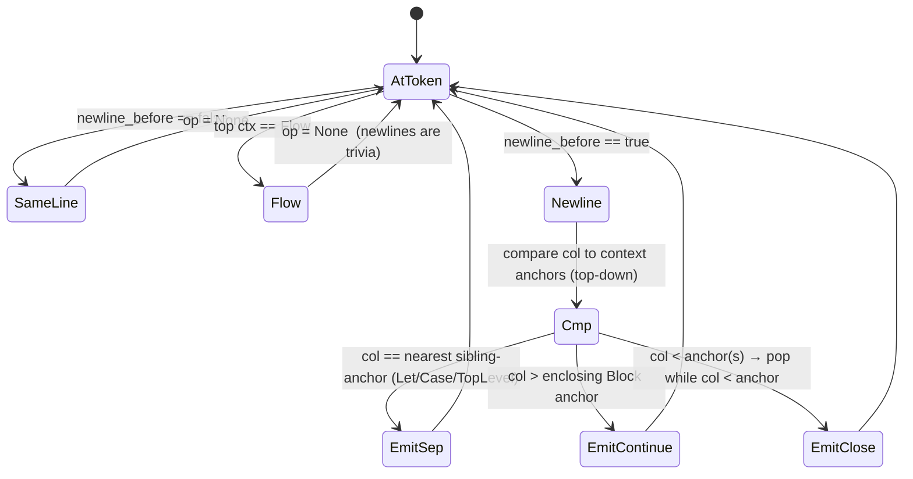

# 04 — Syntax: Lexer, Lossless CST, Layout & Recovery

> **Crate:** `syntax` (`base`, `rowan`, `logos` → `syntax`). See [`02`](02-workspace-and-crates.md).
> **Queries it backs:** `parse(FileId) -> Parse` and `ast(FileId)` in [`01`](01-architecture-overview.md).
> **Laws it exists to satisfy:** **L8** (lossless tree + recovery — the whole
> point), **L7** (diagnostics as data, never throw), **L4** (deterministic —
> the token stream is a pure function of bytes), **L3** (spans are interned
> `Span`s, not row/col structs threaded by hand), **L6** (the parser's own
> node kinds are one exhaustive `enum`).

This crate replaces the CPS combinator parser (`Sky.Parse.*`) wholesale. That
parser is a rank-N, 4-continuation CPS machine (`Primitives.hs:63-71`) that
tracks `row`/`col`/`indent` by hand inside every primitive and scatters layout
decisions (`getCol`, `withIndent`, `checkIndent`) across the grammar. It has no
concept of a tree — it builds the AST directly and **throws away every byte it
does not need** (whitespace, comments, the exact shape of what the user typed).
It cannot recover: a single broken sub-expression forces `oneOf` to re-walk the
whole alternative list, which is why `failParse` has to emit on the *consumed*-
error continuation to avoid exponential heap blow-up (`Primitives.hs:139-157`).
Comments are recovered by a **second raw-text scan** of the file after parsing
(`Module.hs:103-187`) because the grammar can't see them. That is the anti-
pattern L8 names.

The rewrite is the standard rust-analyzer shape: **lex → layout → parse →
lossless green tree (rowan) → typed AST view**, every stage a pure function,
every byte in the tree, errors as `ERROR` nodes + `Diagnostic` values.

---

## 1. Pipeline overview



Three deliberate separations:

1. **The lexer is lossless and layout-blind.** It emits *every* byte as a token
   or trivia token, including whitespace, newlines and both comment forms. It
   knows nothing about indentation.
2. **The layout pass is explicit and standalone.** It consumes the lex vector
   and produces a *parser-facing* token stream (`PToken`) annotated with
   resolved off-side operations (`Open`/`Sep`/`Close`/`Continue`). It is unit-
   testable in isolation with golden `LayoutOp` streams — the historically
   fragile behaviour (`Expression.hs`, `Type.hs` column peeking) becomes one
   inspectable artefact instead of a dozen scattered `getCol` calls.
3. **The parser is layout-context-driven, not column-peeking.** It never asks
   "what column am I in"; it consumes `PToken`s whose `LayoutOp` already tells
   it whether the next line is a sibling, a continuation, or a dedent.

The green-tree builder is fed from the **original lex vector** (so trivia land
in the tree byte-exactly), driven by the parser's `Event` stream. Layout ops are
*events consumed by the parser*, never synthetic tokens in the tree — this keeps
the tree lossless (every byte is a real lexed token/trivia; nothing invented) and
still gives the parser an explicit layout signal. Best of both: L8's
losslessness and the "explicit token-stream layout pass" the fragile history
demands.

---

## 2. Spans: bytes, not row/col

The Haskell side threads `A.Region { start, end :: Position { line, col } }`
everywhere (`Annotation.hs:11-27`) and tracks a parallel `_offset` that is a
**char count** (`Data.Text.length`), not a byte count — a latent unicode
mismatch that never bit only because emission rarely uses offsets.

Rust lexes over `&str` with native byte offsets. Everything spatial is a
`TextRange` (rowan's `(u32, u32)` byte range). Row/col is derived on demand.

```rust
// base crate
pub struct Span { pub file: FileId, pub range: TextRange }   // L3: interned file id

// A LineIndex is built once per file (salsa query), maps offset <-> (line,col)
// for diagnostics + LSP positions. rust-analyzer's exact approach.
pub struct LineIndex { newlines: Vec<TextSize>, /* + utf16 col table */ }
impl LineIndex {
    pub fn line_col(&self, offset: TextSize) -> LineCol { /* binary search */ }
    pub fn offset(&self, lc: LineCol) -> Option<TextSize> { ... }
}
```

Consequence: the parser and CST speak byte ranges only. `line/col` exists at the
edges (diagnostic rendering, LSP `Position`), computed from `LineIndex`. This
deletes an entire class of hand-maintained counters (`_row`/`_col`/`_offset` in
`Primitives.State`) and their tab-width bugs.

**Tab quirk (compat).** `Space.hs` advances a tab by **4 columns** for
indentation (`Space.hs:36-37,68-69`) but by 1 elsewhere. Indentation columns are
the only place width matters. The layout pass computes an **indent column** for
each line's first token using the same tab=4 rule, for accept/reject parity with
the Haskell compiler. This is a documented compat quirk; a future lint may reject
tabs-in-indentation outright.

---

## 3. The token set (`SyntaxKind`)

rowan uses a **single `u16` kind** for both tokens and nodes (`SyntaxKind(u16)`,
converted via `rowan::Language`). We define one `enum SyntaxKind` (L6: exhaustive;
`#[repr(u16)]`). Tokens first, then nodes (§5).

### 3.1 Lexer choice

**`logos` with callbacks for the stateful tokens.** Most tokens are trivially
regex-lexable and `logos` is the fast, deterministic default (L4). The four
stateful tokens — nested block comments, triple-quoted strings, single-line
strings with escapes, char literals — use `logos` *callbacks* that hand-scan via
`Lexer::remainder()` + `bump()`. (If callback ergonomics bite, the fallback is a
~400-line hand-rolled lexer with the same token output; the token set below is
lexer-implementation-agnostic and is the contract.)

Nested `{- {- -} -}` block comments (`Space.hs:95-115`, `Module.hs:173-187`) and
`"""…"""` triple strings that may contain lone `"` (`String.hs:177-188`) are
**not** regular languages — they *require* a counting/scanning callback. This is
called out because a naive `logos` regex silently gets them wrong.

### 3.2 Trivia tokens (kept in the tree, skipped by the parser)

| Kind | Lexes | Notes |
|---|---|---|
| `WHITESPACE` | `[ \t\r]+` (no `\n`) | tab counts as 4 for indent (§2) |
| `NEWLINE` | `\n` | significant to the *layout pass*, trivia to the *tree* |
| `LINE_COMMENT` | `--[^\n]*` | must out-prioritise `-`/`--` operator munch. Abuts identifiers: `Int-- base` lexes `Int` then `LINE_COMMENT` (real case, `State.sky`) |
| `BLOCK_COMMENT` | `{- … -}` nested | stateful callback; unterminated → `ERROR` trivia + diagnostic |

Trivia are collected by the tree builder and attached to nodes (§8). The parser's
token cursor skips them but records their ranges so the builder can re-insert
them (leading/trailing attachment).

### 3.3 Literals

| Kind | Lexes | Cite |
|---|---|---|
| `INT` | `[0-9]+` | `Number.hs:52-56` |
| `HEX_INT` | `0x[0-9a-fA-F]+` | `Number.hs:21-30` |
| `FLOAT` | `[0-9]+\.[0-9]+([eE][+-]?[0-9]+)?` and `[0-9]+[eE][+-]?[0-9]+` | `Number.hs:33-51` (int-with-exponent is a Float) |
| `STRING` | `"…"` w/ escapes | callback; `String.hs:41-47,162-173` |
| `MULTILINE_STRING` | `"""…"""` spanning newlines | callback; interpolation stays raw in the token (§9); `String.hs:22-37,177-188` |
| `CHAR` | `'c'` / `'\n'` | callback; `String.hs:126-156` |

Escape decoding (`\n \t \xHH \u{…}`, `String.hs:59-122`) happens **at AST-value
extraction time**, not in the lexer — the token keeps the raw bytes (lossless).
The typed-AST accessor `.value()` returns the decoded `String`.

### 3.4 Identifiers & keywords

| Kind | Rule | Cite |
|---|---|---|
| `LOWER_IDENT` | starts lower/`_`/caseless-unicode (CJK etc.), continues alnum/`_` | `Variable.hs:17-35` |
| `UPPER_IDENT` | starts uppercase, continues alnum/`_` | `Variable.hs:39-49` |

Keywords are lexed as `LOWER_IDENT`/`UPPER_IDENT` then **reclassified** by exact
text against the keyword set (`Keyword.hs:11-19`) — this matches the Haskell
`keyword` combinator's "string not followed by ident-char" rule
(`Primitives.hs:277-294`) and keeps the maximal-munch identifier rule in one
place.

| Kind | Text |
|---|---|
| `MODULE_KW` `EXPOSING_KW` `IMPORT_KW` `AS_KW` | `module` `exposing` `import` `as` |
| `TYPE_KW` `ALIAS_KW` `FOREIGN_KW` | `type` `alias` `foreign` |
| `IF_KW` `THEN_KW` `ELSE_KW` | `if` `then` `else` |
| `CASE_KW` `OF_KW` | `case` `of` |
| `LET_KW` `IN_KW` | `let` `in` |
| `TRUE_KW` `FALSE_KW` | `True` `False` (uppercase; `Keyword.hs:18`) |

`where` and `port` are historically reserved but unused — reserve the words at
lex reclassification so a user binding named `where` is a clean error, matching
intent (they are absent from the *active* keyword set, so v1 treats them as
ordinary idents unless we choose to reserve; flagged as a differential-test point
against the oracle).

### 3.5 Operators & structural symbols — maximal munch, then reclassify

Sky lexes a **maximal run of operator chars** as one token
(`Symbol.hs:12-28`, char class ``+-*/<>=!&|^~%?@#$:.\\'``) — this is why `a<|b`
is `a` `<|` `b` and not `a < | b`. We reproduce maximal munch, then reclassify
the run by exact text. Structural symbols that happen to be made of operator
chars get dedicated kinds; everything else is a generic `OP` carrying its text
(the Pratt table in §7 reads the text).

| Run | Kind | Role |
|---|---|---|
| `=` | `EQ` | binding / record field / union `=` |
| `:` | `COLON` | annotation, record-type field |
| `::` | `COLON2` | cons operator (prec 5 R) |
| `.` | `DOT` | qualifier sep / field access |
| `..` | `DOTDOT` | `exposing (..)`, `Type(..)` |
| `|` | `PIPE` | union bar / record-update / row-poly bar |
| `->` | `ARROW` | lambda / type arrow / case arm |
| `\` | `BACKSLASH` | lambda intro |
| `+ - * / // % ^ ++ == /= < > <= >= && \|\| \|> <\| >> <<` | `OP` | binary operators (text-tagged) |
| any other run | `OP` (flagged unknown) | parser emits "unknown operator" diagnostic; no custom operators (Limitation #3) |

Non-operator punctuation is single-char:

| Char | Kind |
|---|---|
| `(` `)` | `L_PAREN` `R_PAREN` |
| `[` `]` | `L_BRACK` `R_BRACK` |
| `{` `}` | `L_BRACE` `R_BRACE` |
| `,` | `COMMA` |
| `_` | `UNDERSCORE` (wildcard; note `_x` is a `LOWER_IDENT`, `Pattern.hs:61-68`) |

Two lexer ordering rules that are load-bearing:

- **`--` beats `-`/`--`-operator.** `LINE_COMMENT` priority > operator run, so
  `x -- c` and `Int-- c` both comment. (`Space.hs:38-49`.)
- **`.` inside a number is the float lexer's, not `DOT`.** `1.5` is `FLOAT`;
  `xs.field` needs `xs` to be an ident so `.field` munches `DOT` `LOWER_IDENT`.
  logos longest-match handles this since the float regex requires a leading
  digit.

```rust
#[repr(u16)]
#[derive(Clone, Copy, PartialEq, Eq, Debug)]
pub enum SyntaxKind {
    // ---- trivia ----
    WHITESPACE, NEWLINE, LINE_COMMENT, BLOCK_COMMENT,
    // ---- literals ----
    INT, HEX_INT, FLOAT, STRING, MULTILINE_STRING, CHAR,
    // ---- idents / keywords ----
    LOWER_IDENT, UPPER_IDENT,
    MODULE_KW, EXPOSING_KW, IMPORT_KW, AS_KW, TYPE_KW, ALIAS_KW, FOREIGN_KW,
    IF_KW, THEN_KW, ELSE_KW, CASE_KW, OF_KW, LET_KW, IN_KW, TRUE_KW, FALSE_KW,
    // ---- symbols ----
    EQ, COLON, COLON2, DOT, DOTDOT, PIPE, ARROW, BACKSLASH, OP,
    L_PAREN, R_PAREN, L_BRACK, R_BRACK, L_BRACE, R_BRACE, COMMA, UNDERSCORE,
    // ---- sentinels ----
    ERROR,        // covers bytes the parser could not classify (L8 recovery)
    EOF,
    // ---- nodes ---- (§5)
    SOURCE_FILE, MODULE_HEADER, EXPOSING_LIST, /* … */
    #[doc(hidden)] TOMBSTONE,   // rowan builder internal
}
```

---

## 4. The layout algorithm

Sky is off-side/indentation-sensitive but **alignment-based**, not the classic
Haskell `{ ; }` layout. Siblings share a column; a construct continues while
lines are indented past its anchor. Today these rules live as ad-hoc
`getCol`/`withIndent`/column-`==` checks smeared across the grammar. We lift them
into **one explicit pass** with a context stack.

### 4.1 What the current parser actually does (the spec to reproduce)

| Construct | Rule | Cite |
|---|---|---|
| **Top-level decls** | each decl anchored at col 1; body continuations must be `> `anchor; next decl at col 1 ends the previous body | `Declaration.hs:62-68` (`withIndent bodyCol`), `Module.hs:448-490` |
| **`let` bindings** | first binding sets `bindingCol`; every sibling binding must start at **exactly** `bindingCol`; `in` (at any col) terminates | `Expression.hs:496-536` |
| **`case` arms** | first arm sets `branchCol`; every sibling arm at **exactly** `branchCol`; arm body bound to `withIndent (max patCol bodyCol)` so a following arm at the pattern col is not slurped into the body | `Expression.hs:632-669` |
| **fn-application continuation** | an arg on a later line continues the call if its col `>` the func col **or** `>` the block's min-indent; keyword-leading lines (`then`/`in`/`of`/`else`) never count as args | `Expression.hs:154-230` |
| **binop continuation** | an operator may sit on the next line if indented past the block indent (`|>` pipelines) | `Expression.hs:32-81` |
| **multi-line type sig** | `->` and the leading `:` may sit on a fresh, indented continuation line (Limitation #10, closed) | `Type.hs:21-59`, `Declaration.hs:54-60,84-89` |
| **record/list/exposing** | inside `()[]{}` layout is off; elements separated by `,`/`\|`, leading-comma multi-line style, `freshLine` between tokens | `Expression.hs:689-739`, `Module.hs:270-321` |

Two consequences to preserve exactly:
- `let`/`case` use **strict equality** to the anchor column for siblings, not
  `>=`. A binding one space off is *not* a sibling (it's a continuation or an
  error). Golden-test this.
- **Bracketed regions suspend layout.** Inside `( ) [ ] { }` newlines are pure
  trivia; the layout stack must push a "flow" (layout-off) context on an open
  bracket and pop it on the matching close.

### 4.2 The layout pass: contexts + ops

The pass walks the lex vector, tracking, for each **significant** token
(non-trivia), whether it is the first on its line (`newline_before`) and its
indent column (tab=4). It maintains a stack of layout contexts and emits one
`LayoutOp` per significant token that the parser consumes.

```rust
#[derive(Clone, Copy)]
enum LayoutKind {
    TopLevel,   // anchor col 1; siblings align; body continues while > anchor
    Let,        // siblings must equal anchor; closed by `in`
    Case,       // siblings must equal anchor
    Block,      // a decl/binding/arm body; continues while col > anchor
    Flow,       // inside ( ) [ ] { } — layout suspended
}
struct Ctx { kind: LayoutKind, anchor: u32 }

#[derive(Clone, Copy, Debug)]
pub enum LayoutOp {
    None,          // same-line token, or inside Flow: nothing to decide
    Continue,      // newline, indented past the enclosing Block anchor → same construct
    Sep,           // newline at a sibling anchor (next let-binding / case-arm / top decl)
    Close(u8),     // newline dedented below N context anchors → close N of them
}

pub struct PToken {
    pub kind: SyntaxKind,
    pub range: TextRange,
    pub newline_before: bool,   // first significant token on its line
    pub col: u32,               // indent column (tab=4), meaningful iff newline_before
    pub ws_before: bool,        // any WHITESPACE/NEWLINE trivia immediately precedes
    pub op: LayoutOp,
}
```

`ws_before` is what powers the **negative-literal-argument** rule in §7
(`f -1` vs `f - 1`) — the parser needs "is there whitespace between this token
and the previous one", which the Haskell side reconstructs by peeking raw text
(`Expression.hs:99-149`, `Pattern.hs:272-277`). We compute it once, here.

### 4.3 The state machine



Bracket handling is orthogonal to the column compare: on `L_PAREN`/`L_BRACK`/
`L_BRACE` push `Flow`; on the matching close pop it (tracking bracket depth so a
`}` inside a record closes the right context). While the top context is `Flow`,
every token gets `op = None` regardless of column — reproducing "inside brackets
layout is off".

Context open/close is **driven by the parser, not guessed by the pass**: the
pass exposes `push_ctx(kind, anchor)` / `pop_ctx()` that the parser calls when it
enters a `let`/`case`/decl body (it knows the grammar; the pass knows the
columns). This is the clean seam the Haskell code lacked — there, `exprLet`
computed `bindingCol` *and* enforced it *and* parsed, all tangled
(`Expression.hs:496-529`). Here the parser says "open a `Let` context anchored at
the next token's column"; the pass emits `Sep`/`Close` on subsequent lines; the
parser closes the context on `in`.

> **Design note — why not synthetic `{ ; }` tokens.** Haskell-style layout
> inserts virtual braces/semicolons into the token stream. That fights rowan's
> losslessness (invented tokens have no bytes) and the alignment-vs-indent
> mismatch makes the `L`/`parse-error(t)` rule awkward for Sky's *strict-equal*
> sibling columns. Emitting `LayoutOp` as parser events sidesteps both: the tree
> stays byte-exact, and the op stream is still a standalone, golden-testable
> artefact (`layout(tokens) -> Vec<LayoutOp>`), which is the "explicit pass" the
> fragile history calls for.

### 4.4 Layout pass output is a first-class test artefact

`xtask` snapshots `lex → layout` for every corpus file. Because layout was the
single most regression-prone area of the Haskell parser (every `Expression.hs`
comment is a scar — the `pastBlockInd` relaxation that slurped `else`/`in`/`of`,
`Expression.hs:202-229`; the case-body `max patCol bodyCol` fix,
`Expression.hs:660-668`), making the op stream inspectable is the highest-value
determinism guard in this crate.

---

## 5. The lossless CST (rowan)

### 5.1 Node kinds

Nodes extend the same `SyntaxKind` enum. Grammar-shaped, one node per grammar
production. Naming mirrors the AST view (§7-typed).

```
SOURCE_FILE
  MODULE_HEADER      EXPOSING_LIST   EXPOSED_VALUE  EXPOSED_TYPE  EXPOSED_OPERATOR
  IMPORT             IMPORT_ALIAS    IMPORT_EXPOSING
  VALUE_DECL         TYPE_ANNO_DECL  UNION_DECL     ALIAS_DECL    FOREIGN_DECL
  PARAM_LIST         UNION_VARIANT   UNION_VARIANT_LIST  TYPE_VAR_LIST
  // types
  TYPE_FUN  TYPE_APP  TYPE_VAR  TYPE_CON  TYPE_QUAL  TYPE_RECORD  TYPE_RECORD_FIELD
  TYPE_TUPLE  TYPE_UNIT  TYPE_PAREN  ROW_VAR
  // patterns
  PAT_WILDCARD PAT_VAR PAT_CTOR PAT_CTOR_QUAL PAT_LIST PAT_CONS PAT_TUPLE PAT_UNIT
  PAT_RECORD PAT_ALIAS PAT_INT PAT_FLOAT PAT_STRING PAT_CHAR PAT_BOOL PAT_PAREN
  // expressions
  LITERAL  MULTILINE_LITERAL  REF_EXPR  QUAL_REF_EXPR  ACCESSOR_EXPR  FIELD_ACCESS
  LIST_EXPR  TUPLE_EXPR  UNIT_EXPR  RECORD_EXPR  RECORD_UPDATE  RECORD_FIELD
  PAREN_EXPR  NEGATE_EXPR  BIN_EXPR  CALL_EXPR  LAMBDA_EXPR
  IF_EXPR  ELSE_IF  LET_EXPR  LET_BINDING  DESTRUCTURE_BINDING  CASE_EXPR  MATCH_ARM
```

`rowan::Language` binds `SyntaxKind`:

```rust
#[derive(Clone, Copy, PartialEq, Eq, Hash, Debug)]
pub enum SkyLang {}
impl rowan::Language for SkyLang {
    type Kind = SyntaxKind;
    fn kind_from_raw(r: rowan::SyntaxKind) -> SyntaxKind { unsafe { std::mem::transmute(r.0) } }
    fn kind_to_raw(k: SyntaxKind) -> rowan::SyntaxKind { rowan::SyntaxKind(k as u16) }
}
pub type SyntaxNode  = rowan::SyntaxNode<SkyLang>;
pub type SyntaxToken = rowan::SyntaxToken<SkyLang>;
pub type SyntaxElement = rowan::SyntaxElement<SkyLang>;
```

### 5.2 Trivia and error nodes live in the tree

- **Trivia** (`WHITESPACE`, `NEWLINE`, `LINE_COMMENT`, `BLOCK_COMMENT`) are real
  tokens in the green tree. Nothing is dropped. `sky fmt` (crate `fmt`) walks the
  tree including trivia and re-emits byte-exactly; `sky doc` reads leading
  `LINE_COMMENT` runs as doc comments — no second raw-text scan (contrast
  `Module.hs:103-187`, which we delete).
- **Errors** are `ERROR` nodes wrapping the tokens the parser could not place,
  plus a matching `Diagnostic`. A parse of broken input is still a full tree
  rooted at `SOURCE_FILE` — the LSP always has something to hover/complete on
  (L8). Unterminated string/block-comment → an `ERROR` token covering to EOF +
  diagnostic, never a panic.

Because every token (real, trivia, error) carries a `TextRange` and rowan
computes each node's range as the hull of its children, **spans are free and
exact** — `node.text_range()` is the `Span.range`. No `addLocation`/`A.merge`
plumbing (`Primitives.hs:203-217`).

### 5.3 The `parse` query result

```rust
pub struct Parse {
    green: GreenNode,
    pub errors: Vec<Diagnostic>,   // L7: values, never thrown
}
impl Parse {
    pub fn syntax(&self) -> SyntaxNode { SyntaxNode::new_root(self.green.clone()) }
    pub fn tree(&self) -> ast::SourceFile { ast::SourceFile::cast(self.syntax()).unwrap() }
}
// salsa (skydb): parse(db, file) -> Parse ; ast(db, file) -> ast::SourceFile
```

`GreenNode` is cheap to clone (Arc'd, interned green tokens — rowan dedups
identical `(kind, text)` leaves, an L3/L4 win: identical whitespace/idents share
storage).

---

## 6. Tree building: events + builder

The parser does **not** call the `GreenNodeBuilder` directly. It emits a flat
`Vec<Event>` (rust-analyzer's decoupling), which a `sink` then replays into the
builder, interleaving trivia from the lex vector at the right places. This makes
the parser testable without rowan and lets the sink own trivia-attachment policy
(§8).

```rust
enum Event {
    Start { kind: SyntaxKind, forward_parent: Option<usize> }, // forward_parent → precedence re-parent
    Finish,
    Token { kind: SyntaxKind, n_raw: u8 },  // consume n_raw lexer tokens (multi-token glyphs are already single)
    Error { diag: DiagnosticId },
    Placeholder,   // TOMBSTONE, abandoned marker
}
```

`forward_parent` is how a `Marker::precede` retro-actively wraps an
already-started node — used by the Pratt loop (§7) to nest `BIN_EXPR`s by
precedence without buffering.

The parser drives it with the **marker API**:

```rust
impl Parser<'_> {
    fn start(&mut self) -> Marker;            // push Start(TOMBSTONE)
    fn bump(&mut self, kind: SyntaxKind);     // emit Token, advance cursor past trivia
    fn error_and_bump(&mut self, msg: &str);  // wrap one token in ERROR + diag
    fn err_recover(&mut self, msg: &str, recovery: TokenSet); // §9
}
impl Marker {
    fn complete(self, p: &mut Parser, kind: SyntaxKind) -> CompletedMarker;
    fn abandon(self, p: &mut Parser);
}
impl CompletedMarker {
    fn precede(self, p: &mut Parser) -> Marker; // sets forward_parent
}
```

---

## 7. The parser (recursive descent + Pratt)

Hand-written recursive descent for declarations/statements/patterns/types; a
Pratt (precedence-climbing) loop for the operator layer. The token cursor
consumes `PToken`s, skips trivia (recording it for the sink), and consults
`PToken.op`/`newline_before`/`col`/`ws_before` for every layout decision.

### 7.1 Top level

```
source_file := module_header? import* decl*
```

`module_header` (`Module.hs:227-240`), `import` with `as`/`exposing`
(`Module.hs:386-436`), `exposing (..)`/list with multi-line leading-comma style
(`Module.hs:270-321`). A missing header ⇒ the module exposes all (legacy fixture
behaviour, `Module.hs:206-209`) — reproduced.

Declarations (`Declaration.hs:18-98`): the parser opens a `TopLevel` layout
context (anchor col 1) and reads decls separated by `Sep` ops. Each decl:

- `type alias U vars = T` → `ALIAS_DECL` (`Declaration.hs:135-144`)
- `type U vars = A | B | …` → `UNION_DECL`, `=`/`|` may start on continuation
  lines (`Declaration.hs:149-201`)
- `foreign import "pkg" …` → `FOREIGN_DECL` (`Declaration.hs:278-296`)
- `name : T` → `TYPE_ANNO_DECL`, with the `:` allowed on a continuation line
  (`Declaration.hs:49-60`)
- `name p1 p2 = e` → `VALUE_DECL`, body in a `Block` context anchored at the
  body's column (`Declaration.hs:61-68`)
- `Upper …` disambiguates annotation vs record-constructor value the same way
  (`Declaration.hs:71-97`)

Annotation-to-value association (the `pendingAnns` splice, `Module.hs:448-503`)
is **not** the parser's job — it produces both `TYPE_ANNO_DECL` and `VALUE_DECL`
nodes as siblings, and `hir` (doc 05) pairs them. Keeping them as distinct CST
nodes is better for the LSP (hover on the signature line is a real node) and for
`fmt`.

### 7.2 Expressions — the Pratt layer

```
expr        := pratt(0)
pratt(min)  := app  { bin_op[prec >= min]  pratt(prec' )  }*
app         := atom  arg*                      // arg continuation via layout
atom        := literal | ref | qual_ref | accessor | list | tuple | unit
             | record | record_update | paren | lambda | if | let | case | negate
```

**Precedence table (reproduced verbatim from `Symbol.hs:40-62`).** Fixity is
fixed — no custom operators (Limitation #3) — so resolving precedence *at parse
time* is sound and yields a correctly nested `BIN_EXPR` CST:

| Prec | Ops | Assoc |
|---|---|---|
| 9 | `>>` | L |
| 9 | `<<` | R |
| 8 | `^` | R |
| 7 | `*` `/` `//` `%` | L |
| 6 | `+` `-` | L |
| 5 | `++` `::` | R |
| 4 | `==` `/=` `<` `>` `<=` `>=` | **N** |
| 3 | `&&` | R |
| 2 | `\|\|` | R |
| 0 | `\|>` | L |
| 0 | `<\|` | R |
| 9 | (unknown op) | L (default) + diagnostic |

Pratt loop with `precede` re-parenting:

```rust
fn expr_bp(p: &mut Parser, min_bp: u8) {
    let mut lhs = app(p);                     // CompletedMarker
    loop {
        let Some((op_txt, l_bp, r_bp, assoc)) = peek_bin_op(p) else { break };
        if l_bp < min_bp { break; }
        // Non-associative guard: a == b == c → parse but flag (compat check §12)
        let m = lhs.precede(p);               // wrap lhs as first child of BIN_EXPR
        p.bump_op();                          // the operator token
        // layout: an operator may sit on an indented continuation line
        expr_bp(p, r_bp);                     // rhs
        lhs = m.complete(p, BIN_EXPR);
    }
}
```

The layout hooks for the operator layer:
- **Next-line operator** (`|>` pipelines, `Expression.hs:53-81`): when
  `peek_bin_op` sees the next significant token is an `OP` with
  `newline_before && op == Continue`, it is consumed as a continuation of the
  current expression, not a new statement.
- **Next-line / continuation argument** (`Expression.hs:154-230`): `app`
  collects args while the next token is an atom-start with `op ∈ {None,
  Continue}`. A token with `op == Sep`/`Close`, or a keyword-leading line
  (`then`/`else`/`in`/`of`), ends the application — matching the
  `isExprStart`/`isKeywordPrefix` guard.

**Negative-literal argument** (`f -1` ⇒ `f (-1)`; Limitation #4,
`Expression.hs:99-149`). In `app`, when the next token is `OP "-"` with
`!ws_before` on the *following* `INT`/`FLOAT` token (i.e. `-` immediately
abuts a digit) **and** `ws_before` on the `-` itself (space before `-`), treat
`-` `<num>` as a single negative-literal argument (`NEGATE_EXPR` over a
`LITERAL`). Otherwise `-` is a binary operator handled by Pratt. `f -x` (ident,
not digit) stays binary — parens required, exactly as today. `ws_before` from the
layout pass (§4.2) is precisely the signal the Haskell side reconstructs by raw
peeking.

**Paren grouping.** `( e )` → `PAREN_EXPR` wrapping `e`. Because Pratt already
nests by precedence, `PAREN_EXPR` is a normal CST node — we do **not** need the
`Src.Paren` re-association hack (`Expression.hs:277-287`, needed only because the
Haskell parser deferred precedence to the canonicaliser). Grouping is preserved
structurally; `fmt` can see it; `hir` reads through it.

Atoms of note:
- `Module.name` / `Module.Ctor` → `QUAL_REF_EXPR` (`UPPER_IDENT DOT (lower|upper)`,
  `Expression.hs:416-424`); chained field access `e.a.b` → nested `FIELD_ACCESS`
  (`Expression.hs:241-250`); bare `.field` → `ACCESSOR_EXPR`
  (`Expression.hs:430-433`).
- `\p1 p2 -> body` → `LAMBDA_EXPR` (`Expression.hs:369-377`).
- `if c then a else if … else z` → `IF_EXPR` with `ELSE_IF*` children; the
  `else if` unit is recognised as a pair so a bare `else` is never consumed
  without its `if` (`Expression.hs:457-491`).
- `let … in e` → `LET_EXPR`; opens a `Let` layout context anchored at the first
  binding; each binding is `LET_BINDING` (`x = e` / `f a = e`) or
  `DESTRUCTURE_BINDING` (`(a,b) = e`, `{x} = e`, `Just x = e`); closed by `IN_KW`
  (`Expression.hs:496-574`).
- `case subj of arm*` → `CASE_EXPR`; subject may span lines with `of` on its own
  line (`Expression.hs:599-627`); opens a `Case` context anchored at the first
  arm; each `MATCH_ARM` is `pattern -> body`, body in a `Block` anchored at
  `max(patCol, bodyCol)` (`Expression.hs:632-669`).

### 7.3 Types & patterns

Types (`Type.hs`): `TYPE_FUN` for `->` (right-assoc arrow, multi-line
continuation per Limitation #10, `Type.hs:21-59`), `TYPE_APP` for `Maybe Int`,
`TYPE_RECORD` closed `{f:T,…}` and row-poly `{ r | f:T }` (the
`peekRowPolyIntro` lookahead, `Type.hs:239-256`, becomes ordinary Pratt-free
lookahead: after `{`, if `LOWER_IDENT` then `PIPE`, it's a `ROW_VAR`), `TYPE_QUAL`
for `Set.Set`, `TYPE_TUPLE`, `TYPE_UNIT`.

Patterns (`Pattern.hs`): `PAT_CONS` for `::` (`Pattern.hs:33-42`), `PAT_ALIAS`
for `as` (`Pattern.hs:43-52`), `PAT_CTOR`/`PAT_CTOR_QUAL` incl. qualified
`Db.SetField v` (`Pattern.hs:136-148`), negative-literal patterns via the same
`ws_before`/digit lookahead (`Pattern.hs:150-163,272-277`), `PAT_RECORD`,
`PAT_LIST`, `PAT_TUPLE`, `PAT_UNIT`, wildcard `_` vs `_x`-ident
(`Pattern.hs:61-68`).

### 7.4 Multi-line signatures are just layout

Limitation #10 (closed) — `name`, then `: T1` and `-> T2` on indented
continuation lines — needs *no special grammar*. `TYPE_ANNO_DECL` opens a
`Block` context; `COLON` and `ARROW` arriving with `op == Continue` are consumed
as part of the same annotation. The Haskell code needed an explicit
`freshLine + checkIndent + retry` (`Type.hs:37-59`, `Declaration.hs:54-60`)
because it had no layout context; here it falls out.

---

## 8. Trivia attachment

The sink attaches trivia while replaying events. Policy (matches rust-analyzer,
good enough for `fmt` round-trip and `doc`):

- **Whitespace/newline** between two tokens attaches to whichever node boundary
  is "tighter" — trailing whitespace on the same line stays with the preceding
  token's node; a newline + following-line indentation attaches as **leading**
  trivia of the next node.
- **A `LINE_COMMENT`/`BLOCK_COMMENT` on its own line** attaches as **leading**
  trivia of the following node (so a comment above a decl travels with the decl —
  what `doc`/`fmt` want). A **trailing** comment (code precedes it on the line)
  attaches to the preceding node. This reproduces the `CommentOwnLine` vs
  `CommentTrailing` classification (`Source.hs:57-89`, `Module.hs:141-149`) —
  but as a structural property of the tree instead of a side list.

Result: `sky fmt` and `sky doc` read comments off the tree; the `_comments`
side-channel and its raw re-scan (`Module.hs:73-77,103-187`) are deleted.

---

## 9. Multiline strings & interpolation in the CST

`"""…{{expr}}…"""` today is stored as one raw string and **desugared at
canonicalise time** by re-invoking the expression parser on each `{{…}}` body
(`Canonicalise/Expression.hs:43-46,530-650`). That means the interpolation
sub-expressions are invisible to the LSP (no hover/goto inside `{{name}}`) and
re-parsed with `A.one` (zero) spans.

Rewrite: the `MULTILINE_STRING` **token** stays a single lossless token (bytes
exact), but the parser runs a **second, nested lex+parse pass over the interior**
to produce a `MULTILINE_LITERAL` **node** whose children are `STRING_CHUNK`
tokens and `INTERPOLATION` nodes, each `INTERPOLATION` containing a real
sub-`expr` with **correct byte spans offset into the file**. Escapes
(`\{{` → literal, `String.hs`/`Canonicalise/Expression.hs:565-588`) are handled
by the interior lexer.

```
MULTILINE_LITERAL := ( STRING_CHUNK | INTERPOLATION )*
INTERPOLATION     := "{{" expr "}}"
```

This is the one place the parser recurses into a token's interior; it is bounded
by the token's range and by the depth guard (§10). Net win: hover/goto/rename
work inside interpolations (an LSP capability the Haskell compiler cannot offer),
and interpolation parse errors get real spans + recovery instead of the silent
"treat as literal `{{…}}`" fallback (`Canonicalise/Expression.hs:587,644-650`).

---

## 10. Nesting-depth guard

The CPS parser's failure mode under pathological input was **exponential heap**
(`oneOf` re-walking alternatives after a consumed failure — the entire reason
`failParse` emits on `cerr`, `Primitives.hs:139-157`). Recursive descent turns
that into **stack overflow** on inputs like `((((((((…` or deeply nested records
unless guarded.

```rust
const MAX_DEPTH: u32 = 256;
impl Parser<'_> {
    fn nested<R>(&mut self, f: impl FnOnce(&mut Self) -> R) -> R {
        self.depth += 1;
        if self.depth > MAX_DEPTH {
            self.error_here("expression nested too deeply");
            // wrap the rest of this construct in ERROR, skip to a recovery token,
            // do NOT recurse further — returns a well-formed (if error-laden) tree.
        }
        let r = f(self);
        self.depth -= 1;
        r
    }
}
```

Every `expr`/`type`/`pattern` entry goes through `nested`. On overrun the parser
emits one diagnostic and recovers (§11) rather than aborting — a fuzzer input can
never crash the LSP (an explicit L7/L8 gate, tested in `xtask` with a
depth-bomb corpus).

---

## 11. Error recovery

The parser never throws (L7) and never stops at the first error (L8). Recovery is
**token-set synchronisation** at construct boundaries.

- **`TokenSet`** — a 128-bit mask of `SyntaxKind`s. Each construct carries a
  `recovery` set = its follow-set.
- **`err_recover(msg, recovery)`** — emit a diagnostic, then wrap tokens in an
  `ERROR` node, bumping until the cursor is at a token in `recovery` (or a
  layout `Sep`/`Close`, or EOF). Then return so the enclosing production can
  continue.

Recovery anchors per construct (chosen so one broken decl/arm/field does not
poison the rest — the LSP's core requirement):

| Inside | Recover to |
|---|---|
| top-level decl | layout `Sep`/`Close` at col-1 anchor, or `TYPE_KW`/`IMPORT_KW`/`FOREIGN_KW`, or EOF |
| `let` bindings | layout `Sep` (next binding anchor) or `IN_KW` |
| `case` arms | layout `Sep` (next arm anchor) or dedent `Close` |
| paren/list/record | `COMMA`, matching close `R_PAREN`/`R_BRACK`/`R_BRACE` |
| type after `:` | `EQ`, `ARROW`, layout `Sep`/`Close` |
| record field | `COMMA`, `R_BRACE` |

Because brackets suspend layout (§4.3) but the **matching close** is always a
recovery token, an unclosed `(` degrades to an `ERROR` node ending at the next
outer recovery point rather than eating the file. Unterminated `"""`/`{-`
(the lexer's stateful callbacks) yield an `ERROR` token to EOF + diagnostic; the
tree is still rooted and traversable.

Every recovery site is snapshot-tested (`insta`) on a **rejection corpus** of
deliberately broken files — the artefact the Haskell parser never had.

---

## 12. Typed AST view (rust-analyzer `AstNode`)

The green tree is untyped (`SyntaxNode`/`SyntaxKind`). The typed **view** is
zero-cost wrapper structs implementing `AstNode`, generated by a small macro from
a node-list. `hir` (doc 05) consumes *this*, never raw `SyntaxKind`.

```rust
pub trait AstNode {
    fn can_cast(k: SyntaxKind) -> bool where Self: Sized;
    fn cast(node: SyntaxNode) -> Option<Self> where Self: Sized;
    fn syntax(&self) -> &SyntaxNode;
}

macro_rules! ast_node {
    ($name:ident, $kind:ident) => {
        #[derive(Clone, PartialEq, Eq, Hash)]
        pub struct $name(SyntaxNode);
        impl AstNode for $name {
            fn can_cast(k: SyntaxKind) -> bool { k == SyntaxKind::$kind }
            fn cast(n: SyntaxNode) -> Option<Self> { Self::can_cast(n.kind()).then(|| $name(n)) }
            fn syntax(&self) -> &SyntaxNode { &self.0 }
        }
    };
}

ast_node!(SourceFile, SOURCE_FILE);
ast_node!(ValueDecl,  VALUE_DECL);
ast_node!(LetExpr,    LET_EXPR);
ast_node!(CaseExpr,   CASE_EXPR);
ast_node!(BinExpr,    BIN_EXPR);
// … one per node kind

// accessors via a `support` module (ra-style typed child/children/token queries)
mod support {
    pub fn child<N: AstNode>(p: &SyntaxNode) -> Option<N> { p.children().find_map(N::cast) }
    pub fn children<N: AstNode>(p: &SyntaxNode) -> impl Iterator<Item = N> { p.children().filter_map(N::cast) }
    pub fn token(p: &SyntaxNode, k: SyntaxKind) -> Option<SyntaxToken> {
        p.children_with_tokens().filter_map(|e| e.into_token()).find(|t| t.kind() == k)
    }
}

impl SourceFile {
    pub fn module_header(&self) -> Option<ModuleHeader> { support::child(&self.0) }
    pub fn imports(&self) -> impl Iterator<Item = Import> { support::children(&self.0) }
    pub fn decls(&self)   -> impl Iterator<Item = Decl>   { support::children(&self.0) }
}
impl ValueDecl {
    pub fn name(&self)   -> Option<SyntaxToken> { support::token(&self.0, LOWER_IDENT) }
    pub fn params(&self) -> Option<ParamList>   { support::child(&self.0) }
    pub fn body(&self)   -> Option<Expr>        { support::child(&self.0) }
}
impl LetExpr {
    pub fn bindings(&self) -> impl Iterator<Item = LetBinding> { support::children(&self.0) }
    pub fn body(&self)     -> Option<Expr>                     { support::child(&self.0) }
}
```

`Expr`, `Pattern`, `Type`, `Decl` are **enum views** over their alternatives
(exhaustive `match`, L6):

```rust
pub enum Expr {
    Literal(Literal), Ref(RefExpr), QualRef(QualRefExpr), FieldAccess(FieldAccess),
    Accessor(AccessorExpr), List(ListExpr), Tuple(TupleExpr), Unit(UnitExpr),
    Record(RecordExpr), RecordUpdate(RecordUpdate), Paren(ParenExpr), Negate(NegateExpr),
    Bin(BinExpr), Call(CallExpr), Lambda(LambdaExpr), If(IfExpr), Let(LetExpr),
    Case(CaseExpr), Multiline(MultilineLiteral),
}
impl AstNode for Expr {
    fn cast(n: SyntaxNode) -> Option<Self> {
        Some(match n.kind() {
            LITERAL => Expr::Literal(Literal(n)),
            BIN_EXPR => Expr::Bin(BinExpr(n)),
            // … every arm; no `_ =>` catch-all (L6)
            _ => return None,
        })
    }
    /* … */
}
```

Value extraction (escape decoding, int/float parsing) lives on the typed
accessors, computed from token text, never stored in the tree:

```rust
impl Literal {
    pub fn as_int(&self)    -> Option<i64> { /* parse INT/HEX_INT text */ }
    pub fn as_string(&self) -> Option<String> { /* decode escapes, String.hs:59-122 */ }
}
impl BinExpr {
    pub fn lhs(&self) -> Option<Expr> { support::children(&self.0).next() }
    pub fn rhs(&self) -> Option<Expr> { support::children(&self.0).nth(1) }
    pub fn op(&self)  -> Option<BinOp> { /* read OP/COLON2 token text → BinOp enum */ }
}
```

### Compat check-points (differential-tested vs the Haskell oracle, doc 11)

1. **Non-associative chaining.** `a == b == c` — the Haskell parser builds a flat
   `Binops` chain and the canonicaliser re-associates; our Pratt loop must
   reproduce the *same* accept/reject. Ship it behind a `NonAssocChain`
   diagnostic and diff against the oracle; adjust to match before flipping to
   hard-error.
2. **`where`/`port` reservation** (§3.4) — verify the oracle treats them as
   idents (they are not in the active keyword set) and match.
3. **Precedence outcome** for every operator combination in the corpus — because
   we resolve at parse time and Haskell resolves in canon, the *nesting* differs
   in the CST but the resolved `hir` tree must be identical. Diff at the `hir`
   layer.

---

## 13. What this crate deletes (scars closed)

| Haskell wart | Cite | Replaced by |
|---|---|---|
| 4-continuation rank-N CPS parser | `Primitives.hs:63-71` | plain recursive descent + events |
| manual `row`/`col`/`offset` (char-based!) tracking | `Primitives.hs:222-273` | rowan byte ranges + `LineIndex` |
| `oneOf` consumed-error exponential-heap hazard | `Primitives.hs:139-157` | linear parse + depth guard (§10) |
| layout smeared across grammar (`getCol`/`withIndent`/`==` col) | `Expression.hs:496-669`, `Type.hs:21-59` | one explicit layout pass (§4) |
| comments recovered by second raw-text scan | `Module.hs:73-77,103-187` | trivia in the tree (§5.2, §8) |
| interpolation re-parsed at canon with zero spans | `Canonicalise/Expression.hs:530-650` | `MULTILINE_LITERAL` nodes with real spans (§9) |
| `Src.Paren` precedence-flatten hack | `Expression.hs:277-287` | Pratt nests at parse time (§7.2) |
| no error recovery (broken file → no tree) | (absence) | `ERROR` nodes + `TokenSet` sync (§11) |

---

## 14. Determinism & testing (L4, feeds doc 11)

- `lex(&str) -> Vec<LexToken>` and `layout(tokens) -> Vec<PToken>` are pure and
  golden-snapshotted per corpus file (`insta`). Layout being the historical
  regression epicentre, its op stream is the single most valuable snapshot.
- `parse(&str) -> Parse` is pure; the green tree is snapshotted (S-expression
  dump) for every `examples/*` file and every rejection-corpus file.
- No `HashMap` anywhere in this crate; token/kind order is source order.
- Round-trip invariant, CI-gated: `syntax(parse(src)).text() == src` **byte for
  byte** for every corpus file — the operational definition of L8 losslessness,
  and the precondition for `sky fmt` idempotence (doc 10).

---

## 15. Grammar-behaviour citation map

The single reference table mapping each behaviour the rewrite must reproduce to
its pinning site in the current parser.

| Behaviour | Current site |
|---|---|
| CPS parser being replaced | `src/Sky/Parse/Primitives.hs:63-71` |
| `failParse` on consumed-err (heap guard) | `Primitives.hs:139-157` |
| `withIndent`/`checkIndent`/`getCol` layout mech | `Primitives.hs:193-200`, `Space.hs:118-139` |
| `spaces` stops at newline; inline `--` comment | `Space.hs:9-49` |
| `freshLine` skips newlines/block comments | `Space.hs:53-91` |
| nested `{- -}` block comments | `Space.hs:95-115`, `Module.hs:173-187` |
| tab = 4 indent columns | `Space.hs:36-37,68-69` |
| keyword set (`True`/`False` uppercase) | `Keyword.hs:11-19` |
| maximal-munch operators + char class | `Symbol.hs:12-28` |
| precedence + associativity table | `Symbol.hs:40-62` |
| lower/upper idents; unicode caseless = lower | `Variable.hs:17-49` |
| dotted qualified names | `Variable.hs:59-81` |
| int/hex/float/exponent literals | `Number.hs:18-75` |
| string/triple-string/char + escapes | `String.hs:18-49,59-122,177-188` |
| interpolation desugared at canon (to move into CST) | `Canonicalise/Expression.hs:43-46,530-650` |
| multi-line type sig `->`/`:` continuation (Lim #10) | `Type.hs:21-59`, `Declaration.hs:49-60,84-89` |
| record type closed vs row-poly lookahead | `Type.hs:120-159,239-256` |
| pattern cons/`as`, qualified ctor, negative-lit | `Pattern.hs:26-53,136-163,272-277` |
| decl: annotation vs value; body `withIndent bodyCol` | `Declaration.hs:46-98` |
| union/alias/foreign decls | `Declaration.hs:135-296` |
| binop same-line + next-line (`\|>`) continuation | `Expression.hs:32-81` |
| application arg continuation (funcCol/blockInd) | `Expression.hs:85-230` |
| negative-literal argument (`f -1`) | `Expression.hs:99-149` |
| `Src.Paren` grouping (precedence flatten guard) | `Expression.hs:277-287` |
| `let` bindings strict-equal anchor + `in` term | `Expression.hs:496-536` |
| `case` arms anchor + body `max patCol bodyCol` | `Expression.hs:599-669` |
| list/record leading-comma continuation | `Expression.hs:689-739` |
| module header / imports / exposing multi-line | `Module.hs:190-436` |
| comment collect post-scan (kind + own-line/trailing) | `Source.hs:57-89`, `Module.hs:103-187` |
| annotation→value splice (`pendingAnns`) | `Module.hs:448-503` |
| region/position (row/col; char-based offset) | `Reporting/Annotation.hs:11-27` |

---

*Next: [`05-name-resolution.md`](05-name-resolution.md) — `hir` casts this typed
AST view, pairs annotations with values, resolves imports/qualifiers, and lowers
the operator layer to a precedence-resolved tree.*
