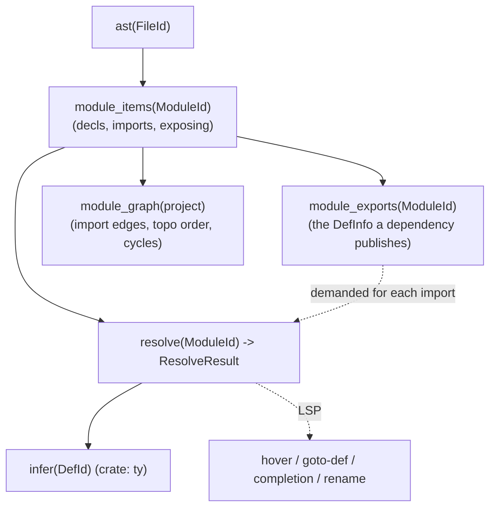
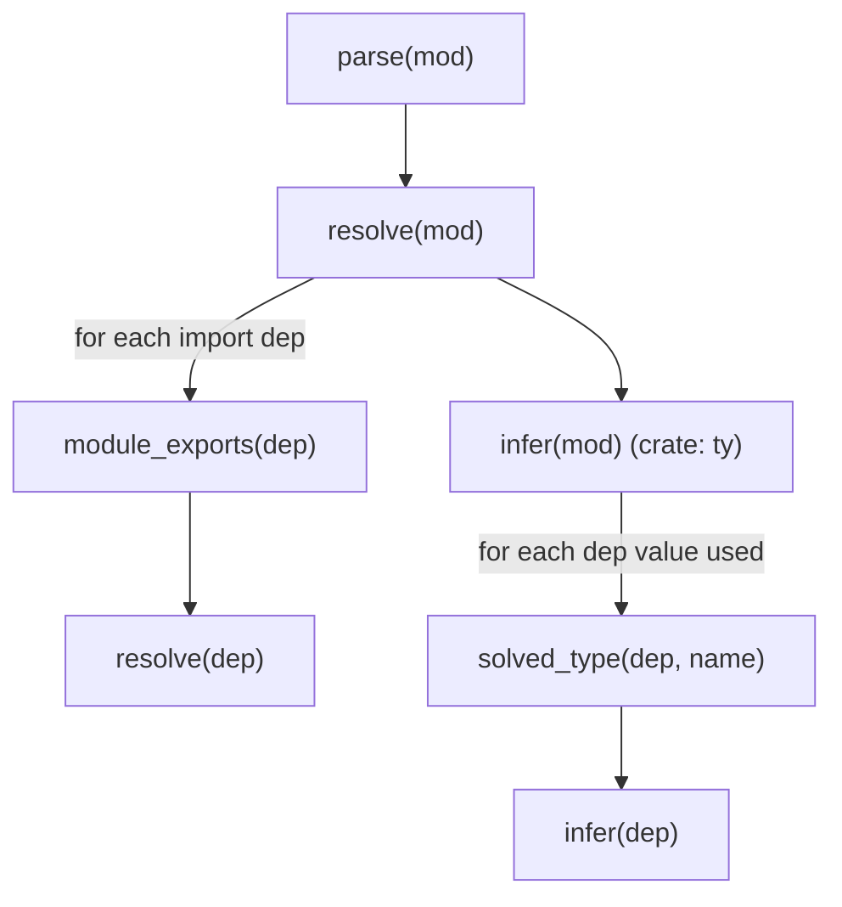

# 05 — Name Resolution (the `hir` crate)

The `hir` crate turns the lossless CST / typed AST view (from [`04`](04-syntax-lexer-parser.md))
into a **name-resolved High-level IR**: every identifier — value, constructor,
type, qualifier — is resolved to a `DefId` (or an explicit `Res::Error`), imports
are processed, qualifier-collision rules are applied, and cross-module visibility
is computed. It is the Rust successor to `Sky.Canonicalise.*`
(`src/Sky/Canonicalise/{Module,Environment,Expression,Pattern,Type}.hs`).

> **Implementation status (as of `rewrite/rust-compiler`).** Name resolution is
> **built** and behaviour-complete (M2: 0 resolver gaps; qualifier rules, E1001,
> DefId allocation, cross-module `module_exports` on demand). But the "salsa
> queries" framing here is the **target**: the running code lives in
> `rust/crates/hir` and threads through `hir::db::SourceDb` (a value-threaded
> `struct` with a `RefCell` exports cache), not memoised salsa `#[salsa::tracked]`
> queries. The db is deliberately structured so a salsa port is mechanical, and it
> already delivers the demand-driven `module_exports(dep)` lookup that replaces the
> 5-round fixpoint. See [`01`](01-architecture-overview.md) status.

The whole subsystem is expressed (in the target) as **salsa queries**, which is
the direct answer to three laws:

- **L1 (no globals).** Resolution is a query `resolve(db, ModuleId)`; the
  environment is a value threaded down the walk, never an `IORef` or a
  `globalCgEnv`. The Haskell canonicaliser is *already* pure by value (`Env` is
  threaded — `Environment.hs:14`), so this is a faithful port, not a rewrite of
  semantics.
- **L2 (demand-driven & incremental).** The current LSP bolts a **fixed 5-round
  canonicalise+solve fixpoint** onto the batch compiler
  (`Compile.hs:6453-6500`) *because the compiler cannot demand a single
  dependency's resolved view on its own*. We replace that whole loop with a
  proper demand-driven query graph. See [§8](#8-cross-module-visibility-without-the-fixpoint).
- **L6 (invariants in the type system).** `VarHome | CtorHome | TypeHome` become
  `enum`s whose every match arm is exhaustive; an unresolved name is a first-class
  `Res::Error(DefId)` value, not a silent fall-through to `VarLocal` (which is
  what `Expression.hs:149` does today and what leaks bogus Go to `go build`).

> **Compat contract.** This crate reproduces the Haskell canonicaliser's
> observable accept/reject behaviour **exactly**, including its quirks, and only
> then improves. Every quirk that user code relies on is catalogued in
> [§13](#13-compat-behaviours-that-must-be-preserved-exactly). Where the query
> model produces a *strictly better* result than the 5-round approximation (true
> convergence on deep alias chains), that is called out as a documented change,
> per [`00`](00-goals-and-principles.md) "Compat first, cleverness second".

---

## 1. The query surface



| Query | Signature (sketch) | Replaces |
|---|---|---|
| `module_items` | `fn(&db, ModuleId) -> ModuleItems` | `Src.Module` field access |
| `module_exports` | `fn(&db, ModuleId) -> ModuleExports` | `DepInfo` (`Module.hs:32`) — built **on demand**, not pre-passed |
| `module_graph` | `fn(&db, ProjectId) -> ModuleGraph` | `ModuleGraph.compilationOrder` (`ModuleGraph.hs:249`) |
| `resolve` | `fn(&db, ModuleId) -> ResolveResult` | `canonicaliseWithDeps` (`Module.hs:247`) |

`resolve` is the headline query. It returns partial results + diagnostics (L7):

```rust
pub struct ResolveResult {
    /// One resolved HIR body per top-level definition, keyed by its DefId.
    pub bodies:      IndexMap<DefId, hir::Body>,
    /// Everything this module *declares* (before export filtering).
    pub decls:       ModuleDecls,
    /// The scope map for LSP goto-def / hover (span -> Res).
    pub occurrences: Vec<(Span, Res)>,
    pub diagnostics: Vec<Diagnostic>,
}
```

Nothing throws; an unresolvable name lands in `bodies` as `Res::Error` **and**
in `diagnostics`, and the walk continues (L7, L8) — the current code already
does this for unqualified names by degrading to `VarLocal` (`Expression.hs:149`),
but silently; we make it explicit and diagnosed.

---

## 2. Interned identity — `Name`, `DefId`, `Res` (L3)

Today the canonicaliser keys everything on `String` and encodes "where a name
lives" with three parallel product types — `VarHome` (`Environment.hs:37`),
`CtorHome` (`Environment.hs:54`), `TypeHome` (`Environment.hs:45`). We collapse
these to one interned `DefId` space plus a resolution enum.

```rust
/// Interned symbol (smol_str). Replaces `String` keys everywhere.
#[derive(Copy, Clone, PartialEq, Eq, Hash)]
pub struct Name(salsa::Symbol);

/// A definition's stable identity. Arena-allocated, compared by ==.
/// Replaces name-string map keys AND the (home-module, name) pairs the
/// Haskell code carried inside VarHome/CtorHome/TypeHome.
#[derive(Copy, Clone, PartialEq, Eq, Hash, PartialOrd, Ord)]
pub struct DefId(u32);

pub struct DefLoc {
    pub module: ModuleId,
    pub name:   Name,
    pub kind:   DefKind,   // Value | Ctor | TypeCon | TypeAlias
    pub span:   Span,      // definition site, for goto-def
}
```

`DefId` is allocated in a per-project arena keyed by `(ModuleId, Name, DefKind)`
— the interner is append-only inside the `db` (the "register-on-first-mention"
pattern from [`01`](01-architecture-overview.md)). Walking `DefId`s in allocation
order is deterministic (L4).

**`Res` — the resolution outcome**, the enum a resolved reference points at. It
is the union of the three Haskell `*Home` types, made exhaustive (L6):

```rust
pub enum Res {
    /// Lambda/let/case-pattern binding. Carries the binding's HIR local id,
    /// not just "it's local" (today `VarLocal` is payload-free — Environment.hs:38).
    Local(LocalId),
    /// A top-level value defined in `module` (this module or an imported one).
    /// = VarTopLevel !ModuleName.Canonical (Environment.hs:39).
    Def(DefId),
    /// A stdlib kernel function: (kernel-module-name, function-name).
    /// = VarKernel !String !String (Environment.hs:40). Not a DefId because
    /// kernel fns have no Sky-source definition site to point goto-def at;
    /// they resolve to a runtime symbol (see §9).
    Kernel { module: Name, func: Name },
    /// A data constructor, with everything CtorHome carried (Environment.hs:54).
    Ctor(CtorRef),
    /// Resolution failed. Resolution continues; a diagnostic was emitted.
    /// This is the node the Haskell code lacked — it degraded to Local instead.
    Error,
}

pub struct CtorRef {
    pub def:     DefId,     // the constructor's own DefId
    pub type_:   DefId,     // the union type it belongs to  (_ch_type)
    pub index:   u16,       // constructor index in the union (_ch_index)
    pub arity:   u16,       // number of arguments            (_ch_arity)
    // The full union + annotation the Haskell CtorHome inlined (_ch_union,
    // _ch_annot) are recovered on demand via `union_of(db, type_)` — no need
    // to clone a whole Can.Union into every reference.
}
```

Type resolution mirrors this with `TypeRes { con: DefId, arity: u16 }` +
`AliasRef` (the successor to `TypeHome` / `AliasInfo`, `Environment.hs:45`/`67`).

---

## 3. The HIR

The resolved IR is the Rust successor to `Sky.AST.Canonical` (`Can.Expr_`,
`Can.Pattern_`, `Can.Type`). One-to-one with the Haskell constructors so the
type checker and lowerer port straight across, but every *name* slot is a `Res`
/ `DefId` rather than a re-decodable string pair.

```rust
pub enum Expr {
    // literals
    Int(i64), Float(f64), Str(Box<str>), Chr(Box<str>), Unit,
    List(Vec<ExprId>),
    Tuple(ExprId, ExprId, Vec<ExprId>),
    Record(IndexMap<Name, ExprId>),          // field order by _fieldIndex (L4)

    // references — the payload is the resolution, computed by `resolve`
    Var(Res),                                // was VarLocal/VarTopLevel/VarKernel
    Ctor(CtorRef),                           // was VarCtor
    Binop { op: Name, res: Res, lhs: ExprId, rhs: ExprId },

    // structure
    Negate(ExprId),
    Lambda { params: Vec<PatId>, body: ExprId },
    Call(ExprId, Vec<ExprId>),
    If(Vec<(ExprId, ExprId)>, ExprId),
    Let  { def: DefId, body: ExprId },       // Can.Let
    LetRec { defs: Vec<DefId>, body: ExprId },
    LetDestruct { pat: PatId, val: ExprId, body: ExprId },
    Case(ExprId, Vec<CaseBranch>),
    Accessor(Name),
    Access(ExprId, Spanned<Name>),
    Update { base: ExprId, fields: IndexMap<Name, ExprId> },
}

pub enum Pattern {
    Anything, Var(LocalId), Unit,
    Bool(bool), Chr(Box<str>), Str(Box<str>), Int(i64),
    Record(Vec<Name>),
    Alias(PatId, LocalId),
    Tuple(PatId, PatId, Vec<PatId>),
    List(Vec<PatId>),
    Cons(PatId, PatId),
    Ctor(CtorRef, Vec<PatId>),               // was PCtor { _p_home, _p_type, ... }
}

pub enum Type {
    Var(Name),
    Con { con: TypeRes, args: Vec<TypeId> }, // was TType !home !name [Type]
    Lambda(TypeId, TypeId),
    Tuple(TypeId, TypeId, Vec<TypeId>),
    Record(IndexMap<Name, FieldType>, Option<Name>),  // row-ext var preserved
    Alias { alias: AliasRef, args: Vec<(Name, TypeId)>, body: AliasBody },
    Unit,
}
```

`AliasBody = Filled(TypeId) | Hoisted(TypeId)` mirrors `Can.AliasType`.
Note `hir::Type::Alias` carries both the applied args **and** the substituted
body — the eager-expand-but-keep-identity trick from `expandTypeAliases`
(`Module.hs:2251`) that lets HM both unfold a record alias for row unification
and preserve nominal alias identity. That pass ports verbatim ([§11](#11-head-position-alias-unfolding--alias-expansion)).

Float patterns are rejected (`Pattern.hs:85` `error "Float patterns not
supported"`) — in Rust this is a diagnostic + `Pattern::Anything` recovery, not a
panic.

---

## 4. The resolver & scopes

`resolve` builds a **module environment** (the successor to `Env`,
`Environment.hs:14`) once, then walks each top-level body with a **scope stack**
layered on top. The module env is immutable during the walk; scopes are pushed
and popped.

```rust
struct Resolver<'db> {
    db:      &'db dyn HirDb,
    module:  ModuleId,
    // ---- module-level namespaces (built once from imports + local decls) ----
    vars:    FxHashMap<Name, Res>,                 // Env._vars   (unqualified values, incl. exposed imports)
    types:   FxHashMap<Name, TypeRes>,             // Env._types
    ctors:   FxHashMap<Name, CtorRef>,             // Env._ctors
    aliases: FxHashMap<Name, AliasRef>,            // Env._aliases
    qual_vars:  FxHashMap<Name, FxHashMap<Name, Res>>,     // Env._qualVars
    qual_ctors: FxHashMap<Name, FxHashMap<Name, CtorRef>>, // Env._qualCtors
    import_aliases: FxHashMap<Name, ModuleId>,     // Env._importAliases
    kernel_mods:    FxHashMap<Name, Name>,         // Env._kernelMods
    // ---- lexical scope, pushed/popped during the walk ----
    scopes:  Vec<FxHashMap<Name, LocalId>>,
    diags:   Vec<Diagnostic>,
}
```

`FxHashMap` is fine here — these maps never *iterate into emitted output*, only
answer point lookups (L4 permits `HashMap` for internal caches). Anything whose
iteration reaches emission uses `IndexMap` / `BTreeMap`.

### Scope kinds

The Haskell canonicaliser has no scope stack; it threads a fresh `Env` by value
and extends `_vars` with `VarLocal` entries via `addLocals` (`Environment.hs:150`).
We keep the same *semantics* with an explicit push/pop, which shadows correctly
because inner-scope lookups are checked first:

| Scope | Introduced by | Haskell site |
|---|---|---|
| Module | imports + top-level decls (built once) | `env0..env4`, `Module.hs:334-355` |
| Value params | `f x y = …` params | `bodyEnv = addLocals paramNames`, `Module.hs:1973` |
| Lambda | `\x -> …` | `Expression.hs:71-76` |
| Nested def | `let f x = …` params | `Expression.hs:490-497` |
| Case arm | pattern binders | `Expression.hs:520-526` |
| `let` group | **all** binders of the group | `Expression.hs:352-374` |

Lookup precedence (encapsulated in `lookup_var`): innermost scope → … →
outermost scope → module `vars`/`ctors`. This is exactly what `addLocals` +
`Map.insert` (overwrite-wins) achieve today: a local shadows a top-level or a
built-in of the same name.

```rust
fn lookup_var(&self, name: Name) -> Res {
    for scope in self.scopes.iter().rev() {
        if let Some(&loc) = scope.get(&name) { return Res::Local(loc); }
    }
    // ctors are checked before plain vars — matches resolveVar (Expression.hs:130)
    if let Some(c) = self.ctors.get(&name) { return Res::Ctor(c.clone()); }
    if let Some(r) = self.vars.get(&name)  { return *r; }
    Res::Error   // ← diagnosed by the caller; NOT silently Local (fix vs Expression.hs:149)
}
```

### `let` is forward-referencing (mutual recursion)

The single most important scope rule to preserve: **every binder in a `let`
group is in scope for every RHS in the group and for the body.**
`Expression.hs:360-370` collects `allNames = concatMap nameFromDef defs`, builds
`letEnv = addLocals allNames env`, and uses `letEnv` for *both* the RHS bodies
and the `in` body. The compat note in CLAUDE.md ("`let a = b + 1; b = 5 in a`
now compiles") depends on this.

```rust
fn resolve_let(&mut self, defs: &[ast::Def], body: &ast::Expr) -> ExprId {
    self.push_scope();
    for d in defs { self.bind_all(d.bound_names()); }   // ALL binders first
    let hir_defs = defs.iter().map(|d| self.resolve_def(d)).collect(); // RHS see the whole group
    let hir_body = self.resolve_expr(body);
    self.pop_scope();
    // LetRec vs Let is a codegen concern; a dependency SCC pass (below) picks it.
    self.mk_letrec(hir_defs, hir_body)
}
```

Note the ordering split: the current `dependencySortDefs` pass
(`Expression.hs:396-428`) re-orders let bindings for Go codegen friendliness and
leaves cycles in source order — that is a **lowering** concern, not resolution.
It moves to the `lower` crate ([`07`](07-lowering-and-ir.md)); resolution only
records the mutual-visibility scope and the SCC grouping (`Let` vs `LetRec`).

---

## 5. Building the module environment — imports

`resolve` builds the module namespaces by folding over imports (successor to
`processImport`, `Module.hs:565`), then registering local decls
(`registerTopLevelNames`/`registerUnions`/`registerAliases`,
`Module.hs:1869/1877/1918`). Order (from `Module.hs:334-355`): initial builtins →
imports → top-level names → unions+ctors → aliases. Local names are registered
**after** imports, so a local top-level shadows an exposed import of the same
name (last-`Map.insert`-wins, `addExposed` `Environment.hs:166`).

Each import contributes from exactly one of three sources, with a fixed
precedence:

```rust
enum ImportSource {
    Dep(ModuleId),   // a user/stdlib Sky-source module (has module_exports)
    Kernel(Name),    // a Go-implemented kernel module (Std.Db, Sky.Core.List…)
    Unknown,         // neither: trust the import, resolve leniently
}
```

**FFI-over-kernel precedence** (`Module.hs:594-623`): when an import path matches
*both* a Sky kernel module *and* a Go FFI dep with real bindings, the FFI/dep
binding wins (`useDep = hasDepBindings`, `useKernel = isKernel && not useDep`).
The motivating case is `import Os`: Sky's kernel once claimed `Os`, and Go's
`os` package binds under alias `Os`; the FFI wins. This must port exactly.

For a `Dep`, we do **not** clone the dependency's unions into the importer.
Instead we ask `module_exports(dep)` (the salsa successor to `DepInfo`) and pull
`CtorRef`s / `Res::Def`s from it — this is the seam that makes cross-module
visibility a demand-driven query ([§8](#8-cross-module-visibility-without-the-fixpoint)).

Constructor contribution mirrors `Module.hs:627-636`: for each exposed union,
each constructor becomes a `CtorRef { def, type_, index, arity }` bound under its
bare name. Record aliases contribute an **auto-constructor** value binding
(`Module.hs:642-648` `depVars`; locally `registerAliases` `Module.hs:1939`) so
`Piece kind colour` and `Decode.succeed UserProfile` resolve — Elm's
`type alias Foo = { … }` ⇒ `Foo : … -> Foo` convention.

---

## 6. The qualifier-collision rule (explicit-alias-wins)

Every non-aliased `import M exposing (…)` also registers `M`'s last segment as an
auto-qualifier — CLAUDE.md (v0.17.5+):

> `import Sky.Core.Prelude exposing (..)` binds `Prelude.<name>` too.

Two imports MAY both try to bind the same qualifier. The resolution is
`effectiveQualifier` (`Module.hs:976-991`), shared between the binding pass
(`processImport`) and the collision gate (`detectImportAliasCollisions`) so they
never disagree:

```rust
/// Port of effectiveQualifier (Module.hs:976).
/// `claims` = every explicit `import M as X` as X -> canonical(M).
fn effective_qualifier(claims: &FxHashMap<Name, ModuleId>, imp: &Import)
    -> Option<Name>                      // None = auto-qualifier suppressed
{
    match imp.alias {
        Some(alias) => Some(alias),      // explicit alias always binds
        None => {
            let last = imp.segments.last();
            match claims.get(&last) {
                // a DIFFERENT module already explicitly claimed this qualifier:
                Some(&claimed) if claimed != imp.module => None,   // suppress; explicit wins
                _ => Some(last),
            }
        }
    }
}
```

The three cases CLAUDE.md pins, reproduced exactly:

1. **Explicit alias wins.** `import Std.Db as Db` + bare `import Lib.Db exposing
   (conn)`: `Db.<x>` → `Std.Db`; `conn` (unqualified) → `Lib.Db`. The bare
   import's `Db` auto-qualifier is **suppressed silently** (`effective_qualifier`
   returns `None`; `processImport` skips the qualifier binding but *still* adds
   the exposing names to scope — `Module.hs:650-661`). No diagnostic.
2. **Two bare, different modules → E1001.** `import State` + `import App.State`
   both auto-register `State` for different canonical modules; no explicit alias
   breaks the tie. Emit:
   `Import error: two imports both bind the qualifier "State"` + a fix-it
   suggesting `import App.State as AppState` (`Module.hs:1067`, `formatClash`).
3. **Two explicit `as X` for different modules → E1001.** User error; no
   disambiguation possible.

Non-collisions that must **not** fire (`Module.hs:830-855`, `detectImportAliasCollisions`):

- **Same-module double import** (`import Std.Ui as Ui` + `import Std.Ui exposing
  (Element)`) — both resolve to the same canonical module; `claimed ==
  imp.module`, so no suppression and no clash.
- **Kernel path aliasing** (`import Sky.Core.Time` + `import Std.Time`) — both
  fold onto the kernel pseudo-module `Time` (`src = kernelMods[path] ?? path`,
  `Module.hs:1024`), so distinct import paths that name the same kernel dispatch
  table don't count as two sources.

```rust
fn detect_qualifier_collisions(&self, imports: &[Import]) -> Vec<Diagnostic> {
    let claims = explicit_alias_claims(imports);             // Module.hs:950
    let mut by_qual: IndexMap<Name, Vec<(CanonSrc, Span, ModulePath)>> = default();
    for imp in imports {
        if let Some(q) = effective_qualifier(&claims, imp) { // suppressed => contributes nothing
            let src = self.kernel_mods.get(&imp.path).copied()  // kernel collapse
                          .unwrap_or(CanonSrc::Path(imp.path));
            by_qual.entry(q).or_default().push((src, imp.span, imp.path));
        }
    }
    by_qual.iter()
        .filter(|(_, g)| distinct_sources(g).len() >= 2)     // >=2 distinct canonical sources
        .map(format_clash)                                    // "two imports both bind the qualifier"
        .collect()
}
```

> **Diagnostic-code note (compat call-out).** CLAUDE.md labels this "[E1001]",
> but in the current code `E1001 = canonE_UndefinedName` (`Diagnostic.hs:169`)
> and the qualifier collision actually travels the *legacy String* path
> (`Module.hs:392-393` returns `Left err`, never a typed `DiagCode`). The rewrite
> should give the collision its own structured code (natural fit:
> `E1002 = AmbiguousName`, or a new `E1005 = QualifierCollision`) **while keeping
> the message text byte-for-byte** — `Import error: two imports both bind the
> qualifier "X"`. User-facing text is the compat surface; the code string is an
> improvement.

---

## 7. Exposing, re-export, and import-hiding

`module_exports(ModuleId)` is the successor to `DepInfo` (`Module.hs:32`) and to
`filterDepByExports` (`Module.hs:51`). It returns exactly what a dependency
publishes, already narrowed by that dependency's own `exposing` clause:

```rust
pub struct ModuleExports {
    pub module:    ModuleId,
    pub unions:    Vec<ExportedUnion>,      // (type DefId, type vars, ctor DefIds+arities)
    pub aliases:   Vec<DefId>,              // exported alias names
    pub alias_defs: IndexMap<Name, hir::Type>, // alias bodies, for cross-module expansion
    pub values:    Vec<DefId>,              // exported top-level value names
    pub exposing:  Exposing,                // ExportEverything | ExportExplicit(set)
}
```

Extraction is the projection at `Module.hs:6463-6476` / `Module.hs:2431`
(`collectDepAliases`): `unions ← _unions`, `alias_defs ← _aliases` (bodies are
load-bearing — the cross-module alias fix), `values ← decl names`, `exposing ←
_exports`. The **type vars per union are load-bearing** (`Module.hs:34-39`): a
cross-module `Box x` must scheme as `forall a. a -> Box a`, else HM rejects
`Box vs Box a`. `module_exports` therefore keeps `Can._u_vars`.

`Exposing::ExportEverything` is the no-op fast path (`filterDepByExports`
`Module.hs:52`); `ExportExplicit` keeps only listed names.

### Import-hiding validation (E1004)

`import M exposing (a, B(..), C(Ctor1))` must name things `M` actually exports —
`checkImportExposingAgainstDep` (`Module.hs:484-554`). Reproduce exactly:

- Kernel imports skip the check (their surface is the kernel registry, not a
  parsed module) — `Module.hs:496`.
- A value/type not exported → `module "M" does not expose "n"`.
- `Type(Ctor)` where `Ctor` isn't a real constructor → `exposes type "T" without
  constructor "c"`.

**Kernel-implicit Prelude types (#576) — must preserve.** `Decoder`, `Value`,
`Attribute`, `Handler`, `Middleware`, `Session`, `Store`, `Route`, `VNode`,
`Request`, `Response`, `Cmd`, `Sub`, `Db`, `Error` are globally-available
runtime types with no `type alias` in any `.sky` source. Listing one in
`exposing (…)` is **redundant but accepted as a no-op** (`isKernelImplicitType`,
`Module.hs:520-524`) — `import Std.Db.Decode exposing (Decoder, …)` must *not*
error. Port the list verbatim.

### Exposing collisions (used-unqualified ambiguity — E1002)

Two imports may both expose the same unqualified name. This is **tolerated** as
long as the name is never *used* unqualified without a local shadow — exactly
Elm's rule. `detectExposingCollisions` (`Module.hs:1120`) builds name → distinct
sources; `checkAmbiguousUses` (`Module.hs:1173`) walks bodies and only errors if
an ambiguous name is referenced unqualified *and* not locally defined. Sources
that normalise to the same kernel module are one origin (re-exports never
collide). Fix-it: `add "as <Alias>" to one import and call it qualified`.

---

## 8. Cross-module visibility without the fixpoint

This is the section that pays for the whole rewrite.

### What the current 5-round loop compensates for

`typecheckWorkspace` (`Compile.hs:6257-6522`) runs a **fixed 5-round**
canonicalise+solve over the *entire* workspace (`Compile.hs:6453-6500`):

```haskell
        maxRounds = 5 :: Int
        rounds depMap externals iter
            | iter >= maxRounds = runRound depMap externals
            | otherwise = do
                results <- runRound depMap externals
                let canons  = [ (n, cm) | (n, Right (cm,_,_), _,_,_) <- results ]
                    solved  = [ (n, ts) | (n, Right (_,ts,_), _,_,_) <- results ]
                    nextDepMap    = buildDepMap canons
                    nextExternals = buildCrossModuleExternalsWithMods canons solved
                rounds nextDepMap nextExternals (iter + 1)
```

Two artifacts thread round-to-round, feeding two ordering-sensitive resolutions:

- **`depMap :: Map String DepInfo`** — feeds `canonicaliseWithDeps`. Fixes
  **Bug 2**: `Std.Webview.AppCfg`'s alias body references `Html` from
  `Std.Html`; in a single pass `Html` freezes as nullary `TType "Html" []`
  because `Std.Html`'s exports weren't available yet, so downstream `view :
  Model -> Html` loses its `msg` param.
- **`externals :: Map (String,String) Annotation`** — feeds constrain/solve
  (`buildCrossModuleExternalsWithMods`, `Compile.hs:11195`). Fixes **Bug 1**:
  an unannotated wrapper `exec q args = …` over `Db.exec` infers as
  fully-polymorphic under empty externals, then poisons callers with spurious
  `String vs List a`.

Both are **demand/ordering failures**: a module needs a *resolved-and-solved*
view of its dependencies, which only exists after those deps are resolved with
*their* deps. The loop brute-forces it — recomputing **every** module 5× whether
or not its inputs changed, because it has *no dependency tracking*. 5 is
empirical (covers the observed 2–3-hop chains; the CLI's convergence-checked
loop caps at 16 and settles in 2–4). The `DepInfo` extraction is duplicated in
**four** places (`Compile.hs:6362`, `6463`, `3417`, `Index.hs:653`) — the "keep
in sync" comment at `Index.hs:651` is itself the smell.

### The query graph that replaces it

Make each threaded artifact a **tracked query**. Salsa then orders,
memoises, and recomputes exactly the demanded slice.



- `resolve(A)` demands `module_exports(B)` for each `import B` — the DefInfo
  successor. `module_exports(B)` demands `resolve(B)` (it reads B's canonical
  decls + exposing). No pre-pass, no `depMap` threading: the dependency edge
  *is* the query call.
- `infer(A)` demands `solved_type(dep, name)` for each cross-module value it
  references — the `externals` successor. `solved_type` demands `infer(dep)`.
- **No topo sort, no fixed round count.** Salsa executes dependencies first
  because a query blocks on the queries it calls; results memoise; editing file
  B invalidates only queries that transitively read B (L2).
- **Genuine import cycles** (mutually-recursive modules) surface as *salsa
  cycles* — handled by salsa's cycle recovery with a real diagnostic — instead
  of being silently under-iterated. The DFS `topoSort` (`ModuleGraph.hs:256`)
  today tolerates cycles by arbitrary ordering with no error; the query model is
  strictly better here.

The pure helpers the loop calls port **unchanged**, because they operate on
already-canonical data — only their *inputs stop being recomputed redundantly*:
`buildCrossModuleExternalsWithMods` + `buildGlobalTypeHomeMap`/`fixupHomes`
(`Compile.hs:11195-11230`, the `Model vs Model` home-fixup), and the alias
machinery of [§11](#11-head-position-alias-unfolding--alias-expansion).

> **Documented behaviour change (a correctness *improvement*).** The 5-round
> count silently truncates alias/dep chains deeper than ~3 hops; the query graph
> converges *fully*. This can only make a previously-wrong deep chain right. Per
> [`00`](00-goals-and-principles.md), we note it: validate against the Haskell
> oracle on the corpus (chains at issue: `Std.Db` 2-hop, `Std.Webview →
> Std.Html → Sky.Core.Html` 3-hop, the `Std.Live` multi-alias chain). Any
> divergence is the query model being *more* correct, and is recorded, not
> hidden.

> **LSP/CLI unification (L2).** The LSP needed a *separate* fixpoint at all only
> because the CLI's phases write to stdout (the JSON-RPC transport) and mutate a
> shared `scopeStateRef` IORef (`Compile.hs:6400-6405`). With resolution as a
> pure query over `db`, the LSP and CLI are two drivers over the **same**
> queries — the entire reason a bespoke LSP fixpoint existed evaporates.

---

## 9. Kernel & FFI qualifier resolution

Qualified references resolve through a fixed fallback chain — the successor to
`resolveQualVar` (`Expression.hs:153-189`). Order:

1. qualified constructor (`qual_ctors[qual][name]`),
2. qualified value (`qual_vars[qual][name]`),
3. **kernel-module registry** (`kernel_mods[qual]` → `Res::Kernel { module, name }`),
4. import alias (`import_aliases[qual]` → `Res::Def` in that module),
5. last-resort `Res::Def` in a literal `Canonical qual` module (today) — in the
   rewrite this final arm becomes a **diagnosed `Res::Error`** (see [§10](#10-error-recovery--diagnostics)).

Step 3 is the crux for bare kernel qualifiers: `Crypto.sha256` with **no**
`import Crypto` resolves because `Crypto ∈ kernel_mods`
(`Expression.hs:184-185`). Without it the lowerer would emit `Crypto_sha256(...)`
un-prefixed and `go build` fails.

`kernel_mods` is the merged **static ∪ FFI** map (`Module.hs:256`
`Map.union staticKernelModules ffiKernelMods`, static wins on collision). The
static table is `staticKernelModules` (`Environment.hs:348-503`) — both full
paths (`Sky.Core.List → List`, `Std.Db → Db`, `Sky.Core.Prelude → Basics`) and
bare aliases (`List → List`, `Db → Db`) so `List.map` works unqualified. The FFI
half is pinned/committed FFI surface (see [`09`](09-runtime-and-ffi.md)); it
enters the query graph as a salsa **input** (`ffi_surface`), so `kernel_mods`
is a derived query, never a global. Deliberate omissions to preserve: `Args`,
`Os`, `Slog`, `Env`, `Sha256`, `Hex` are gone; `Os → System` renamed (bare `Os`
reserved for Go FFI); `Std.Html*`, `Std.Css`, `Std.Db.Decode`, `Std.PubSub` are
Sky-source Layer-3 modules and intentionally absent so the kernel registry never
shadows a parsed module.

The static per-module kernel **function** lists live in `staticKernelFunctions`
(`Module.hs:1752-1861`) and are merged with FFI kernel functions
(`Module.hs:822-827`); these drive `exposing (..)` on a kernel import and the
ambiguity check. Port both tables as data.

---

## 10. Prelude autoload & builtins

Two mechanisms, both seeded into the module env before any import (successor to
`initialEnv`, `Environment.hs:86-98`):

1. **Unconditional builtins.** `initialEnv` seeds `vars`, `types`, `ctors`, and
   `qual_vars` from `builtinVars` / `builtinTypes` / `builtinCtors` /
   `preludeQualVars` regardless of imports:
   - `builtinVars` (`Environment.hs:212`): `identity`, `always`, `not`,
     `toString`, `modBy`, `clamp`, `fst`, `snd`, `errorToString`, `println`,
     `js` — all `Res::Kernel`.
   - `builtinTypes` (`Environment.hs:229`): `Int/Float/Bool/String/Char` (arity
     0), `List/Maybe` (1), `Result/Task` (2), `Error` (0, auto-imported from
     `Sky.Core.Error` so `Result Error a` needs no import).
   - `builtinCtors` (`Environment.hs:249`): `True/False`, `Just/Nothing`,
     `Ok/Err` with their full unions + annotations.
   - `preludeQualVars` (`Environment.hs:105-140`): auto-qualifiers `String.*`,
     `List.*`, `Dict.*`, `Set.*`, `Maybe.*`, `Result.*`, `Basics.*`, `Cmd.*`,
     `Sub.*`, `Task.*` without an explicit `import`.
2. **The explicit Prelude import.** Templates emit `import Sky.Core.Prelude
   exposing (..)` (`app/Main.hs:1612`); `Sky.Core.Prelude → Basics` in
   `kernel_mods` (`Environment.hs:453`), pulling the full `Basics` surface.

CLAUDE.md pins the autoloaded set: `Result (Ok/Err)`, `Maybe (Just/Nothing)`,
`identity`, `not`, `always`, `fst`, `snd`, `clamp`, `modBy`, `errorToString`.
Reproduce the tables as data (they change rarely; a diff against the Haskell
lists is a CI check).

**Prelude-shadow gate (v0.15.42 §3.2).** A user `type Result a = Just a |
Nothing` silently rebinds `Just`/`Nothing`/`Result` everywhere downstream — a
soundness regression. `detectPreludeShadowing` (`Module.hs:872-943`) hard-errors
any user union whose **type name or constructor name** collides with a
Prelude-exposed name (`Int/…/Error`, `True/False/Just/Nothing/Ok/Err`), carving
out the protected name's own canonical home (`Sky.Core.Maybe` may define
`Maybe`). Port with the same home carve-out and message shape.

---

## 11. Head-position alias unfolding & alias expansion

Two pure passes over already-canonical types, both porting unchanged.

**Head-position unfold** (`unfoldHeadAlias`, `Module.hs:2036-2046`, applied at
`Module.hs:1999`). When a value's whole annotation is a type alias whose body is
a function — the canonical `f : Handler` where `type alias Handler = Request ->
Task Error Response` — the raw canonical form is a nominal `Con` that
`arrow_args` can't peel, so params would be dropped and the body checked against
the unpeeled alias. `unfoldHeadAlias` peels **only the head** (arg/return leaves
stay nominal), with a `(home, name)` visited-set guarding mutually-recursive
alias chains. `arrow_args`/`arrow_result_n` (`Module.hs:2019/2052`) likewise
unwrap a `TAlias` head when splitting params from the return type. This is
contributor PR #123 (v0.16.4) and CLAUDE.md's `Handler` alias note; it must
behave identically so `myHandler : Handler` keeps its `req` parameter.

**Module-level alias expansion** (`expandTypeAliases` / `expandModuleAliases`,
`Module.hs:2215-2289`). Rewrites nominal `Con(alias, args)` into
`Type::Alias { args, body: Filled(subst) }` — eagerly unfolding for HM row
unification *while preserving* alias identity. Keyed by `(home, name)` via
`AliasMap` (`Module.hs:2165`) with a unique-body bare-name fallback
(`lookupAlias`, `Module.hs:2202`) — the two-index design that closed #350
(two deps each exposing `Model` must not collapse to one body) and #361 (a
qualified type transiting a re-exporting intermediate module). `collectDepAliases`
(`Module.hs:2431`) supplies dep alias bodies; in the query model these come from
`module_exports(dep).alias_defs`. Parametric aliases substitute vars → call-site
args before wrapping. Preserve the `(home,name)` keying and the unique-body
fallback exactly — the `Model vs Model` class depends on it.

---

## 12. Error recovery & diagnostics (L7, L8)

Resolution never aborts. Each failure emits a `Diagnostic` (structured value: span,
code, severity, hint, optional fix-it) and yields a recovery node so the walk
continues and the LSP still gets a full occurrence map on broken code.

| Failure | Recovery node | Diagnostic | Haskell site |
|---|---|---|---|
| Unbound unqualified name | `Res::Error` (today: silent `VarLocal`) | `E1001` "Undefined name: X" + typo hint | `Module.hs:1271`, `Expression.hs:149` |
| Qualified, module known but name not exported | `Res::Error` | "Module M is imported but does not export N" | `Module.hs:1309-1340` |
| Unknown qualifier | `Res::Error` | "Module M is not imported / not a known kernel module" + did-you-mean | `Module.hs:1342-1373` |
| Unknown ctor pattern | `Pattern::Var` (bind as var) | none (Elm-compatible) | `Pattern.hs:116` |
| Unknown qualified ctor pattern | `Pattern::Anything` (today: `error`/panic) | hard error → diagnostic | `Pattern.hs:139` |
| Float pattern | `Pattern::Anything` (today: panic) | "Float patterns not supported" | `Pattern.hs:85` |

**Did-you-mean.** `suggestQualifier` + `levenshtein` (`Module.hs:1551-1585`):
for an unknown qualifier, suggest the closest known qualifier (kernel modules ∪
import aliases ∪ `qual_vars`/`qual_ctors` keys) within edit-distance 2; emit
nothing if none — silence beats a misleading hint. This edit-distance-2 rule +
the candidate set port verbatim; the `strsim` crate replaces the hand-rolled DP.

**The unknown-qualifier gate is load-bearing (v0.15.42 §3.1).** Today
`NotARealModule.foo` where the qualifier is neither kernel, alias, nor in the
qual maps used to fall through `resolveQualVar`'s final arm to
`VarTopLevel (Canonical "NotARealModule") "foo"`, emitting bogus Go that
`go build` rejected with `undefined: NotARealModule_foo`. The rewrite makes that
final arm ([§9](#9-kernel--ffi-qualifier-resolution) step 5) emit `Res::Error` +
this diagnostic directly — the Sky-layer fence stays.

**Dedup.** `foo` unbound 12× reports once (`dedupeByNameTop`, `Module.hs:1599`).
The LSP one-diagnostic-per-identifier split (`multiErrorSeparator`,
`Module.hs:120`) is a legacy String-packing hack that the structured `Vec<Diagnostic>`
return type makes obsolete — one `Diagnostic` per site, natively.

---

## 13. Compat behaviours that must be preserved exactly

Every row is a quirk user code (or the corpus) relies on. Differential-tested
against the Haskell oracle ([`11`](11-testing-and-verification.md)).

| # | Behaviour | Pinned by |
|---|---|---|
| C1 | Explicit-alias-wins: bare import's last-segment qualifier suppressed silently when an explicit `as X` claims it; exposing names still bind | CLAUDE.md v0.17.5; `Module.hs:589-661`, `976-991` |
| C2 | Two bare / two explicit-alias different-module qualifier clash → "two imports both bind the qualifier X" + `as <Alias>` fix-it | CLAUDE.md; `Module.hs:1067` |
| C3 | Same-module double import & multi-path kernel import never collide (kernel collapse to pseudo-module) | `Module.hs:1024`, `830-855` |
| C4 | FFI-over-kernel precedence (`import Os` → Go `os`, not kernel) | `Module.hs:594-623` |
| C5 | Bare kernel qualifier resolves with no import (`Crypto.sha256`) | `Expression.hs:184`; `Environment.hs:348` |
| C6 | `let` group: all binders visible to all RHS + body (forward refs) | `Expression.hs:360-370` |
| C7 | Local shadows exposed import shadows builtin (last-insert-wins) | `Environment.hs:166`; `Module.hs:349` |
| C8 | Ctor checked before var on unqualified lookup | `Expression.hs:130` |
| C9 | Record alias auto-constructor (`type alias Foo = {…}` ⇒ `Foo` value binding) | `Module.hs:1939`, `642-648` |
| C10 | Cross-module ctor keeps its union type vars (`Box x : Box a`) | `Module.hs:34-39`, `727-743` |
| C11 | Exposing collision tolerated unless used unqualified & unshadowed (E1002) | `Module.hs:1120`, `1173` |
| C12 | Kernel-implicit Prelude types accepted as no-op in `exposing (…)` (#576) | `Module.hs:520-524` |
| C13 | Import-hiding rejects non-exported names; kernel imports skip the check | `Module.hs:484-554` |
| C14 | Prelude-shadow gate hard-errors user `Result`/`Just`/… with home carve-out | `Module.hs:872-943` |
| C15 | Head-position alias unfold keeps params (`f : Handler`) | `Module.hs:1999`, `2036` |
| C16 | Alias expansion `(home,name)`-keyed + unique-body fallback (#350/#361) | `Module.hs:2165-2213`, `2251` |
| C17 | Unknown-qualifier gate + edit-distance-2 did-you-mean; silent when no candidate | `Module.hs:1342-1373`, `1551-1585` |
| C18 | Unbound-name dedup (one report per name) | `Module.hs:1599` |
| C19 | Auto-imported `Error` type from `Sky.Core.Error` | `Environment.hs:244` |
| C20 | `main` special-cased as Go `func main()` (resolution keeps the name; emission handles it) | CLAUDE.md "Go reserved-name rewriting"; codegen ([`08`](08-go-codegen.md)) |

Two behaviours we deliberately **change** (documented, oracle-validated):

- **D1** — Deep alias/dep chains converge fully (query graph) instead of
  truncating at 5 rounds ([§8](#8-cross-module-visibility-without-the-fixpoint)).
- **D2** — Unresolved names become explicit `Res::Error` + diagnostic instead of
  silent `VarLocal` fall-through; observable diagnostics are additive, never
  fewer than today.

---

## 14. Determinism & module budget (L4, L5)

- `ResolveResult.bodies` is an `IndexMap` keyed by `DefId` in allocation order;
  `occurrences` is source-order. No `HashMap` iteration reaches the HIR that
  feeds lowering/emission. The internal resolver maps are `FxHashMap` (point
  lookups only, never iterated into output).
- Record fields carry `_fieldIndex` and are stored `IndexMap`/index-sorted, per
  the non-regression rule "Record field enumeration sorts by `_fieldIndex`".
- The `hir` crate is `#![forbid(unsafe_code)]` and sits below `ty` in the DAG
  ([`02`](02-workspace-and-crates.md)). Split points if it exceeds budget:
  `resolve` (walk), `imports` (env building + qualifier rules), `exports`
  (`module_exports`), `aliases` (expansion) — each a submodule with one
  responsibility.

---

## 15. Open questions (resolve before coding)

1. **`_qualTypes` asymmetry.** The Haskell `Env` has a `_qualTypes` field that is
   *never populated* and has *no lookup function* (`Environment.hs:21`); qualified
   types resolve through `aliasMap` in `Type.hs:131` instead. Decide: unify
   qualified-type resolution into `qual_*` maps in the rewrite (cleaner) vs.
   mirror the two-path Haskell shape (safer for exact compat). Lean unify, gate on
   the oracle.
2. **`Res::Error` vs recovery aggressiveness.** How far does an `Error`
   propagate before `infer` should stop reporting cascades? Coordinate the
   recovery contract with [`06`](06-type-system.md) so one unbound name doesn't
   produce a wall of downstream type errors.
3. **Salsa cycle policy for genuine import cycles.** Pick salsa's
   `cycle_fn`/recovery so a real module cycle yields one clear diagnostic, not a
   panic — and confirm the corpus contains a mutually-recursive-module fixture
   (today's DFS silently tolerates it; we must reject or support it *deliberately*).
4. **FFI surface as input granularity.** `ffi_surface` as one big input
   invalidates all `kernel_mods` consumers on any FFI change. Per-package inputs
   keep incrementality tighter — coordinate with [`09`](09-runtime-and-ffi.md).
