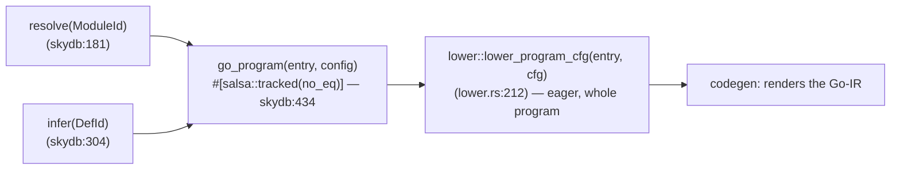

# 07 — Lowering & the Typed Go-IR

The `lower` crate turns **typed Sky** (name-resolved HIR + the `infer` type
table) into a **typed Go-IR** — a Rust data structure where *every node already
carries its Go type*. Codegen ([`08`](08-go-codegen.md)) then walks that IR and
prints Go without re-deriving a single type.

This doc is the concrete design of law **L9 — a typed lowering IR; coercion is
the exception**. It is also where **L4** (deterministic fresh-name generation),
**L3** (interned ids drive iteration order), and the TCO/DCE memory story live.

> **Implementation status.** The typed IR is
> **partly built**: `rust/crates/lower/src/ir.rs` does carry a structural `GoTy`
> on every `GoExpr` (the L9 spine is real, and it is why the corpus builds+runs).
> But the target's stronger claims below — *"coercion is the exception"*, *"no
> `Raw(String)`"*, *"no widen-to-`any`"*, structural Go-generics on record
> aliases, and sealed-interface ADT emission that deletes residual coerce classes
> 1/2/3/4/6/8 — describe the **destination**, not the current milestone. What the
> code does today:
>
> - **A `Widen` node exists** (`ir.rs`, `GoExprKind::Widen`) and codegen renders
>   it as `any(x)` (`rust/crates/codegen/src/lib.rs`). So `Coerce` is *not* the
>   only narrowing/widening node yet.
> - **User ADTs are erased, not structurally generic.** `sky_ty_to_go`
>   (`rust/crates/lower/src/goty.rs`) emits user nominal types **non-generic**: a
>   sealed ADT becomes a `rt.SkyADT` bag (`type X = rt.SkyADT`, `{Fields []any}`,
>   codegen `emit_type`), an iota enum becomes `int`, a parametric record alias
>   becomes a plain struct whose type-var fields are erased to `any`. A parametric
>   application like `Cfg Msg` renders as the bare Go name with its args dropped —
>   the file calls this the *"generic-erase floor, doc 07 §6 class 8"* in a code
>   comment. The `Cfg_R[Msg]` structural-generic emission in §3 below is target.
> - **Tuples erase to `rt.T2[any,any]`** (`goty.rs` / codegen `render_tuple_ty`) —
>   the runtime's reflection paths standardise on the `any`-element shape — rather
>   than the `rt.T2[A,B]` structural form §1/§6 describe.
> - **Names are `String`, not interned `GoName`/`TyParamId`.** `GoTy::Named(String, …)`
>   and `GoTy::TyVar(String)` in `ir.rs`; the interned-`GoName`/`Name` listing
>   in §1 is target.
>
> **§4 and §5 are NOT target — they describe what the code does today**, and
> both were rewritten after the previous text (which described a
> monomorphiser that has never existed, and an auto-TCO HIR pass that has never
> existed) caused the same wrong architectural conclusion three times. §5.1 in
> particular states a *policy*, not a gap: there is no monomorphiser, and there
> is not going to be one.
>
> This interim erase-based representation is **verified to build+run+match** the
> Haskell oracle across the corpus (including `13-skyshop`, 76k FFI symbols), so
> it is a working simplification, not a bug — but the residual-`any` surface it
> carries is exactly what the structural typed IR below is designed to remove, and
> that removal is remaining work ([`12`](12-migration-and-milestones.md)). Read the
> rest of this doc as the target design; the §6 "Fate under the typed IR" column
> is target-state, not a description of current emission.

## The scar this fixes

In the Haskell backend the Go IR carries **types as `String`s**. Look at the
node definitions in `src/Sky/Generate/Go/Ir.hs:13-36`: `GoSliceLit !String`,
`GoStructLit !String`, `GoGenericCall !String [String]`, `GoTypeAssert !GoExpr
!String`, `GoFuncDecl._gf_returnType :: !String`. The type of every value is a
free-form string produced by `typeToGo :: T.Type -> String`
(`src/Sky/Generate/Go/Type.hs:39`) — and once it is a string, nothing
downstream can reason about it structurally. Three consequences, all scars:

1. **Type-directed lowering had to be bolted on.** Because the IR node did not
   know its own type, the solver was retrofitted to publish a *side table* of
   per-source-region types (`Solve.lookupSolvedRegion`, snapshotted into
   `LowerCtx._lc_solved`, `src/Sky/Build/LowerCtx.hs:87`), and the lowerer
   threads an "expected type for this slot" through a 15-field `LowerCtx`
   (`_lc_lambdaGoTypes`, `_lc_enclosingTypeParams`, `_lc_ffiTypedWrapperParams`,
   …). The type is *reconstructed at emit time* instead of *carried by the node*.

2. **Monomorphisation degraded to a string rewrite.** `substTypeParamsInString`
   (`src/Sky/Build/Monomorphise.hs:481`) walks emitted Go *type strings* token by
   token replacing `T1`→`int`. A structural substitution
   (`substTVarsInGoTypeStructural`, `src/Sky/Generate/Go/Type.hs:290`) was later
   added over a *half-migrated* `GoType` ADT (`Go/Type.hs:237`) that now coexists
   with the String IR — a migration frozen mid-flight.

3. **`rt.Coerce`/`any` became a pervasive surface.** When a slot's type is a
   string you cannot cheaply prove "these two types are already equal", so the
   safe default is to wrap. The result is documented in
   `docs/v0.17/rt-coerce-residual-surface.md`: **8 safety classes, 200–700 coerce
   sites per UI-heavy example**. A real emitted line from
   `examples/07-todo-cli/sky-out/main.go:864` reads:

   ```go
   rt.TaskCoerceT[Sky_Core_Error_Error, struct{}](rt.Task_map(func(_ any) any {
       … _ = rt.AnyTaskRun(rt.Db_exec(any(conn).(*rt.SkyDb), …, []any{todoTitle})) … },
       /* PROOF: FFI: SkyTask[any,any] → SkyTask[E,A] (typed instantiation) */
       rt.TaskCoerceT[any, any](rt.Db_exec(any(conn).(*rt.SkyDb), …))))
   ```

   Nested `TaskCoerceT[any, any]` wraps with `/* PROOF */` comments are the
   *symptom* of a lowerer that lost the type and is defensively re-narrowing.

The rewrite makes the type non-optional: `GoTy` is a field of every IR node, set
once at lowering from the `infer` result, never re-derived. A coercion is then a
**distinct, explicit IR node** the lowerer emits *only* when it can prove the
source and target Go types genuinely differ — which, as the residual-surface
analysis shows, is a small, enumerable set.

## Position in the query graph

`lower` never reads a global; it asks the db. But it is **not** a set of
per-def salsa queries, and the granularity below is whole-program, not
per-def — the previously-drawn graph (`typed_hir` → `mono_instances` →
`go_items` + `reachable`) has no counterpart in the code. `grep -rn salsa
rust/crates/lower/src/` returns a single passing mention in a comment; the
crate declares no queries at all.

The real shape is **one tracked query, at the whole-program floor**:



`go_program` (`rust/crates/skydb/src/lib.rs:434`) is memoised and keyed on
`(entry, config)`; the source and inference edges are captured through the
`db.ty_db()` reads the lowerer performs while executing. So re-demanding with
unchanged inputs is a cache hit, and any `SourceFile` edit that transitively
reaches a lowered def re-executes it.

**Re-executes all of it.** There is no per-def or per-module lowering
granularity to fall back to: `lower_program_cfg` walks from `main` and lowers
the whole reachable program in one call (§5.2). Editing one def does not rerun
"that def and its module"; it reruns the lowering of the program.

`resolve` (`skydb:181`) and `infer` (`skydb:304`) *are* the finer-grained
tracked queries, and they are what keeps the re-execution cheap — the type
world above `go_program` is still memoised per module and per def.

## 1. The typed Go-IR (`GoTy` + `GoExpr` + `GoStmt` + `GoItem`)

The center of the crate. Contrast with `Ir.hs`: **there are no `String` type
fields**. Types are the `GoTy` enum, names are interned `Name`s (L3), and every
expression is `(node, GoTy)`.

```rust
/// Structural Go type — the ONLY representation of a Go type in the IR.
/// Supersedes `typeToGo :: T.Type -> String` (Go/Type.hs:39) and the
/// half-migrated `GoType` ADT (Go/Type.hs:237). Rendered to source once,
/// in codegen (08), never parsed back.
#[derive(Clone, PartialEq, Eq, Hash)]
pub enum GoTy {
    Bare(Prim),                       // int | string | bool | float64 | rune | []byte
    Unit,                             // struct{}   (Sky's `()`)
    Any,                              // any        — the JUSTIFIED wildcard (see §6)
    Func(Vec<GoTy>, Box<GoTy>),       // func(A, B, …) R   (N-ary; no curry chain)
    Named(GoName, Vec<GoTy>),         // Module_Name  or  rt.SkyList[T] etc.
    Struct(Vec<(Name, GoTy)>),        // anonymous struct{ … } (fields in _fieldIndex order)
    Tuple(Vec<GoTy>),                 // rt.T2[A,B] / rt.T3[…] / rt.SkyTupleN (arity ≥ 4)
    TyVar(TyParamId),                 // T1, T2 — a Go generic type parameter, interned
    // NOTE: no `Raw(String)` escape hatch. `Go/Type.hs:237`'s `GoRaw` is the
    // seam through which untyped strings leaked; the rewrite forbids it. Any
    // shape the constructors can't model is a design gap to be fixed, logged,
    // never string-patched.
}

/// `GoName` is an interned, already-mangled Go identifier (L3). Mangling
/// (module prefix, reserved-name rewrite — see 08 §reserved) happens once at
/// interning time so no emit path re-mangles.
pub struct GoName(Name);

pub struct GoExpr {
    pub kind: GoExprKind,
    pub ty:   GoTy,          // ← the invariant: every expression knows its type
}

pub enum GoExprKind {
    Ident(GoName),
    Qualified(GoName, Name),                 // pkg.name
    IntLit(i64), FloatLit(f64), StrLit(Text), RuneLit(char), BoolLit(bool), Nil,
    Call(Box<GoExpr>, Vec<GoExpr>),
    GenericCall(GoName, Vec<GoTy>, Vec<GoExpr>),  // f[T1,T2](a,b) — type args are GoTy, not String
    Selector(Box<GoExpr>, Name),
    Index(Box<GoExpr>, Box<GoExpr>),
    SliceLit(GoTy, Vec<GoExpr>),             // []T{…} — element type is structural
    MapLit(GoTy, GoTy, Vec<(GoExpr, GoExpr)>),
    StructLit(GoName, Vec<(Name, GoExpr)>),
    FuncLit(Vec<GoParam>, GoTy, Vec<GoStmt>),
    Binary(BinOp, Box<GoExpr>, Box<GoExpr>),
    Unary(UnOp, Box<GoExpr>),
    Block(Vec<GoStmt>, Box<GoExpr>),         // typed IIFE; ty field is the return type
    /// The ONLY narrowing node. `from`/`to` are both known; codegen picks the
    /// exact runtime helper (Coerce / AsListT / MaybeCoerce / …) or, when
    /// `from == to`, emits nothing (the coercion elides — see §6, cf.
    /// `coerceToFieldType` in the Haskell backend).
    Coerce { inner: Box<GoExpr>, from: GoTy, to: GoTy, reason: CoerceReason },
}

pub enum GoStmt {
    Expr(GoExpr),
    Short(GoName, GoExpr),                    // name := expr
    Assign(GoName, GoExpr),
    Var(GoName, GoTy, Option<GoExpr>),
    Return(Option<GoExpr>),
    If(GoExpr, Vec<GoStmt>, Vec<GoStmt>),
    Switch(GoExpr, Vec<(GoExpr, Vec<GoStmt>)>, Option<Vec<GoStmt>>),
    TypeSwitch(GoName, GoExpr, Vec<(GoTy, Vec<GoStmt>)>, Option<Vec<GoStmt>>),
    ForRange(GoName, GoExpr, Vec<GoStmt>),
    Loop(Vec<GoStmt>),                        // for { … } — the TCO target (§4)
    Continue,
    Comment(Text), Blank,
}

pub enum GoItem {
    Func(GoFuncDecl),
    Method(GoName, GoTy, GoFuncDecl),
    Type(GoName, GoTypeDef),                  // struct / iota-enum / alias / sealed iface
    Var(GoName, GoTy, Option<GoExpr>),
    Const(GoName, GoTy, GoExpr),
}

pub struct GoFuncDecl {
    pub name:        GoName,
    pub type_params: Vec<(TyParamId, GoTy)>,  // [(T1, any), (E, error)] — constraints are GoTy
    pub params:      Vec<GoParam>,
    pub ret:         GoTy,
    pub body:        Vec<GoStmt>,
}
```

`CoerceReason` is a small enum (`FfiReturn`, `WireDecode`, `TeaDispatch`,
`PrimitiveJoin`, `GenericErase`) that turns the Haskell backend's freeform
`/* PROOF: … */` comment string into typed data (L7). Codegen renders it as the
comment; a CI lint asserts no `CoerceReason` outside the §6 allowlist reaches
emission — the mechanised version of "the residual surface is enumerated".

## 2. Type-directed lowering

Lowering is a fold over the typed HIR carrying an `expected: GoTy` for the
current slot (the honest, structural version of `LowerCtx`'s "expected type"
thread). At each node the lowerer:

1. reads the node's Sky type from the `infer` region map,
2. maps it to `GoTy` via `sky_ty_to_go` (§3), producing the node's **actual** type,
3. lowers children with *their* expected `GoTy` (record-field type, call-arg
   param type, list-element type — computed from the parent's `GoTy`),
4. reconciles actual vs expected by **inserting a `Coerce` node iff they
   differ** — otherwise the child value flows through unwrapped.

```rust
fn lower_expr(db, cx: &LowerCx, e: &hir::Expr, expected: &GoTy) -> GoExpr {
    let sky_ty = db.region_ty(e.region);          // from infer(DefId)
    let actual = sky_ty_to_go(db, cx, &sky_ty);
    let node = match &e.kind {
        hir::ExprKind::List(items) => {
            let elem = actual.elem_ty();           // structural: []T -> T
            let lowered = items.iter().map(|it| lower_expr(db, cx, it, &elem)).collect();
            GoExprKind::SliceLit(elem, lowered)
        }
        hir::ExprKind::Record(fields) => {         // fields walked in _fieldIndex order (08)
            /* each field lowered with its declared field GoTy as `expected` */
        }
        hir::ExprKind::Call(f, args) => {
            let param_tys = actual_param_tys(db, cx, f);  // structural, from callee sig
            /* each arg lowered with its param GoTy as `expected` */
        }
        /* … */
    };
    coerce_if_needed(GoExpr { kind: node, ty: actual }, expected)
}

/// The whole point of L9. Because both types are structural, "already equal" is
/// a cheap `==` (L3 interned) and the coercion vanishes. Contrast the Haskell
/// `coerceToFieldType`, which had to string-compare rendered Go and often lost.
fn coerce_if_needed(x: GoExpr, expected: &GoTy) -> GoExpr {
    if &x.ty == expected || *expected == GoTy::Any {
        return x;                                   // no wrap — the common case
    }
    let reason = classify_coercion(&x.ty, expected); // §6; panics via bug!() if unjustified
    GoExpr { ty: expected.clone(),
             kind: GoExprKind::Coerce { from: x.ty.clone(), to: expected.clone(),
                                        inner: Box::new(x), reason } }
}
```

Because the "expected type" is a real `GoTy` threaded structurally, the
subset-record synth-var gymnastics (the Haskell `_skysynth_<alias>_<var>` TVar
minting) and the `_lc_enclosingTypeParams` scope set both disappear: a generic
parameter in scope is simply a `GoTy::TyVar(id)` that unifies by `==`.

## 3. `sky_ty_to_go` and Go-generics on parametric record aliases

`sky_ty_to_go` is the single Sky→Go type map (replacing `typeToGo` +
`mapSkyTypeToGo` + `goNamedType`, `Go/Type.hs:39/1018/88`). It is total and
returns `GoTy`, never a string.

A parametric record alias emits a Go-generic struct **from its type scheme**,
cleanly — no alias-chain workaround:

```elm
type alias Cfg msg = { onSubmit : msg, label : String }
```

```rust
// scheme: Cfg has one type param `msg`. Emit:
//   type Cfg_R[T1 any] struct { OnSubmit T1; Label string }
GoItem::Type(cfg_r, GoTypeDef::Struct {
    type_params: vec![(t1, GoTy::Any)],
    fields: vec![(onSubmit, GoTy::TyVar(t1)), (label, GoTy::Bare(Prim::Str))],  // _fieldIndex order
})
```

An instantiation at `msg = Msg` is `GoTy::Named(cfg_r, vec![GoTy::Named(msg,
[])])` → renders `Cfg_R[Msg]`. Because the instantiation is structural, a
callback field keeps its typed callee parameter (`func(Msg) …`, never
`func(any) any`) and cross-alias passing needs no coercion — the two `GoTy`s are
`==`. This is the clean form of what CLAUDE.md calls "Go generics on parametric
record aliases", with the subset-record case falling out of ordinary
`GoTy::TyVar` unification rather than synthesised TVars.

Structs (data records), sealed-interface ADTs, and iota enums are all chosen
here from the alias/union classification (the Rust port of `classifyAlias`,
`Go/Record.hs:458`, and `shouldEmitSealedIface`). **Sealed-interface ADT
emission is designed in from day one** — see §6, it is the lever that deletes
residual classes 1/3/6.

## 4. Auto-TCO

Same *strategy* as the Haskell `Sky.Build.TailCallOpt`, but **not** the same
placement. There is **no HIR→HIR normalisation pass and no `typed_hir` query**:
auto-TCO is applied **inline, during Go-IR construction**, in the single place
that decides a definition's return shape — `lower_def`,
`rust/crates/lower/src/lower.rs:2138-2152`. The Go-IR comes out loop-shaped
because the lowerer emitted it that way, not because an earlier pass rewrote the
HIR. Codegen still stays dumb, which was the property that mattered.

- `Ctx::is_tail_recursive(root, cur_def, arity)`
  (`lower.rs:4790`, documented against the oracle's
  `Sky.Build.TailCallOpt.isTailRecursive`) — a self-reference exists AND every
  self-reference is a saturated call in tail position with matching arity
  (tail-position propagators = `Case`/`If`/`Let` bodies).
- When it holds, `lower_def` installs a `TcoCtx { def, arity, params }` on the
  lowering context (`lower.rs:2140`), lowers the body through
  `lower_tail_stmts`, clears the context (`lower.rs:2150`) and wraps the result
  in `GoStmt::Loop` (`lower.rs:2151`). Each tail self-call becomes *param
  reassignments + `Continue`* — the rewrite lives in `Ctx::tco_tail_call`
  (`lower.rs:5087`), which reads the installed `TcoCtx` and bails when the
  callee is not the current def or the arity does not match. Reassignment uses
  fresh temporaries drawn from the L4 deterministic counter to avoid the
  read-before-write hazard.
- The optimisation is **gated on `body.is_empty()`** (`lower.rs:2138`) — a def
  whose params destructure has already pushed statements, and those would have
  to be re-run per iteration. Such a def falls through to the ordinary
  `GoStmt::Return` path.

Because the transform is inline rather than a pass, `self.tco` is a lowering
context field (`lower.rs:1902`), set and cleared around exactly one body. The
in-crate tests are `mod tco_tests` (`lower.rs:7277`).

The pure-Sky CPS-rewritten list ops (`map`/`filter`/`foldr`/… per CLAUDE.md)
are stdlib source, not compiler passes — they land as ordinary tail-recursive
defs that this pass turns into loops. Result: constant Go stack, the arena/no-GC
memory story of L3 continued into the runtime.

## 5. There is no monomorphiser — and DCE is a demand worklist

### 5.1 No monomorphisation. This is policy, not a gap.

**The Rust compiler does not monomorphise, has never monomorphised, and is not
going to.** There is no `mono_instances` worklist, no `subst_tyvars`, no
structural `GoTy` mangle, no per-call-site specialisation. The whole mechanism is
absent:

```bash
$ grep -rn 'mono_instances\|subst_tyvars' rust/crates
$                                    # no matches, and none are expected
```

The policy is stated at the site that would most obviously have wanted the
escape hatch — `Ctx::func_shape_eta` (`rust/crates/lower/src/lower.rs:2823`),
whose doc comment (`lower.rs:2804`) reads:

> The ABI stays fully erased: **one emit per definition, no monomorphisation,
> no binary growth.**

Sky's Go ABI is **erased** (§ the status banner above, and §3): a user ADT is an
`rt.SkyADT` bag, a parametric record alias is a struct with `any`-erased type-var
fields, a tuple is `rt.T2[any,any]`. Erasure is what makes one emit per
definition sufficient. A monomorphiser would have to un-erase that ABI first, and
would buy binary growth proportional to the instance count for it.

**When a value's Go shape does not match its slot, the lever is eta-expansion at
the statically-known shape — not specialisation.** `func_shape_eta`
(`lower.rs:2823`), `kernel_value_eta` (`lower.rs:3349`) and `lower_ctor_value`
(`lower.rs:3363`) all emit a closure *at the target shape* whose params narrow
inward and whose result widens back. Both `from` and `to` are concrete `GoTy`s at
that point, so the adaptation the compiler can already prove is emitted directly
and the `rt.Coerce` — with its `reflect.MakeFunc` thunk paying a reflect dispatch
per element — disappears. `func_shape_eta` returns `None` (leaving the runtime
coerce in place) in exactly two cases, both documented at `lower.rs:2816-2822`:
the source is not itself a Go func, or the arities differ.

> **Why this section is written this way.** The removed text described the
> monomorphiser in the present tense with no aspirational marker, and **the same
> wrong architectural conclusion was reached from it three separate times**.
> Twice an optimisation was filed as "irreducible — would require monomorphising
> every call site", and both times it was closed instead by eta-expansion at a
> statically-known shape, one emit per definition, no binary growth:
> `docs/perf/runs/hof-dispatch-20260815/` (**1.36× throughput**, ranges
> non-overlapping) and `docs/perf/runs/typed-destructure-20260815/` (**1.34×
> throughput**, ranges non-overlapping). Before concluding that anything here
> needs monomorphisation, check whether the shape is statically known at the
> emit site — it usually is, and then the answer is an eta-expansion.
>
> `docs/architecture/sky-compiler-architecture.md` §5.3 retracted the same
> claim on 2026-08-15 ("Both halves were wrong, and together they are why this
> category was filed as irreducible"). That retraction landed in the *legacy*
> reference while this — the **primary** one — still described the
> monomorphiser as real, which is how the conclusion came back a third time.

### 5.2 DCE — a demand-driven worklist inside `lower_program_cfg`

DCE is real, but it is **not** the salsa `reachable(project)` query the previous
text described, and there is no `Dce` module, no `Ref` ADT, and no
`go_items`-consults-a-reachability-set step. Nothing named `Dce`, `reachable`,
`expandCtorClosure` or `sideEffectRoots` exists in `rust/crates`.

What exists is simpler: lowering **only ever lowers what it reaches**, and
reachability is discovered as a side effect of lowering
(`rust/crates/lower/src/lower.rs:611-685`).

- **One root**: `main` in the entry module (`lower.rs:592-613`). Not a root list
  — a single `DefId`. A program with no `main` returns an empty `LowerOutput`.
- The worklist is `Vec<DefId>` seeded with that root; each `lower_def` records
  the defs its body referenced in `Ctx::discovered`, which are pushed onto the
  worklist if not already `seen` (`lower.rs:671-675`). Unreached defs are never
  lowered, so they are never emitted — DCE by construction rather than by a
  subsequent filter.
- A **kernel-alias** def is skipped rather than emitted (`lower.rs:625-629`): it
  is inlined at the call site, and only a value-reference needs a wrapper.
- **Type declarations** get a second, separate BFS: `Ctx::used_types` accumulates
  Go type names actually mentioned in emitted code, and a walk over those emits
  only the reachable type decls (`lower.rs:687` onward).

Determinism (L4) is preserved differently than the old text claimed. `discovered`
is an ordered `Vec`; the two set drains are order-*independent* because they only
union into another set (`lower.rs:666-670`); `used_go_types` is sorted before it
drives emission; `ffi_used` is a `BTreeSet`. So the randomised `HashSet`
iteration order never reaches the output.

The incrementality claim was also aspirational: this runs eagerly inside
`lower_program_cfg`, once per program, and is not a tracked query. The LSP does
not get "unused" diagnostics out of it.

## 6. The central goal — coercion is the exception, enumerated

The typed IR makes `Coerce` a node the lowerer must *justify*. Every insertion
site is one of a small allowlist; `classify_coercion` returns the `CoerceReason`
and `bug!()`s on anything else (L6/L7). Mapping the 8 documented residual classes
(`docs/v0.17/rt-coerce-residual-surface.md`) onto the rewrite:

| # | Haskell residual class | Sites (26-ui) | Fate under the typed IR |
|---|---|---|---|
| 1 | Sealed-iface ctor narrowing | 80+ | **Deleted.** Sealed-iface ADT emission (Haskell #677, deferred) is the default here: a ctor already returns the interface type, so `from == to`, no wrap. |
| 2 | Parametric record-alias | 63+ | **Deleted** for typed paths — `Cfg_R[Msg]` flows structurally (§3). Survives *only* at a genuine `any` source (JSON/DB row) as reason `WireDecode`. |
| 3 | Typed list narrowing `AsListT[T]` | 458+ (dominant) | **Deleted** for typed literals — `SliceLit(GoTy, …)` is born typed. Survives only wrapping a genuinely-`any` runtime slice (`WireDecode`). |
| 4 | Container Maybe/Result/Task | 15+ | **Deleted** for typed paths — containers are `Named("rt.SkyMaybe",[T])`; the payload type is carried, not re-narrowed. |
| 5 | Primitive narrowing | 6 | **Irreducible floor.** HM-structural ↔ Go-nominal join. Kept as `PrimitiveJoin`; caught by the panic floor (08). |
| 6 | Tuple narrowing | 57+ | **Deleted** for typed tuples — `Tuple(vec![A,B])` renders `rt.T2[A,B]` directly. |
| 7 | Map/Dict narrowing | 5+ | Survives only at genuine `any` source (`WireDecode`). |
| 8 | Generic-param erasure | 3+ | **Deleted** — `GoTy::TyVar(id)` in scope unifies by `==`; no widen-to-`any`-then-recover dance (the whole point of the enclosing-scope T-var hack). |

What remains is exactly the **irreducible floor** named by L10 §8: values that
enter Sky as genuine `any` — a **Go FFI return**, a **gob/JSON wire decode**, a
**TEA `reflect.MakeFunc` dispatch**. Those are the only `CoerceReason`s that
legitimately survive, and each is a small, countable set rather than a
per-expression reflex. The reproducibility + soundness gates (L4/L6, tested in
[`11`](11-testing-and-verification.md)) assert the coerce-site count on the
corpus stays at the floor and never regresses toward the Haskell surface.

## What this crate hands to codegen

A `Vec<GoItem>` per module in which **every `GoExpr` carries a `GoTy`, every type
argument is a `GoTy`, every name is an interned already-mangled `GoName`, and
every `Coerce` is justified**. Codegen ([`08`](08-go-codegen.md)) never asks "what
type is this?" — it only renders. That separation is L9 realised: the *lowering*
owns types; the *codegen* owns bytes.
