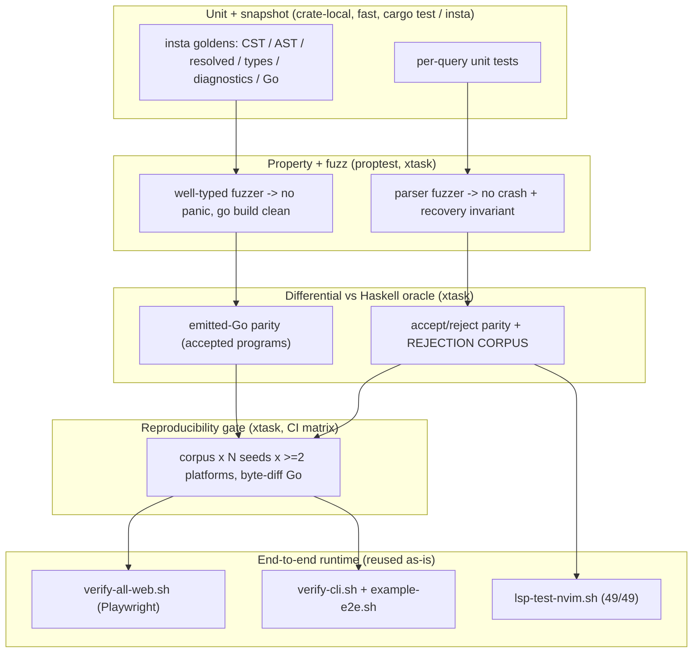
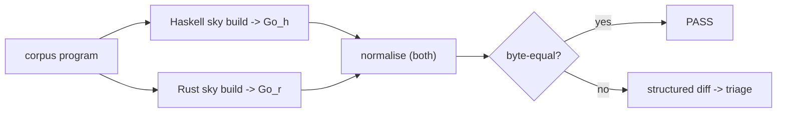

# 11 — Testing & Verification

How we **prove** the rewrite is compatible-or-better and that every example
builds AND runs. This doc is the operational face of the two hard goals from
[`README`](README.md) and the acceptance gates in [`00`](00-goals-and-principles.md).

The whole strategy turns on one scar, surfaced by the self-host analysis
([`docs/self-host/00-feasibility-and-architecture.md`](../self-host/00-feasibility-and-architecture.md) §7,
grill **R1-D1**):

> A byte-diff-of-emitted-Go oracle on a **well-typed** corpus is structurally
> **blind to rejection parity.** An ill-typed program the Haskell rejects emits
> no Go → there is nothing to byte-compare. The historical self-host killer
> ("couldn't catch bugs in itself" = *failed to reject*) is exactly the class the
> accept-only oracle cannot observe.

So differential testing has **two halves that must both hold** — *accept-and-emit
parity* AND *reject parity* — and the second half needs a dedicated **rejection
corpus** that neither the Haskell test-suite nor the example corpus contains
today. Building it is a first-class deliverable, not an afterthought.

## The verification pyramid



Each layer is a different *kind* of proof; none subsumes another. Snapshots pin
intent; properties find the unknown-unknowns; the differential oracle proves
compatibility; the reproducibility gate proves L4; the runtime scripts prove "if
it compiles, it works." A green byte-diff does not prove soundness (that is the
rejection corpus's job); a green rejection corpus does not prove the program
*runs* (that is the runtime scripts' job). We ship all layers.

---

## 1. The conformance corpus — the numbered examples, build **AND** run

`examples/00`–`examples/55` are the conformance suite — **56 numbered
directories** at this commit (`ls -d examples/[0-9][0-9]-*/ | wc -l`), plus the
unnumbered `simple/` and `test_pkg/`. This section said "42 examples" and
"`examples/00`–`examples/39`" in three places; the corpus outgrew that and the
number was never re-derived, so it is now stated as a command rather than a
constant. The gate is **build AND
run correctly**, never build-only. `--build-only` is blind to the entire
*click-is-a-no-op* regression class — a page that renders but whose event wire is
dead `go build`s perfectly and serves HTTP 200. That class is why the runtime
scripts exist and why they are non-negotiable in the release checklist.

| Category | Examples | Runtime gate (reused script) |
|---|---|---|
| CLI / one-shot | 00, 01, 02, 03, 04, 06, 07, 14 | `verify-cli.sh` (exit 0, expected stdout substring, no panic string) |
| Sky.Tui / Sky.Cli | 20, 21, 22, 23, 24 | `verify-cli.sh` `tui-start` (spawn, clean non-TTY exit, no panic) |
| Sky.Live + Sky.Http.Server | 05, 08, 09, 10, 12, 15, 16, 17, 18, 19, 25, 27, 34, 36, 37, 39 | `verify-all-web.sh` (Playwright load + 0 console errors + 0 server panic) |
| GUI (Fyne / Webview) | 11, 29, 31 | build-only `gui`-skip (needs display / macOS cgo) |
| SSE / streaming / WebSocket | 28, 30, 32, 33 | `example-sweep.sh` server probe + `verify-streaming-chat.*` |
| Composite / generics fixtures | 35, 38 | `example-sweep.sh` build + run |
| Landmark benchmarks | 00 (120-assertion stdlib smoke), 13-skyshop (76k FFI), 26-ui-showcase (visual-regression) | `verify-cli.sh` / opt-in `SKY_VERIFY_SKYSHOP=1` / `verify-ui-showcase.sh` |

Three tiers of "runs correctly", in ascending strength — the Rust compiler must
pass all three, exactly as the Haskell compiler does:

1. **Smoke** — `scripts/example-sweep.sh`: clean-slate build (`rm -rf sky-out
   .skycache/lowered .skycache/go`) of every example, then either run-to-exit-0
   with non-empty stdout (cli) or HTTP 2xx/3xx probe (server). Parallel via
   `xargs -P`; keeps `.skycache/ffi/` (regenerating skyshop's 76k symbols costs
   15+ min). This is the *floor*.
2. **Load / no-panic** — `scripts/verify-all-web.sh` + `scripts/verify-cli.sh`:
   drive a real browser (Playwright) / spawn the binary; PASS = zero console
   errors AND zero server-side panic strings (`panic:` / `runtime error:` /
   `interface conversion:`). Catches the crash-on-first-event class.
3. **Behavioural** — `scripts/example-e2e.sh`: each example with an `e2e.json`
   contract runs a scripted sequence (CLI invocations, HTTP requests, Sky.Live
   event dispatches) with expected outputs/status/body substrings. This is the
   layer that catches "AI played nonsense", CLI args not dispatching, and silent
   DB constraint errors — the click-*is*-a-no-op class in full.

**Reuse, don't rewrite (L10).** Every script above drives the *compiled binary*,
not the compiler internals. They are backend-agnostic and are pointed at the
Rust compiler's output with a one-line `SKY_BIN` override. The Rust rewrite adds
no new runtime-verification tooling here — it inherits the whole suite. The
release checklist (CLAUDE.md, steps 4–8) is the acceptance script verbatim.

---

## 2. Differential testing vs the Haskell oracle

The Haskell compiler is the **oracle** until the Rust compiler passes 100% of
both differential halves (`00` non-negotiables). The `xtask` crate drives both
compilers over a shared corpus and compares. Two independent comparisons run,
because — per the R1-D1 scar — the first is blind to soundness.

### 2a. Emitted-Go parity (the *accept-and-emit* half)

For every program **both** compilers accept, compare the emitted Go.



- **Corpus:** the numbered examples first (§1), then a growing library of focused
  fragments (one construct per file — every language feature in
  [`03`](03-language-reference.md), every stdlib surface).
- **What "parity" means, honestly.** Byte-identical Go is the *target* but not
  every difference is a bug — the Rust codegen may legitimately emit cleaner Go
  (fewer `rt.Coerce`, no redundant wraps) once the typed IR (L9) removes the
  impedance layer. So the harness has two modes: **strict** (byte-equal, used on
  the frozen subset the migration milestone M4 pins) and **semantic** (parse
  both Go outputs, compare after normalising whitespace / import order /
  gensym names / provably-equivalent coercion elisions). A strict diff is a hard
  fail; a semantic diff is a hard fail; a normalised-away difference is logged
  for review, never silently accepted.
- **The ordering trap (self-host §7, L4).** Record fields MUST emit in
  `_fieldIndex` (source) order, NOT lexical order. A codegen that sorts fields
  lexically is *deterministic-but-WRONG* — it reproduces the v0.7 tag-order
  corruption and passes a byte-diff-across-runs gate while emitting a broken
  program. Emitted-Go **parity against the oracle** is what catches this
  (the Haskell reference emits source order); the reproducibility gate (§3) does
  not. Both gates are needed and they catch *different* bugs.
- **Where Go parity is not meaningful** and is deliberately excluded: LSP
  responses, formatter output, diagnostic text (covered by 2b + snapshots), and
  any example whose Go the modern oracle itself churns (visual-regression 26 is
  gated on rendered HTML, not Go bytes).

### 2b. Accept/reject parity + the rejection corpus (the *reject* half)

This is the half the self-host oracle lacked. For every corpus program, record
**each compiler's verdict** and compare:

| Haskell verdict | Rust verdict | Result |
|---|---|---|
| accept | accept | → go to §2a (emitted-Go parity) |
| reject `[Ecode]@span` | reject `[Ecode]@span` | **PASS** (diagnostic parity, see below) |
| reject | accept | **FAIL** — soundness regression (Rust accepts what Haskell rejects) |
| accept | reject | **FAIL** — over-eager rejection (compat break) |

**The rejection corpus** is a dedicated, versioned tree of **ill-typed /
ill-formed programs**, one defect per file, each annotated with the expected
diagnostic. It does not exist in the Haskell tree today (the 201 `*Spec.hs`
files test the Haskell compiler's *own* behaviour; they are not a portable,
compiler-agnostic reject corpus) and building it is a named deliverable of the
migration (see [`12`](12-migration-and-milestones.md), grows per milestone).
Seed categories, mapped to the real historical holes:

| Rejection class | Example defect | Diagnostic | Scar it guards |
|---|---|---|---|
| Nominal FFI soundness | unify two unrelated FFI opaque types (`Customer` ≡ `Widget`) | type error | self-host §7 R1-D2 — `isOpaqueFfiType a && isOpaqueFfiType b -> Ok` accepted everything |
| Interface satisfaction | pass a concrete that does NOT implement the iface | type error | `isFfiInterfacePair` must reproduce *sound* nominal identity |
| Import qualifier collision | two bare imports binding the same qualifier | `[E1001]` | CLAUDE.md import rules |
| Exhaustiveness | `case` missing an arm | `[E3001]` | v0.7 `getDeclName` panic; R1-D3 (Sky is stronger than GHC-as-configured here) |
| Arity / value-vs-arrow | call `: T` with `()`; bare `: () -> X` in a value slot | `[E2007]` | Limitation #7 |
| Shadowing Prelude ctors | user `type Result = Just \| Nothing` | hard error | canonicaliser audit §3.2 |
| Unknown qualified name | `NotAModule.foo` | did-you-mean | audit §3.1 (was silently passed → `undefined` in Go) |
| Homogeneous-list violation | mixed-type list literal | `[E2001]` | Std.Db SqlValue history |
| Row-poly / record field | missing field, wrong field type | type error | parametric-record-alias class |

**Diagnostic parity granularity.** We do NOT require byte-identical error prose
(the rewrite is allowed to *improve* diagnostics — that is a stated goal). Parity
is asserted on the **structured** diagnostic: `(error-code, primary-span,
severity)` must match; secondary labels and suggested fixes are compared but a
*superset* on the Rust side (more help) is a PASS, a *different code or moved
primary span* is a FAIL. This makes "better diagnostics" and "reject parity"
coexist without one silencing the other. The structured `Diagnostic` value
(from the `diagnostics` crate, L7) is what serialises for comparison — one
reporter, one machine-readable form, for CLI + LSP + this harness.

**Redundant/unreachable-arm guard (R1-D4).** The Haskell compiler as configured
does not warn overlapping patterns; Sky's own exhaustiveness is stronger. The
rejection corpus includes dead-arm and redundant-guard fixtures so the Rust
compiler's reachability analysis is directly tested rather than trusted — a class
invisible to *both* an accept-only oracle and a self-hosted checker.

---

## 3. The reproducibility gate (L4)

Determinism is an invariant, tested — the historical CI killer (`f6e3ecdd`:
Go-map iteration + platform-variant FFI inspector). The gate:

**Compile the corpus `N` times across ≥2 platforms and byte-diff the Go.** Any
difference is a hard fail with the offending file + the two divergent outputs.

- **N runs, fresh process each (the natural L4 fuzzer).** Rust's default
  `HashMap`/`HashSet` seed their hasher from process-random `RandomState`. So any
  accidental `HashMap` iteration that reaches emitted output surfaces as a diff
  **across fresh processes** — we do not need to hand-construct the adversary,
  the standard library is it. The gate additionally exposes a test hook that
  forces a *shuffled* deterministic seed so a single machine can exercise the
  variance without spawning N processes. This is why the non-negotiable "no
  `HashMap` iteration reaching output" (use `IndexMap` / `BTreeMap` /
  interned-id order) is *test-enforced*, not just reviewed.
- **≥2 platforms** = the existing CI matrix (`ubuntu-latest` x64 +
  `macos-latest` arm64, from `.github/workflows/rust-ci.yml`). Multi-seed × multi-
  toolchain is required precisely because a single green byte-diff does not prove
  cleanliness (self-host §7 R2(B)).
- **FFI surface is pinned and committed (see [`09`](09-runtime-and-ffi.md)).**
  The platform-variant Go inspector NEVER runs mid-build inside the gate; the
  `.skyi` surface is checked in and byte-frozen. This directly closes the
  self-host §7 R2(B) hole (`.skycache/` gitignored → zero `.skyi` committed → CI
  regenerated the platform-variant inspector fresh = the `f6e3ecdd` killer,
  unchanged). The gate asserts the inspector process is not invoked.
- **Determinism ≠ correctness (kept honest).** This gate proves *stable* output.
  It does NOT prove *correct* output — a lexically-sorted-fields codegen is
  stable and wrong. §2a (oracle parity) is the correctness check. The two gates
  are orthogonal; both are required. Stating this explicitly is the antidote to
  the self-host misdiagnosis that "sort keys before iterating" would fix repro.

---

## 4. Snapshot / golden tests (`insta`)

Every query in the pipeline ([`01`](01-architecture-overview.md) data flow) gets
a snapshot suite. Snapshots pin *intent* — they turn "did this edit change
behaviour?" into a reviewable diff, and they are how a model (or human) working
in a bounded crate verifies a local change without running the whole pipeline.

> **This whole snapshot regime is TARGET. One row of it exists.** `insta` is a
> dev-dependency of exactly one crate (`rust/crates/syntax/Cargo.toml:16`),
> `find rust -name '*.snap'` returns **two** files — both parser CST goldens —
> and `cargo insta test` / `cargo insta review` appear in no workflow
> (`grep -rn 'insta' .github/workflows/` is empty). The bullets below about
> layered localisation, a shared normaliser, and `.snap.new` failing CI
> describe a regime that is not in place.

| Query | Snapshot content | Crate | Guards | Exists? |
|---|---|---|---|---|
| `parse(FileId)` | CST (lossless) + parse diagnostics | `syntax` | L8 — trivia + recovery | **yes** (2 goldens) |
| `ast(FileId)` | typed AST view | `syntax` | desugaring stability | no |
| `resolve(ModuleId)` | name → `DefId`, imports, qualifiers | `hir` | import-collision rules | no |
| `infer(DefId)` | inferred types + per-expression type table | `ty` | HM parity surface | no |
| `exhaustiveness(DefId)` | diagnostics | `ty` | `[E3001]` | no — and it is not a separate query (06) |
| all phases | rendered `Diagnostic` (Elm-style) | `diagnostics` | L7 — error quality | no |
| `go_module(ModuleId)` | emitted Go source | `codegen` | L9 + repro | no — the goldens that do this are `xtask`'s stdout goldens over `examples/`, not insta snapshots |

- **Layered, not just end-to-end.** A codegen change that alters emitted Go is
  visible at the `go_module` snapshot; a resolver change is visible at `resolve`.
  When an oracle diff (§2) fails, the layered snapshots localise *which query*
  diverged — the bounded-context win (L5) applied to debugging.
- **Golden Go is the same bytes the oracle compares.** The `codegen` insta
  snapshots and the §2a strict-parity corpus share one normaliser, so a golden
  update and an oracle-parity pass can never disagree.
- **Review discipline:** `cargo insta review` gates every snapshot change; an
  unreviewed `.snap.new` fails CI. Diagnostic snapshots doubling as
  documentation of every `[Ecode]` is a deliberate bonus.

---

## 5. Property + fuzz testing

Snapshots and the oracle test what we *thought of*. Fuzzers test what we didn't.

### 5a. Well-typed fuzzer → no panic, `go build` clean

Generate random **well-typed** Sky programs; assert each `sky build`s and
`./sky-out/app` runs with no panic (L6 — no runtime panic from well-typed Sky).
This already exists in two tiers and is reused directly:

- **Tier A (in-suite):** the Haskell `Sky.Build.WellTypedFuzzerSpec` (QuickCheck,
  100 iters every CI). The Rust equivalent is a `proptest` generator over a typed
  AST *builder* (so generated programs are well-typed by construction, not by
  filtering) living in the `ty`/`lower` test crates.
- **Tier B (milestone runner):** `scripts/fuzz-well-typed.sh` — ≥10,000
  iterations, deterministic LCG seeding (failed seed replays via `--seed N
  --iters 1 --keep`), template + corpus + composite modes, full forensics
  (source + Go + logs) preserved on first failure. Backend-agnostic: point
  `SKY=<rust-sky>` at it. Criterion-8 grade: ≥10k clean before a milestone
  closes.
- **Tier A′ — well-typed DIFFERENTIAL (`cargo run -p xtask -- welltyped`).**
  The Rust-side `WellTypedFuzzerSpec` analog. A bounded, deterministic,
  type-directed builder constructs well-typed Sky programs (build a typed term →
  pretty-print → valid by construction), then runs BOTH the Rust compiler AND the
  Haskell oracle in check-only mode (verdict read at the type-check boundary —
  Rust's `-- Generating Go` / the oracle's `Types OK`, both strictly before
  codegen / `go build`, so a check costs type-check time, not build time) and
  asserts they AGREE on ACCEPT/REJECT for every program, modulo the ledgered
  `known-divergences.toml` entries. This closes the accept/reject-parity gap on
  GENERATED valid programs that neither `xtask fuzz` (mutates corpus → mostly
  INVALID, asserts only no-panic + determinism) nor the accept-parity corpus gate
  covers. Deterministic: a fixed base seed → identical programs + verdicts
  run-to-run. LOCAL / release-only, exactly like `xtask divergences` — it shells
  the oracle, which is not built in CI; absent oracle → the gate SKIPS (still
  verifying generator determinism). `--count=N` (default 120) bounds it;
  `--emit-only` prints the programs without a compiler. Point it at explicit
  binaries with `SKY_RUST_BIN` / `SKY_ORACLE_BIN`.

### 5b. Parser fuzzer → no crash + recovery invariant

Feed random bytes AND random *mutations of valid programs* to `parse`; assert
two invariants that fall out of the lossless-CST design (L8):

1. **Never panics, never hangs** — parse always returns a tree + diagnostics,
   never an exception (L7). A nesting-depth guard (self-host §5/P3) bounds
   pathological inputs.
2. **Recovery + losslessness** — `reprint(parse(src)) == src` for *every* input,
   valid or broken (rowan holds every byte, including error nodes and trivia).
   This is the formatter-idempotence and LSP-on-broken-code guarantee, tested
   as a property rather than on a fixed sample.

`cargo-fuzz` (libFuzzer) drives 5b on CI-nightly; a crash or a reprint-mismatch
is a hard fail with the minimised input committed as a regression fixture.

---

## 6. Runtime verification reuse (web + CLI/TUI)

Covered per-category in §1; called out here because it is the "if it compiles, it
works" proof and the answer to build-only blindness. These scripts are the
**same** ones the Haskell compiler ships against — reused unchanged (L10):

- **`scripts/verify-all-web.sh`** — Playwright over every Sky.Live +
  Sky.Http.Server example on a unique port; PASS = server listens + page loads +
  0 console errors + 0 server panic strings. Plus the console-e2e sweep (parent +
  spawned console child + reverse-proxy + wire) and the ui-showcase regression
  gates.
- **`scripts/verify-cli.sh`** — CLI exit-0 + stdout-substring + panic-grep; Tui
  spawn-and-clean-exit.
- **`scripts/example-e2e.sh`** — behavioural `e2e.json` contracts (§1 tier 3).
- **`scripts/playwright-live-verify.mjs` + the `verify-*.mjs` family** — deep
  scenario drivers (pub/sub multi-tab, streaming-chat, issue-63 input
  preservation, Std.Ui matrix).

The Rust compiler passes when these scripts pass against its output with no edit
beyond the binary path.

---

## 7. The LSP 17-test gate

`scripts/lsp-test-nvim.sh` drives a **real Neovim LSP client** headless through
17 user-visible behaviours — hover (kernel calls / fields / type names /
functions / constructors / lambda params / case patterns), completion (qualified
insert-text / field / let-binding), goto-def (type names / functions /
constructors / let bindings / lambda params / fields). It catches editor-level
bugs (label-vs-insertText, filterText, scope handling) that synthetic JSON-RPC
tests miss.

Because the LSP is a *front-end over the same query database* ([`01`](01-architecture-overview.md),
L2) rather than a bolted-on fixpoint, the Rust `sky-lsp` is exercised by the
identical nvim suite over stdio JSON-RPC. **49/49 green is a release gate**,
same as today. The salsa core means the LSP is not a special case to
independently re-verify — the same `resolve`/`infer` queries the batch build
proves are the ones the LSP answers hover from — but the editor-level suite
still runs, because the wire mapping (LSP protocol ⇄ query results) is its own
surface.

---

## 8. CI structure

The Rust CI lives in **`.github/workflows/rust-ci.yml`** (matrix:
`ubuntu-latest` x64 + `macos-latest` arm64; fail-fast off) — **both** compilers
build in CI (the oracle stays live under `legacy-haskell-compiler/`, see
[`12`](12-migration-and-milestones.md)). Earlier text here named
`.github/workflows/ci.yml`, which does not exist.

> **Five rows of this table were wrong, and "Blocks merge? yes" is exactly the
> claim a reader cannot check cheaply.** They are struck below with the
> disproof, because a plan that assumes a gate is catching something is worse
> than no plan. This section's own §9 header says a law with no gate is not
> enforced; that discipline has to apply to the table itself.

| Job / step | Command | Blocks merge? | Proves |
|---|---|---|---|
| Rust workspace build + ~~clippy-deny~~ **clippy (advisory)** | `cargo build --workspace`; clippy runs as `cargo clippy --workspace --all-targets \|\| true` (`rust-ci.yml:229-230`, step named "Clippy (report only)") | build **yes**, clippy **no** | L5 boundaries. The no-unsafe guarantee is `#![forbid(unsafe_code)]` in 12 crates, not clippy |
| ~~Unit + snapshot~~ **Unit** | `cargo test --workspace`. **Not `cargo nextest run` and not `cargo insta test`** — `grep -rn nextest rust scripts .github` finds one comment; `insta` is a dev-dep of one crate (`syntax`), `find rust -name '*.snap'` returns 2 parser CST goldens, and `cargo insta test` appears in no workflow | yes | per-query units |
| ~~Property (fast)~~ | ~~`proptest` in-suite~~ — **there is no property-test tier.** `grep -rn proptest rust scripts .github` → zero hits | — | — |
| ~~**Differential — emitted-Go**~~ | ~~`xtask diff-go`~~ — **no such subcommand.** `xtask` dispatches `("diff", diff_stub)` (`rust/crates/xtask/src/main.rs:86-87`); `diff_stub` prints `xtask diff: NOT IMPLEMENTED (stub)` and returns 2 (`:92`) | — | — |
| ~~**Differential — accept/reject + rejection corpus**~~ | ~~`xtask diff-verdict`~~ — **no such subcommand**, same stub | — | — |
| **Reproducibility gate** | `cargo run -p xtask -- repro --seeds N` (matrix → cross-platform diff) | yes | §3, L4 |
| Example sweep (build + run) | `scripts/example-sweep.sh` (SKY_BIN=rust) | yes | §1 tier-1 |
| Runtime web | `scripts/verify-all-web.sh` (macOS: Playwright) | yes | §1 tier-2/3 |
| Runtime CLI/TUI | `scripts/verify-cli.sh` + `scripts/example-e2e.sh` | yes | §1 |
| LSP | `scripts/lsp-test-nvim.sh` | yes | §7, 49/49 (17 symbol-class + 32 corpus) |
| Fuzz (robustness + determinism) | `cargo run -p xtask -- fuzz` | yes | §5 — mutated-corpus no-panic + L4 determinism |
| Well-typed differential (local/release) | `cargo run -p xtask -- welltyped` | no (oracle absent in CI) | §5a Tier-A′ — generated-valid-program accept/reject parity vs oracle |
| ~~Fuzz (nightly)~~ | ~~`fuzz-well-typed.sh --iters 10000` + `cargo-fuzz` parser~~ — **nothing schedules either.** `.github/workflows/nightly-sweep.yml` runs four jobs (`example-sweep`, `web-runtime`, `behaviour-corpus`, `postgres-bundle-licence`); no workflow or script invokes `fuzz-well-typed.sh` or `cargo-fuzz` (`grep -rn 'cargo.fuzz' .github scripts rust` → zero). `scripts/fuzz-well-typed.sh` exists but is a **manual milestone runner**, not a nightly gate. The mutation fuzzer `xtask fuzz` *does* run per-push (`rust-ci.yml:540`) and is the row above | **manual, not nightly** | §5 milestone grade |
| fmt idempotent + `sky check` smoke | (existing steps) | yes | tooling parity |

Notes carried from the Haskell CI that stay true:

- **Every long-running step is `timeout`-bounded** (CLAUDE.md §3). No unbounded
  `wait`. The differential + repro jobs inherit per-example caps.
- **FFI + Go module caches** are keyed as today (`.skycache/ffi`, `~/go/pkg/mod`)
  so the sweep stays ~3 min warm; the repro gate deliberately uses the *pinned*
  `.skyi` and asserts the inspector never runs (§3).
- **Disk hygiene** (the `No space left on device` cascade) — the pre-sweep
  cleanup steps stay; Rust's `target/` is added to the reclaim list.

---

## 9. Law → gate coverage matrix (kept honest)

Every design law from [`00`](00-goals-and-principles.md) maps to a *test*, not a
promise. If a law has no gate, it is not enforced.

> **Implementation status — the disclaimer under this table was itself
> unenforced.** It used to say "most gates below are live" and name **two**
> aspirational rows (L2's salsa invalidation tests, L9's emitted-Go parity).
> Checking each named mechanism against the tree turned up **five more that do
> not exist**, all of them now struck in the table rather than listed here:
>
> ```bash
> $ grep -rn 'static mut\|non_exhaustive_omitted_patterns\|crate size' \
>       rust/crates .github/workflows/rust-ci.yml
> $ grep -rn 'insta\|snap.new' .github/workflows/
> $                                     # both empty
> ```
>
> The `HashMap`-in-output "lint" is the one that matters most, because it was
> listed twice under two names: there is no lint. What exists is
> `xtask repro`'s fresh-process byte-diff
> (`rust/crates/xtask/src/repro_gate.rs:1-16`), which is the *same mechanism*
> as the reproducibility gate in the adjacent column — so L4 has one gate, not
> two independent ones.
>
> Still true from the original note: **L2's salsa invalidation unit tests** do
> not exist (though `infer`/`resolve`/`go_program` *are* now real tracked
> queries — see [`01`](01-architecture-overview.md)), and **L9's emitted-Go
> parity** holds only against the interim erase-based Go, so "fewer
> `rt.Coerce`" remains a target.

| Law | Enforcing gate |
|---|---|
| L1 no globals | crate boundaries (Cargo) + `#![forbid(unsafe_code)]` in 12 crates; a leaked global would surface as a repro-gate diff. ~~no `static mut` lint~~ — no such lint exists |
| L2 incremental | LSP suite over the query DB (§7). ~~salsa invalidation unit tests~~ — do not exist |
| L3 intern everything | union-find identity ~~property tests~~ **unit tests** in `ty` (there is no `proptest`); deterministic id-order iteration (feeds L4) |
| **L4 determinism** | **reproducibility gate §3** (N seeds × ≥2 platforms). ~~+ `HashMap`-in-output lint~~ — that *is* the repro gate (`xtask/src/repro_gate.rs`), not a second mechanism |
| L5 module budget | Cargo DAG (cycles impossible). ~~+ per-crate size CI check~~ — no such check; the ~2–4k-line budget in [`02`](02-workspace-and-crates.md) is reviewed, not gated |
| L6 illegal states unrepresentable | well-typed fuzzer §5a proves no panic. ~~`#![deny(non_exhaustive_omitted_patterns)]`~~ — not applied in any crate |
| L7 diagnostics as data | reject-parity §2b compares the structured form. ~~+ structured-`Diagnostic` snapshots §4~~ — there are no diagnostic snapshots; the only `.snap` files in the tree are 2 parser CST goldens in `syntax` |
| L8 lossless CST + recovery | parser fuzzer reprint-invariant §5b + formatter idempotence |
| L9 typed IR, coercion is exception | emitted-Go parity §2a (fewer `rt.Coerce` is a *reviewed* improvement, not a silent diverge) |
| L10 keep the Go backend | all runtime scripts §1/§6 reused unchanged |
| **rejection parity (the R1-D1 scar)** | **rejection corpus §2b — the gate the self-host oracle structurally lacked** |

## 10. Definition of "verified" (the release bar)

The Rust compiler is *verified-compatible* when, on the CI matrix:

1. **Accept/reject parity is 100%** on the corpus + the rejection corpus (§2b) —
   the soundness half, first-class.
2. **Emitted-Go parity** holds strict on the M4-frozen subset and semantic on
   the rest (§2a).
3. **Every numbered example builds AND runs** through the three runtime tiers (§1) — zero
   panics, zero dead-click regressions.
4. **The reproducibility gate is green** across N seeds × ≥2 platforms (§3).
5. **LSP 49/49** (§7).
6. **Fuzzers clean** at milestone grade (§5).

No "but / except / mostly / for the scope of." Compat-or-better means the whole
list, on every push, with the Haskell oracle — preserved under
`legacy-haskell-compiler/` — still standing behind it
([`12`](12-migration-and-milestones.md) M8).
