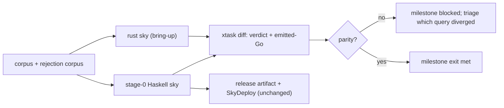
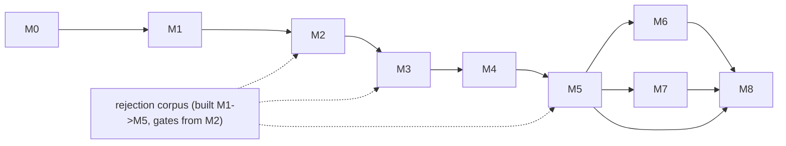

# 12 — Migration & Milestones

How the Rust compiler was brought up **without breaking anything that ships
today**, using the Haskell compiler as a differential oracle. The Rust compiler
is now the primary Sky compiler; the Haskell compiler is preserved under
`legacy-haskell-compiler/` as reference, oracle, and rollback path. This was a
strangler migration ([`docs/self-host/00`](../self-host/00-feasibility-and-architecture.md)
§6, the strategy that survived the grill): each phase landed one subsystem that
diff-matched the oracle before the next began. Never big-bang.

Two facts framed every decision:

- **The Haskell compiler is preserved under `legacy-haskell-compiler/` as the
  differential oracle + rollback path.** It bootstrapped the Rust compiler and
  remains available for parity checks; the primary release artifact is now the
  Rust `sky` binary ([`11`](11-testing-and-verification.md) §10).
  SkyDeploy (commercial, [MEMORY: `project_skydeploy_business`]) tracks the
  primary compiler; the migration must not perturb it.
- **The oracle is only as good as its rejection half.** The single most important
  lesson from the self-host analysis (§7 R1-D1): an accept-only oracle is blind
  to soundness regressions. So the **rejection corpus is built alongside the
  compiler from M2 onward**, not bolted on at the end — it is a milestone
  deliverable, threaded below.

---

## Implementation status

The milestone plan below (§2, M0–M8) is the roadmap. Here is where the Rust
compiler actually stands, verified via the gate (`cargo run -p xtask -- build-run --all
--run`, `cargo test -p sky-lsp`, the determinism + reject gates). **Functionally
the compiler is well advanced** — the non-FFI corpus builds+runs+matches the
Haskell oracle, FFI scales to skyshop (76k symbols), `sky` is a standalone binary,
and the LSP passes 49/49. What remains is largely two *architectural refinements*
that the functional results do not depend on, plus a handful of narrow items.

### Milestones

| Milestone | Status | Notes / evidence |
|---|---|---|
| **M0** workspace + salsa spike | **Built** | Crate DAG compiles; `#![forbid(unsafe_code)]` on frontend crates; clippy-deny clean. Salsa spike only — one input + one tracked query (`skydb`); the DAG is **not** threaded through salsa (see below). |
| **M1** lex + parse, round-trip | **Built** | Lossless CST + recovery; reprint round-trip on the corpus (156/156). |
| **M2** name resolution | **Built** | `resolve` over `hir::db::SourceDb`; qualifier rules, E1001, DefId alloc; 0 resolver gaps. |
| **M3** inference | **Built** (accept + reject) | HM + union-find + exhaustiveness; 39/39 non-FFI typecheck-match; reject-parity/rejection corpus added (v0.7 unifier killer closed). |
| **M4** lower + emit Go | **Built (interim representation)** | Typed `GoTy`-carrying IR emits deterministic Go that builds+runs+matches — but via an **erase-based** runtime representation (`rt.SkyADT` bags, `rt.T2[any,any]`, a `Widen`→`any` node), **not** the structural-generic / sealed-interface / coercion-is-the-exception target of [`07`](07-lowering-and-ir.md)/[`08`](08-go-codegen.md). |
| **M5** full corpus build+run | **Built** | Whole corpus builds; run+match vs a freshly-rebuilt oracle across the non-FFI set + skyshop; `11-fyne` GUI is build-only (headless-unverifiable); `36-composite-server`'s only non-match is a genuine **oracle-side** Haskell bug (Rust serves correctly). |
| **M6** LSP | **Built (minus 3 endpoints)** | Hover/goto/completion/references/rename/semantic-tokens/document-symbol; 49/49 nvim + broader suite. Runs on `hir::db::SourceDb`, not salsa. `inlayHint`/`signatureHelp`/`formatting` **not implemented** ([`10`](10-lsp-and-tooling.md) status). |
| **M7** reproducibility gate | **Built** | Byte-stable emission across seeds (37/37); deterministic FFI inspector runs only at `add`/`install`/`update`, never mid-build (L4). |
| **M8** cutover (Rust default) | **Landed (refinements ongoing)** | Rust is the primary Sky compiler; the Haskell tree is preserved under `legacy-haskell-compiler/` as oracle + rollback path. The remaining architectural refinements (salsa DAG, structural Go-IR) are tracked above and do not block primacy. |

### Subsystems (built / interim / target)

| Subsystem | State | Reality vs the target docs |
|---|---|---|
| Crate DAG, determinism gate, standalone binary | **Built** | Matches [`02`](02-workspace-and-crates.md)/[`08`](08-go-codegen.md)/[`09`](09-runtime-and-ffi.md). |
| Lexer / parser / CST / recovery | **Built** | Matches [`04`](04-syntax-lexer-parser.md). |
| Name resolution, HM inference, exhaustiveness | **Built** | Matches [`05`](05-name-resolution.md)/[`06`](06-type-system.md) in behaviour; runs value-threaded, not salsa-memoised. |
| Deterministic committed-surface FFI (inspector + `sky add/install/update`) | **Built** | Matches [`09`](09-runtime-and-ffi.md) (correct the Part G API names). |
| CLI verbs (build/run/check/fmt/test/init/doc/watch/db/add/install), `sky fmt` | **Built** | Opinionated formatter with lossless safety net. |
| LSP (hover/goto/completion/references/rename/semantic-tokens/document-symbol) | **Built** | 49/49 + broader. |
| **Salsa query DAG** | **Interim → target** | Spike wired; running pipeline is `hir::db::SourceDb` (batch RefCell walk). [`01`](01-architecture-overview.md). |
| **Structural typed Go-IR (coercion-is-the-exception, no `any` widen, Go-generic aliases, sealed ifaces)** | **Interim → target** | IR carries `GoTy`, but Go rep erases to `any`-backed shapes + `Widen`. [`07`](07-lowering-and-ir.md)/[`08`](08-go-codegen.md). |
| LSP `inlayHint` / `signatureHelp` / `formatting` endpoints | **Target** | Advertised in the target capability set; not yet implemented. [`10`](10-lsp-and-tooling.md). |
| Runtime `abi` manifest gate (§A.2) | **Target** | Not yet a wired CI gate. |
| Reject-parity completeness, remaining FFI-surface pinning (`03`/`08`) | **In progress** | See resume notes. |

Everything below (§0 onward) is the **plan**; read it as the intended path, with
the table above as the ground truth for what is already done.

---

## 0. Repo layout: in-tree `rust/` subdir (decided)

**Decision: an in-tree `rust/` subdirectory, not a parallel repo.** The Haskell
compiler now lives under `legacy-haskell-compiler/` in the same repo. Rationale:

| Concern | In-tree `rust/` (chosen) | Parallel repo (rejected) |
|---|---|---|
| Shared corpus (`examples/`, `runtime-go/`, `sky-stdlib/`, `scripts/`) | one checkout, no sync | must vendor or submodule; drift risk |
| Differential harness (`xtask` runs BOTH compilers) | trivial — both in one tree | needs cross-repo CI orchestration |
| Runtime + stdlib (L10 — kept, shared) | consumed in place | duplicated or submoduled |
| Oracle stays honest | Haskell + Rust build from identical inputs | divergent snapshots of stdlib/runtime |
| SkyDeploy impact | none — it consumes the released binary, path-agnostic | none |
| Atomic "stdlib change touches both compilers" PR | possible | impossible |

Layout:

```
sky/
  src/                 # Haskell compiler (stage-0, unchanged, keeps shipping)
  runtime-go/          # Go runtime  (shared, L10)
  sky-stdlib/          # Sky stdlib  (shared)
  examples/            # conformance corpus (shared)
  scripts/             # verify-*, sweep, lsp, fuzz (shared, reused as-is)
  rust/                # the rewrite — Cargo workspace (02-workspace-and-crates)
    Cargo.toml
    crates/{base,syntax,hir,ty,skydb,lower,codegen,ffi,project,fmt,sky,sky-lsp,testrunner}
    xtask/             # differential + reproducibility harness
    tests/reject/      # THE REJECTION CORPUS (grows per milestone)
```

The `rust/` tree is inert to the release pipeline until M8: `scripts/build.sh`,
the SKY_VERSION bumps, and the SkyDeploy redeploy all continue to build and ship
**stage-0 Haskell**. Rust CI runs in parallel jobs that cannot fail the release.

---

## 1. The oracle contract (how stage-0 stays live)



- **Stage-0 never regresses during bring-up.** The Haskell tree is touched only
  for bug fixes it would have received anyway (CLAUDE.md §4 no-deferral). Its
  201 `*Spec.hs` + example sweep keep passing on `main`.
- **`xtask` is the bridge.** It shells both binaries over the shared corpus,
  captures `(verdict, diagnostics, emitted-Go)` from each, and applies the two
  comparisons from [`11`](11-testing-and-verification.md) §2. It is the single
  program that says "milestone N's parity holds."
- **Divergence-is-correct is a *documented* exception, never silent** (compat-
  first, `00` non-negotiables). Where Rust intentionally improves observable
  behaviour (cleaner Go, better diagnostic), the delta is recorded in
  `rust/xtask/known-divergences.toml` with a rationale and a compat classification
  (emit-improvement / diagnostic-superset). An undocumented divergence fails CI.

---

## 2. Milestones M0–M8

Each milestone has **entry criteria**, **exit criteria**, and **what proves it**
(the gate). A milestone is closed only by its gate going green on the CI matrix
(ubuntu x64 + macOS arm64) — not by "feels done" (§0 goal fidelity). Circuit-
breaker (CLAUDE §0.3): 3 consecutive diff-parity failures on the same lever →
stop, re-classify against the architecture docs, escalate — do not attempt a 4th.

### M0 — Workspace skeleton + salsa wiring

| | |
|---|---|
| **Goal** | The crate DAG ([`02`](02-workspace-and-crates.md)) compiles; salsa `db` exists with `set_source_text` input + one trivial query end-to-end; `xtask` skeleton shells stage-0. |
| **Entry** | Spine docs 00–10 reviewed |
| **Exit** | `cargo build --workspace` green; `#![forbid(unsafe_code)]` on frontend crates; clippy-deny clean; `xtask diff` can invoke stage-0 and capture its output. |
| **Proves** | L5 (DAG by construction), L1 (db-is-state scaffold), CI shape (jobs wired, all no-op-green). |
| **Oracle** | Not yet compared — harness plumbing only. |

### M1 — Lex + parse; round-trip the 42 corpus

| | |
|---|---|
| **Goal** | Lossless CST (rowan) + error recovery over the whole language; `parse` query memoised. |
| **Entry** | M0 exit. |
| **Exit** | For all 42 examples (+ growing fragment corpus): `reprint(parse(src)) == src` byte-for-byte; parser fuzzer ([`11`](11-testing-and-verification.md) §5b) runs clean at bring-up iters (no crash, reprint invariant holds on mutated inputs); CST insta snapshots reviewed. |
| **Proves** | L8 (lossless + recovery), L7 (parse returns tree + diagnostics, never throws). |
| **Oracle** | Token/CST structural parity where the Haskell parser exposes a dump; the *authoritative* M1 gate is the reprint round-trip (compiler-agnostic, needs no oracle). |
| **Rejection corpus** | Seed the **ill-formed** slice (syntax errors, bad layout) — assert Rust produces a diagnostic + a recovering tree; assert stage-0 also rejects. |

### M2 — Name resolution

| | |
|---|---|
| **Goal** | `resolve(ModuleId)` — imports, qualifier rules (explicit-alias-wins, E1001 collisions), scopes, `DefId` allocation; desugared HIR. |
| **Entry** | M1 exit. |
| **Exit** | `resolve` insta snapshots reviewed for the corpus; **accept/reject parity** vs oracle on all resolution-level verdicts (unbound name, unknown qualified name did-you-mean, import collision, Prelude-ctor shadowing). |
| **Proves** | Import/qualifier compat (CLAUDE import rules), L2 (query composes). |
| **Oracle** | `xtask diff-verdict` on the resolution rejection slice. |
| **Rejection corpus** | Add the **resolution** classes: E1001, unknown-qualifier, Prelude shadowing, unbound. This is the first milestone where reject-parity is a *hard gate* — the R1-D1 lesson takes effect here. |

### M3 — Inference matches oracle types

| | |
|---|---|
| **Goal** | HM inference, arena union-find (TyVarId identity — "the one real design task", solved by interning L3), generalisation, exhaustiveness (`[E3001]`), per-region type map. |
| **Entry** | M2 exit. |
| **Exit** | Inferred principal types match the oracle on the corpus (type-dump parity); **accept/reject parity** on the type rejection corpus including the two soundness holes the self-host grill named (unrelated-FFI-opaque unify; interface non-satisfaction) — Rust must reproduce `isFfiInterfacePair`-grade *sound* nominal identity, independently verified, not merely "accepts the corpus." |
| **Proves** | Type-system compat + soundness (the R1-D2 scar — checker *logic*, not data representation, is what the oracle-parity + rejection corpus jointly pin). |
| **Oracle** | Type-dump parity (accept side) + `diff-verdict` on the type rejection slice (reject side). Both halves; §11 §2b table. |
| **Rejection corpus** | Add **type** classes: nominal FFI soundness, interface satisfaction, arity `[E2007]`, homogeneous-list `[E2001]`, exhaustiveness `[E3001]`, redundant/unreachable arms (R1-D4). Wildcard-free lint on the compiler's own match arms (R1-D3) turned on. |

### M4 — Lower + emit byte-compatible Go on a subset

| | |
|---|---|
| **Goal** | Typed lowering IR (L9), type-directed lowering, TCO, DCE, monomorphisation; deterministic Go emission (L4). |
| **Entry** | M3 exit. |
| **Exit** | **Strict byte-identical Go** vs oracle on a *frozen subset* (start: CLI examples 00–07, 14 — no FFI, no server runtime); record fields emit in `_fieldIndex` (source) order, NOT lexical (the deterministic-but-WRONG trap, self-host §7); the subset passes the reproducibility gate (N seeds, cross-platform). |
| **Proves** | L9 (coercion is the exception), L4 (determinism), lowering compat. |
| **Oracle** | `xtask diff-go` strict mode on the frozen subset; semantic mode elsewhere (cleaner Go is a *reviewed* improvement logged in `known-divergences.toml`, never silent). |
| **Rejection corpus** | No new classes (lowering runs post-accept); but the frozen subset now also runs the well-typed fuzzer ([`11`](11-testing-and-verification.md) §5a) → no panic. |

### M5 — Full 42 examples build **AND** run

| | |
|---|---|
| **Goal** | The whole corpus compiles through the Rust pipeline and passes the three runtime tiers. FFI surface consumed from the pinned/committed `.skyi` ([`09`](09-runtime-and-ffi.md)). |
| **Entry** | M4 exit; FFI pinning ([`09`](09-runtime-and-ffi.md)) landed. |
| **Exit** | `scripts/example-sweep.sh` (build + run), `scripts/verify-all-web.sh` (Playwright, 0 console errors, 0 panic), `scripts/verify-cli.sh`, `scripts/example-e2e.sh` (behavioural contracts) all green with `SKY_BIN=rust`. Zero *click-is-a-no-op* regressions — the build-only-blind class. skyshop (76k FFI) + ui-showcase (visual-regression) included. |
| **Proves** | Hard goal #2 — "if it compiles, it works" (`00` acceptance gate 2). |
| **Oracle** | Emitted-Go semantic parity across all 42; runtime scripts are the authoritative gate (they need no oracle — the program either runs correctly or it doesn't). |
| **Rejection corpus** | Full type + resolution + syntax reject-parity 100% (the complete [`11`](11-testing-and-verification.md) §2b table). |

### M6 — LSP 49/49

| | |
|---|---|
| **Goal** | `sky-lsp` over the same `skydb` (L2 — the LSP is a driver, not a special case). Hover / completion / goto-def / diagnostics / rename. |
| **Entry** | M5 exit (needs resolve + infer). |
| **Exit** | `scripts/lsp-test-nvim.sh` → 49/49 through a real Neovim client; incremental-invalidation unit tests green. |
| **Proves** | L2 (incremental for free — no bolted-on fixpoint + threads, the scar that motivated salsa), tooling parity + improvement. |
| **Oracle** | The 17-test suite is the gate (behaviour-level, backend-agnostic). |

### M7 — Reproducibility gate green

| | |
|---|---|
| **Goal** | The full corpus compiles byte-identically across N seeds × ≥2 platforms; the FFI inspector never runs mid-build. |
| **Entry** | M5 exit (M6 parallel). |
| **Exit** | `xtask repro --seeds N` green on the CI matrix; `HashMap`-in-output lint clean; pinned `.skyi` asserted (inspector not invoked). |
| **Proves** | L4 — determinism is an invariant, *tested* (closes the `f6e3ecdd` + R2(B) killer). Note: this proves *stable*, §2a oracle-parity proves *correct* — both required (kept honest, [`11`](11-testing-and-verification.md) §3). |
| **Oracle** | Not oracle-based — this is a self-consistency + cross-platform gate. |

### M8 — Cutover (Rust default; Haskell retained as oracle)

| | |
|---|---|
| **Goal** | The `sky` binary is the Rust build; stage-0 Haskell is retained as the oracle + rollback path. |
| **Entry** | M1–M7 all green **simultaneously** on the CI matrix; verification bar [`11`](11-testing-and-verification.md) §10 met with no documented-divergence that breaks compat. |
| **Exit** | `scripts/build.sh` produces the Rust binary; release pipeline + SKY_VERSION bump + SkyDeploy redeploy (CLAUDE §5) cut over; a full release-checklist run (steps 1–9) green on the Rust binary; stage-0 kept buildable + oracle CI job stays on. |
| **Proves** | Both hard goals, end to end. |
| **Rollback** | Documented + rehearsed: revert the `build.sh` binary selection to stage-0 (one flag); the Haskell tree never left, so rollback is a build-config change, not a resurrection. SkyDeploy pins a known-good SKY_VERSION and is unaffected by a compiler-tree flag. |

**Milestone dependency graph:**



---

## 3. How stage-0 + SkyDeploy keep shipping during bring-up

- **Release artifact is stage-0 until M8.** Every `vX.Y.Z` tag through the
  bring-up builds the Haskell binary. The Rust CI jobs are *additive* and cannot
  fail a stage-0 release (separate required-check set).
- **SkyDeploy consumes the released binary by version, not by tree.** The five
  `SKY_VERSION` refs (CLAUDE §5) keep pointing at stage-0 tags; the redeploy flow
  is untouched. When M8 lands, the *content* of the binary changes but the
  version-bump + redeploy mechanics are identical — SkyDeploy does not know or
  care which compiler produced the binary.
- **Bug fixes land in stage-0 as normal** (CLAUDE §4 no-deferral). A compiler bug
  found during Rust bring-up that also affects stage-0 is fixed in stage-0 in the
  next patch — and becomes a rejection/regression fixture the Rust compiler must
  also satisfy. The migration is a *source of* oracle test cases, not a reason to
  defer fixes.
- **Editing bounded context (the AI-velocity motivation) starts paying at M1.**
  Each Rust crate is holdable in one context (L5), so bring-up work is itself the
  first proof that the foundation fixes the 24k-line-`Compile.hs` scar.

---

## 4. Risk register (kept honest)

| ID | Risk | Likelihood | Mitigation | Kills the migration if… |
|---|---|---|---|---|
| **#M1** | Borrow-checker friction on graph-shaped IR (HIR/type graph with cross-references) | High early, fades | Arena + integer-index idiom (L3): nodes are `Idx`, edges are ids, not `&`-references. Union-find is a `Vec<TyVarId>` with in-place path compression, local to the `infer` query. This is the *documented Rust answer* to graph IR (rust-analyzer, salsa) — not an open research problem. | …we reach for `Rc<RefCell<…>>` webs instead of arenas — a design smell to reject in review, not a real ceiling. |
| **#M2** | Salsa learning curve + API churn | Medium | M0 is a deliberate spike: one query end-to-end before any subsystem. Pin the salsa version; the query DAG ([`01`](01-architecture-overview.md)) is small and explicit. rust-analyzer is the reference implementation to copy. | …salsa's model can't express a needed query shape — none foreseen; the DAG is standard compiler-as-queries. |
| **#M3** | FFI reproducibility (the `f6e3ecdd` killer) | High if unaddressed | Pin + commit the `.skyi` surface ([`09`](09-runtime-and-ffi.md)); inspector never runs mid-build; M7 gate asserts it. This is the self-host §7 R2(B) hole closed by *committing* what was gitignored. | …the compiler's own or an example's FFI deps are inherently platform-variant AND cannot be frozen — bounded by pinning to a snapshot. |
| **#M4** | Emitted-Go parity is a moving target (stage-0 churns) | Medium | Freeze a subset for strict parity (M4); semantic parity + `known-divergences.toml` elsewhere; pin the oracle to a stage-0 SHA per milestone. | …stage-0 emission is nondeterministic enough that even *it* can't be a stable oracle — mitigated by pinning + normalising. |
| **#M5** | Rejection corpus is incomplete → a soundness hole ships unseen | Medium | Grow it from M1, gate from M2; seed from the *named* historical holes (self-host §7 table); map every closed limitation + audit finding to a fixture; treat "oracle accepts, we accept, both wrong" as covered by the corpus, not the diff. | …a soundness class exists that neither compiler's corpus exercises — the honest residual risk the accept-only oracle *cannot* retire; the corpus shrinks it, never to zero. |
| **#M6** | Effort estimate optimism | — | See §5. | …scope is mis-sold as "mechanical" — the self-host §7 R5 scar. |

**On #M5, the irreducible honesty:** the rejection corpus makes soundness
regressions *observable* where the accept-only oracle made them invisible. It
does not make them impossible — a hole both compilers share and no fixture probes
is undetectable by construction. This is why the corpus is seeded from the
concrete historical failures (the v0.7 unifier holes, every closed limitation,
every canonicaliser audit finding) rather than hoped complete, and why the
wildcard-free lint (R1-D3) + reachability fixtures (R1-D4) are in scope: they
attack the *classes* of hole, not just known instances.

---

## 5. Effort estimate honesty

The self-host analysis rejected a Sky-in-Sky rewrite partly on effort +
AI-corpus grounds (§7 R5: ~40–70k LOC of Sky, multi-quarter, near-zero training
corpus). **Rust inverts the corpus argument** — it has a large training corpus
and rust-analyzer-grade tooling for the compiler's authors — which is the primary
motivation ([`00`](00-goals-and-principles.md)). But the *size* is comparable and
must not be undersold:

- The compiler is a **multi-quarter** effort. M0–M4 (frontend + typed lowering to
  a Go-emitting subset) is the bulk of the intellectual work; M5 (full corpus) is
  where the long tail of FFI + runtime-shape parity lives.
- **"Mechanical" is the forbidden word** (self-host §7 R5 scar). The union-find
  identity scheme, the typed-IR coercion boundary (L9), and sound nominal FFI
  unification (R1-D2) are *design* tasks, not transcription. They are the reason
  the rewrite is worth doing — and the reason it is not a weekend.
- **The migration de-risks the estimate by making progress measurable.** Each
  milestone's gate is a hard, external checkpoint (parity %, examples passing,
  49/49, repro-green) — so "how far are we" has a number, not a vibe. That is the
  concrete answer to the estimate risk: not a smaller number, an *honest,
  observable* one.

---

## 6. Definition of done (the migration bar)

The migration is complete when, on the CI matrix, **all of**:

1. M1–M7 gates green simultaneously (§2).
2. The verification bar [`11`](11-testing-and-verification.md) §10 met — accept
   AND reject parity 100%, all 42 build-and-run, repro-green, LSP 49/49, fuzzers
   clean.
3. `known-divergences.toml` contains only *documented improvements*, no compat
   breaks (`00` compat-first non-negotiable).
4. A full release-checklist run (CLAUDE steps 1–9) passes on the Rust binary.
5. Stage-0 Haskell retained, buildable, and running as the oracle CI job — the
   rollback path stays warm.

Only then does M8 cut the default. No "but / except / mostly / for the scope of"
(§0 goal fidelity) — the Haskell oracle stands behind the Rust compiler until
every number on the list is green, and stays standing after, as the permanent
soundness net the self-host analysis proved we cannot ship without.
