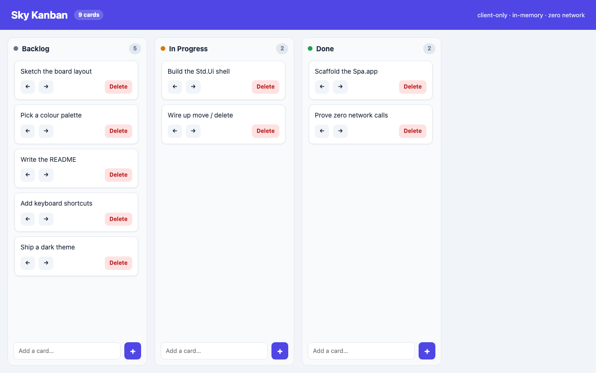

# 61 — Sky.Spa Kanban (client-only)

A polished **Kanban board** written in [Sky.Spa](../../docs/skyspa/overview.md) —
the client-side TEA target that compiles to WebAssembly and runs **entirely in
the browser**. This is the *"no server needed"* tier:

- **No backend.** No `Sky.Http.Server`, no `Std.Db`, no `File`, no `Http`, no
  `Task`. Every `update` branch is a **pure, client-local** transition that
  returns `Cmd.none`, so interacting with the board makes **zero network calls**.
- **All state is in-memory** and intentionally **lost on reload**. That is the
  whole point of the tier: ship a folder of static files and it just runs, with
  nothing to operate.
- **Deploy = copy three files** (`index.html` + `main.wasm` + `wasm_exec.js`) to
  any static host (GitHub Pages, S3, Netlify, `nginx`, a USB stick…).

It doubles as the **viewport / scroll showcase** for `Std.Ui`: a full-viewport
shell, a fixed header, side-scrolling lanes, and per-lane vertical scroll.



## What it demonstrates

| Concern | How |
|---|---|
| Full-viewport shell | `Ui.column [ Ui.height (Ui.vh 100), Ui.clip ]` — the app is exactly one viewport tall; only the board scrolls. |
| Fixed header | `Ui.row [ Ui.height (Ui.px 64) ]` — a stable frame that never scrolls. |
| Board fills the rest | `Ui.el [ Ui.height Ui.fill ]` — bounded height is what makes inner scrolling work. |
| Lanes scroll sideways | `Ui.row [ Ui.height Ui.fill, Ui.scrollbarX ]` — Trello-style horizontal scroll when lanes overflow; the header stays put. |
| Cards scroll *within* a lane | the card list is `Ui.column [ Ui.height Ui.fill, Ui.scrollbarY ]` — a long stack scrolls inside the lane, never the page. |
| Fixed-width lanes | `Ui.width (Ui.minimum 260 (Ui.px 300))`. |
| Rich cards | `Border.rounded` + `Border.shadow` + `Background.color` + move-left / move-right / delete controls. |
| Responsive | a real CSS `@media` layer (see note below) stacks the lanes vertically and hides the header tagline under 768px. |
| Pure state | ids are a monotonic `Int` counter — no `Uuid` / `Random` / `Time` (those are effects). |

## The Sky.Spa viewport note (why there's an injected `<style>`)

Sky.Spa runs the **same `Std.Ui` view** as Sky.Live, but the wasm DOM renderer
(`runtime-go/rt/dom_render_wasm.go`) is a plain VNode→DOM patcher. Unlike the
server renderer (`live.go`) it does **not** inject the base CSS reset, nor the
`@media` / `:hover` post-processing that backs `Ui.breakpoint`. So a client-only
app that wants `box-sizing: border-box` and responsive breakpoints supplies them
itself. This example does that in **one injected `<style>`** (via the `Ui.html`
raw escape hatch — see `globalStyle` in `src/Main.sky`):

1. `*{box-sizing:border-box}` — without it, `width + padding` elements render
   content-box and spill past their declared width.
2. a `@media (max-width:767px)` block keyed on the ids the view assigns
   (`#tagline`, `#board`, `#lanes`, `lane-*`) — the mobile layout, expressed in
   plain CSS because `Ui.breakpoint` is inert in wasm today.

No runtime or compiler change is needed; the fix ships inside the wasm binary.

## Build & serve

```bash
# from this directory
sky build --target web src/Main.sky      # → dist/ (index.html + main.wasm + wasm_exec.js)

# serve the static bundle with anything
cd dist && python3 -m http.server 8971    # then open http://localhost:8971/
```

Or use the helper, which builds and serves in one step:

```bash
./run.sh                 # builds, serves dist/ on http://localhost:8971/
KANBAN_PORT=9000 ./run.sh
```

There is **no backend to start** — that's the point.

## Files

- `src/Main.sky` — the whole app (Model / Msg / pure `update` / `Std.Ui` view).
- `sky.toml` — a standalone single-project Spa client.
- `dist/` — the built, servable bundle (regenerated by `sky build --target web`).
