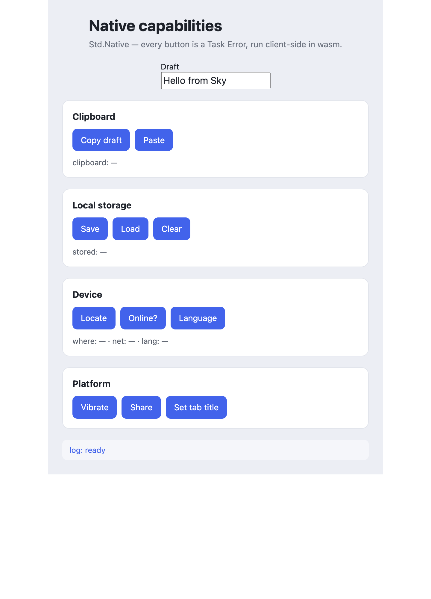
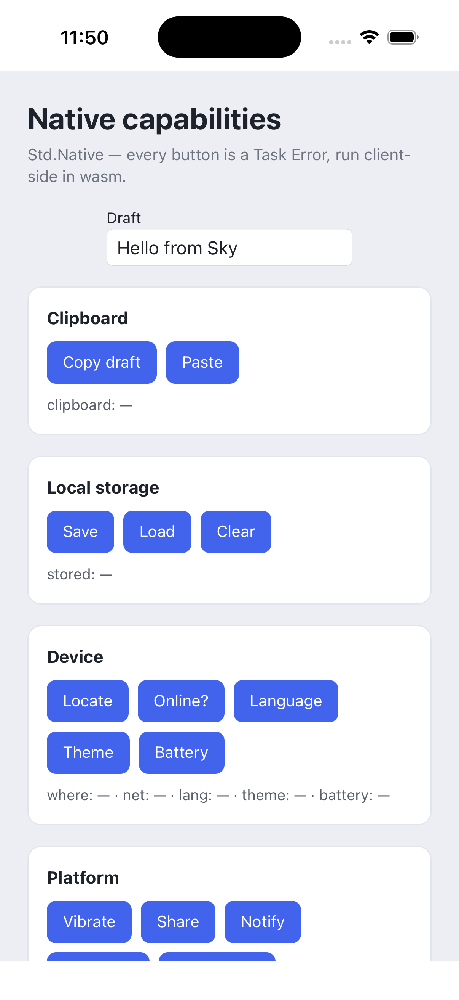
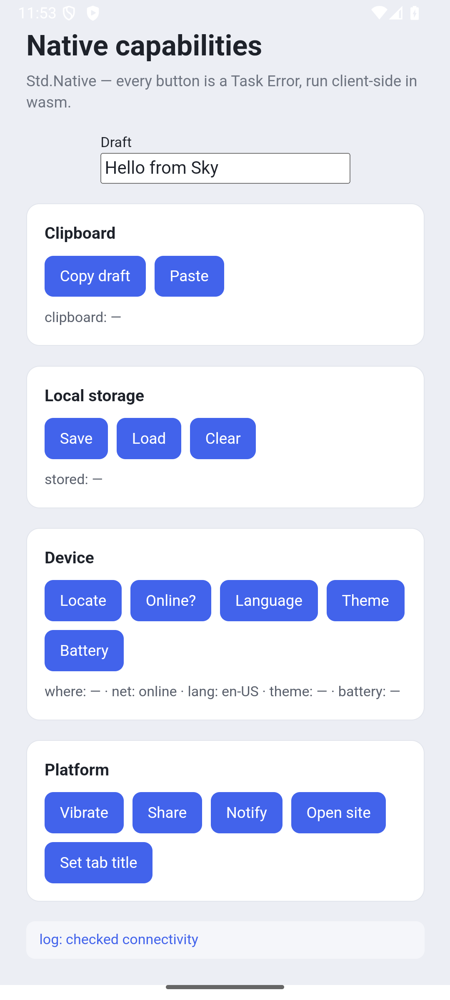

# 64 · Sky.Spa Native — device-capability playground

A client-only **Sky.Spa** app that exercises the whole `Std.Native` surface: the
most commonly used browser / webview capabilities, each driven through the
ordinary TEA loop. It doubles as the **dedicated manual + e2e test harness** for
the native-capability set.

The **same view** runs on web, iOS, and Android from one source — one `view`
function, one wasm client:

| Web | iOS | Android |
|---|---|---|
|  |  |  |

(The Android shot is live: `net: online` and `lang: en-US` are `isOnline` and
`language` having fired in the Android WebView.)

Every button is `Cmd.perform (Native.<cap> …) OnResult`, and every capability is
a **`Task Error a`** — a denial, a timeout, or an unavailable API is a clean
`Err` shown in the log, never a crash. The client stays pure; the capability is
the effect.

## The capabilities

| Section | Buttons | `Std.Native` | Signature |
|---|---|---|---|
| Clipboard | Copy / Paste | `clipboardWrite` / `clipboardRead` | `String -> Task Error ()` · `() -> Task Error String` |
| Local storage | Save / Load / Clear | `storageSet` / `storageGet` / `storageRemove` | `String -> String -> Task Error ()` · `String -> Task Error (Maybe String)` · `String -> Task Error ()` |
| Device | Locate / Online? / Language / Theme / Battery | `geolocation` / `isOnline` / `language` / `prefersDarkMode` / `batteryStatus` | `() -> Task Error Coords` · `() -> Task Error Bool` · `() -> Task Error String` · `() -> Task Error Bool` · `() -> Task Error BatteryStatus` |
| Platform | Vibrate / Share / Notify / Open site / Set tab title | `vibrate` / `share` / `notify` / `openUrl` / `setTitle` | `Int -> Task Error ()` · `ShareContent -> Task Error ()` · `String -> String -> Task Error ()` · `String -> Task Error ()` · `String -> Task Error ()` |

Note the effect-boundary discipline: a **write** returns `Task Error ()`, a
**read** returns `Task Error <value>`, and a read that can legitimately find
nothing (`storageGet`) returns `Task Error (Maybe String)` — a missing key is
`Ok Nothing`, only a storage failure is `Err`.

## Why it's client-only

`Std.Native` capabilities are **client effects** — they reach a browser/webview
platform API (`navigator.clipboard`, `localStorage`, the Geolocation API, …)
that only exists in the wasm client. So `sky spa-split` keeps every branch in the
frontend and the derived backend contains **no `/_rpc/` endpoint** — it only
serves the static bundle. (Route a native effect to the server and it would hit
its non-browser stub and fail; the split is aware of this and never does.)

## Run it

```bash
PORT=8974 ./run.sh          # Ctrl-C to stop, then open http://localhost:8974/
```

Then:

- **Copy** the draft and **Paste** it back — a real clipboard round-trip.
- **Save** the draft, reload the page, **Load** — it survives (localStorage).
- **Locate** (grant location) shows your coordinates; **Online?** and
  **Language** read the device state.
- **Vibrate** and **Share** are best on a phone (a laptop has no vibration motor,
  and most desktop browsers have no share sheet — both return a clean result
  regardless).
- **Set tab title** renames the browser tab.

## Where each capability really shines

The same view runs on **web, desktop (Sky.Webview), and mobile (iOS/Android
webview)**. Clipboard, storage, geolocation, online status, language and title
work everywhere; **vibrate** and the native **share sheet** come alive on mobile,
where `Bundle.withPermission` wires the OS-level grants the shells need.
